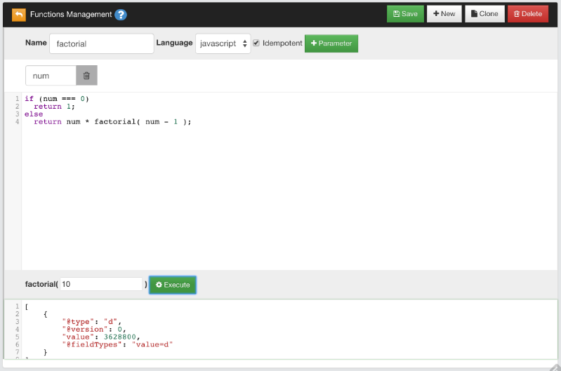

# Creating Functions

In addition to the functions provided in OrientDB by default, you can also create your own functions.

## Using OrientDB Studio

You can do so through the [OrientDB Studio](Studio-Home-page.md). To create a sample function, complete the following steps:

1. In Studio, open a database and navigate to the **Functions** panel.

1. Enter `sum` as a name, then add two parameters: `a` and `b`.

1. Give the function the following code in the text area:

   ```javascript
   return parseInt(a) + parseInt(b);
   ```

1. Click **Save**.

This adds the function `sum` to the database.  In Studio, it appears on the left-side with the available functions.

On the bottom of the page, there are two empty boxes in which you can test the function.  Write `3` in one and `5` in the other, then click **Execute** to see the results.


>Why using `parseInt()` instead of `a + b`?  Because HTTP protocol passes parameters as strings.

## Saved Functions

OrientDB saves functions in the database, using the `OFunction` class.  This class has the following properties:

| Property | Description |
|---|---|
| `name` | Defines the name of the function. |
| `code` | Defines the code the function executes. |
| `parameters` | Defines an optional `EMBEDDEDLIST` of strings, containing the parameter names, if any. |
| `idempotent` | Defines whether the function is idempotent, that is if it changes the database.  Read-only functions are idempotent.  This is needed to avoid calling non-idempotent functions using the HTTP GET method. |

>Given that OrientDB uses one record per function, the MVCC mechanism is used to protect against concurrent record updates.


## Using Recursive Calls

Functions can call on other functions in order to process the results.  They can also call themselves in a recursive call.

For instance, create a new function with the name `factorial`.  Give it the parameter `num`, with the following code:

```javascript
if (num === 0)
  return 1;
else
  return num * factorial( num - 1 );
```



When you call `factorial()`, it calls itself in order to determine the factorial of the given `num` value, until it reaches the result, which in the case of the test is `3648800.0`.
