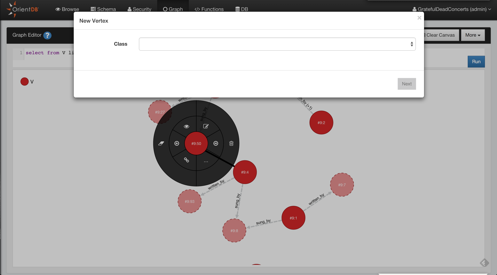

#Graph Editor

Since Studio 2.0 we have a new brand graph editor.  Not only you can visualize your data in a graph way
but you can also interact with the graph and modify it.

To populate the graph area just type a query in the query editor or use the functionality **Send To Graph** from the [Browse UI](Query.md)

Supported operations in the Graph Editor are:

* Add Vertices
* Save the Graph Rendering Configuration
* Clear the Graph Rendering Canvas
* Delete Vertices
* Remove Vertices from Canvas
* Edit Vertices
* Inspect Vertices
* Change the Rendering Configuration of Vertices
* Navigating Relationships
* Create Edges between Vertices
* Delete Edges between Vertices
* Inspect Edges
* Edit Edges

## Add Vertices

To add a new Vertex in your Graph Database and in the Graph Canvas area you have to press the button
**Add Vertex**.
This operation is done in two steps.

The first step you have to choose the class for the new Vertex and then click **Next**

In the second step you have to insert the fields values of the new vertex, you can also add custom fields as OrientDB supports Schema-Less mode. To make the new vertex persistent click to **Save changes** and the 
vertex will be saved into the database and added to the canvas area

## Delete Vertices

Open the circular menu by clicking on the Vertex that you want to delete, open the sub-menu by passing hover the mouse to the menu entry more (**...**) and then click the trash icon.

## Remove Vertices from Canvas

Open the circular menu , open the sub-menu by passing hover the mouse to the menu entry more (**...**) and then click the **eraser** icon.

## Edit Vertices

Open the circular menu and then click to the **edit** icon, Studio will open a popup where you can edit the vertex properties.

## Inspect Vertices

If you want to take a quick look to the Vertex property, click to the **eye** icon.

## Change the Rendering Configuration of Vertices

## Navigating Relationships

## Create Edges between Vertices

## Delete Edges between Vertices

## Inspect Edges

## Edit Edges