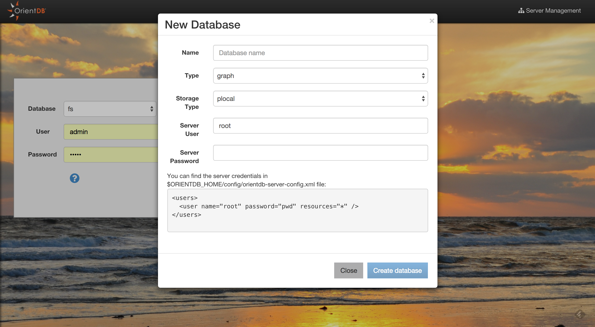

# Studio Home page

Studio is a web interface for the administration of OrientDB that comes in bundle with the OrientDB distribution. 

If you run OrientDB in your machine the web interface can be accessed via the URL:

```
http://localhost:2480
```


This is the new Studio 2.0 Homepage. 


From here, you can :

* Connect to an existing database
* Drop an existing database
* Create a new database
* Import a public database
* Go to the [Server Management UI](Server-Management.md)


## Connect to an existing database

To Login, select a database from the databases list and use any database user. By default **reader/reader** can read records from the database, **writer/writer** can read, create, update and delete records. **admin/admin** has all rights.

## Drop an existing database

Select a database from the databases list and click the trash icon.
Studio will open a confirmation popup where you have to insert

* Server User
* Server Password

and then click the "Drop database" button.
You can find the server credentials in the 
$ORIENTDB_HOME/config/orientdb-server-config.xml file:
```
<users>
  <user name="root" password="pwd" resources="*" />
</users>
```
## Create a new database

To create a new database, click the "New DB" button from the Home Page 



Some information is needed to create a new database:

* Database name
* Database type (Document/Graph)
* Storage type (plocal/memory)
* Server user
* Server password 

You can find the server credentials in the 
$ORIENTDB_HOME/config/orientdb-server-config.xml file:
```
<users>
  <user name="root" password="pwd" resources="*" />
</users>
```
Once created, Studio will automatically login to the new database.

## Import a public database

Studio 2.0 allows you to import databases from a public repository.
These databases contains public data and bookmarked queries that will allow you to start
playing with OrientDB and OrientDB SQL. The classic bundle database 'GratefulDeadConcerts' will be moved to this public repository.


To install a public database, you will need the Server Credentials. 
Then, click the download button of the database that you are interested in.
Then Studio will download and install in to your $ORIENTDB_HOME/databases directory.
Once finished, Studio will automatically login to the newly installed database.