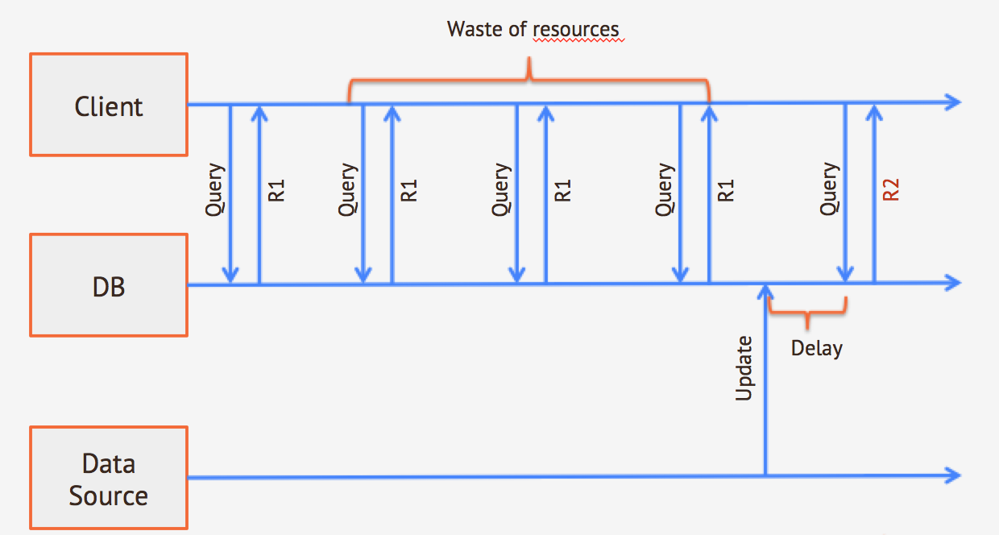
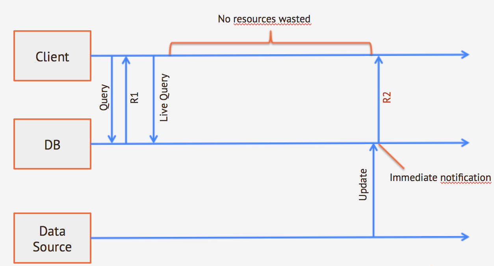

---
search:
   keywords: ['live query', 'live queries']
---

# Understanding Live Queries

Writing real-time, reactive applications can prove a difficult task when working from the traditional query paradigm.  Beginning in version 2.1, OrientDB introduces an alternative: the Live Query.

## Traditional Query Approach

Consider the typical use-case of a web application. Visitors open a page on their browser.  You need to page to update itself as new records are added to the database.  Moreover, these updates can originate from different data sources, such as multiple applications, manual database operations, and so on.

In the traditional approach, the client polls the database for updates.  This does work in that it allows you to update the page with new material, but it comes at a price:

- The client does not know when changes are made.  In order to get updates, it must constantly execute polling queries.  This can lead to wasted resources, especially in the case where the poll requires long-running or otherwise intensive queries. 

- When you need near real-time data, the client must poll the database very often.

- Queries return results at fixed intervals to the client.  When changes are made between intervals, the client only receives them at the next polling query.

*Traditional Query Polling Approach*

Given this information, in order to implement this approach effectively, you need to make one of the following compromises:

- Use long intervals between polling queries, reducing the resource demands at the expense of the result-set being less up to date.
- Use short intervals between polling queries, ensuring near real-time updates at the expense of resource usage.

## Live Query Approach

In the new Live Query approach, the process is a little different.  Instead of issuing polling queries the database, the client subscribes to a query result-set.  Whenever changes occur in the records in this result set, OrientDB pushes these changes to the client as they happen.

*Live Query Approach*

The most obvious advantages to this are that,

- You no longer need to poll the database and only use resources when the application requires them.
- You receive notifications as soon as a change happens on the database, no matter the data source.

