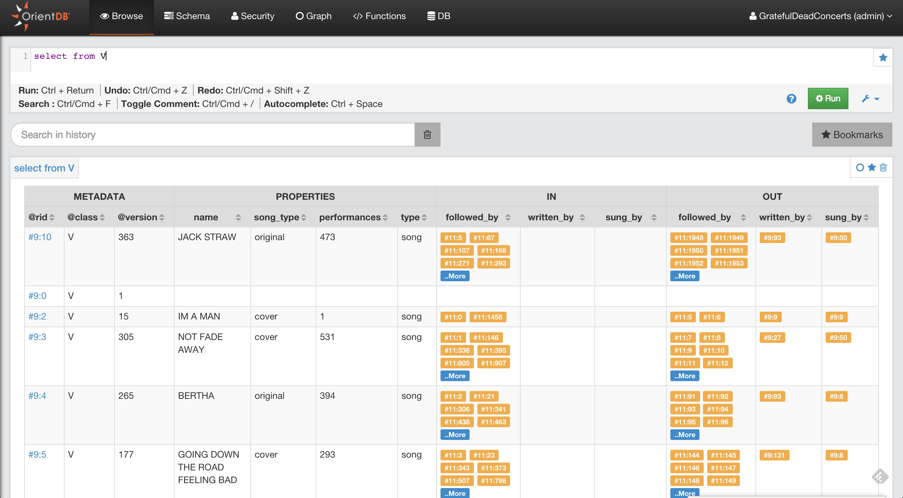
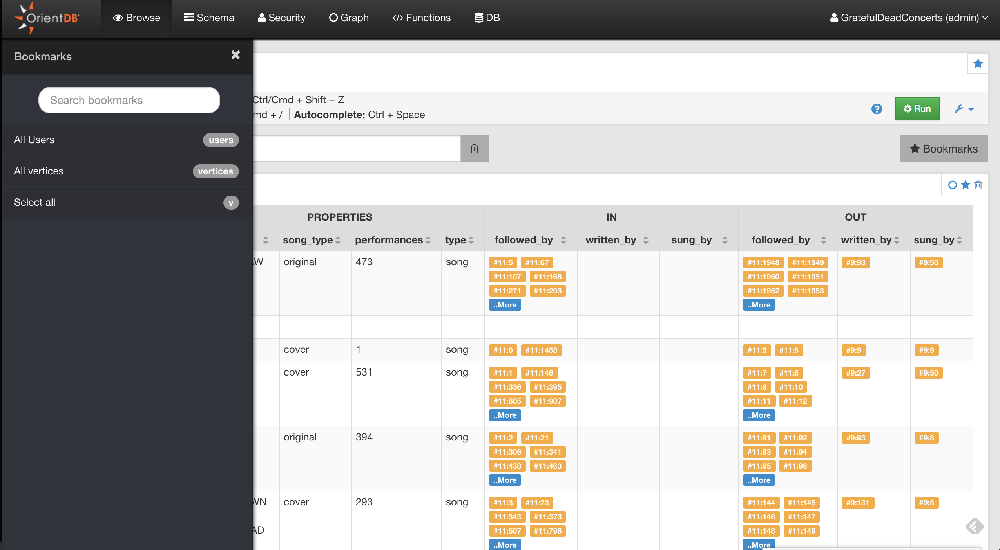

# Execute a query

Studio supports auto recognition of the language you're using between those supported: [SQL](SQL.md) and [Gremlin](Gremlin.md). 
While writing, use the auto-complete feature by pressing Ctrl + Space.

Other shortcuts are available in the query editor:

* **Ctrl + Return** to execute the query or just click the **Run** button
* **Ctrl/Cmd + Z** to undo changes
* **Ctrl/Cmd + Shift** + Z  to redo changes
* **Ctrl/Cmd + F** to search in the editor
* **Ctrl/Cmd + /** to toggle a comment

> **Note:**
> If you have multiple queries in the editor, you can select a single query with text selection and execute it with **Ctrl + Return** or the **Run** button

By clicking any @rid value in the result set, you will go into [document edit](Edit-Document.md) mode if the record is a Document, otherwise you will go into [vertex edit](Edit-Vertex.md).

You can bookmark your queries by clicking the star icon in the results set or in the editor.
To browse bookmarked queries, click the **Bookmarks** button. Studio will open the bookmarks list on the left, where you can edit/delete or rerun queries.

Studio saves the executed queries in the Local Storage of the browser, in the query settings, you can configure how many queries studio will keep in history. 
You can also search a previously executed query, delete all the queries from the history or delete a single query.

From Studio 2.0, you can send the result set of a query to the [Graph Editor](Graph-Editor.md) by clicking on the circle icon in the result set actions. This allows you to visualize your data graphically.

## Look at the JSON output

Studio communicates with the OrientDB Server using [HTTP/RESt+JSON protocol](OrientDB-REST.md). To see the output in JSON format, press the **RAW** tab.

