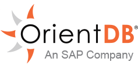

# OrientDB EE Manual - version {{book.currentVersion}}



Welcome to **OrientDB Enteprise Edition**.

# OrientDB EE v 3.1.x is our latest GA

# Enterprise Edition

This is the main guide on using <b>OrientDB Enterprise Edition</b>. For more information look at [OrientDB Enterprise Edition]({{book.enterpriseSite}}).

Enterprise Edition is a commercial product developed by OrientDB Ltd, the same company that lead the development of OrientDB Community Edition. [Download now the 45-days trial]({{book.enterpriseSite}}/#matrix).

OrientDB Enterprise Edition is designed specifically for applications seeking a scalable, robust, and secure multi-model database. Its main goal is to save time and money on your OrientDB investment by reducing risk, cost, effort, and time invested in a business critical application. It includes all Community features plus professional enterprise tools such as support for [Query Profiler](./ee/Server-Profiler.md), [Distributed Clustering](./ee/Cluster-Management.md) configuration, [Auditing Tools](./ee/Security.md), [Metrics recording](./ee/Server-Management.md), [Non-Stop Incremental Backups](./ee/Backup-Management.md), [Teleporter](./ee/Teleporter.md) to import data from any Relational DBMS.


### Installation

Enterprise Edition is an additional package which can be installed in the [Community Edition]({{book.baseCommunityDoc}}/gettingstarted/Tutorial-Installation.html). Download the Enterprise package after registering on the web site and install it in the `${ORIENTDB_HOME}/plugins` folder.

At run-time, the Enterprise edition logs this message:

```
2016-08-04 09:38:26:589 INFO  ***************************************************************************** [OEnterpriseAgent]
2016-08-04 09:38:26:589 INFO  *                     ORIENTDB  -  ENTERPRISE EDITION                       * [OEnterpriseAgent]
2016-08-04 09:38:26:589 INFO  ***************************************************************************** [OEnterpriseAgent]
2016-08-04 09:38:26:589 INFO  * If you are in Production or Test, you must purchase a commercial license. * [OEnterpriseAgent]
2016-08-04 09:38:26:589 INFO  * For more information look at: http://orientdb.com/orientdb-enterprise/    * [OEnterpriseAgent]
2016-08-04 09:38:26:590 INFO  ***************************************************************************** [OEnterpriseAgent]
```

## EE Features

Explore the Enterprise Edition features:

* [Dashboard](./ee/Dashboard.md)
* [Server Management](./ee/Server-Management.md)
* [Cluster Management](./ee/Cluster-Management.md)
* [Backup Management](./ee/Backup-Management.md)
* [Server Profiler](./ee/Server-Profiler.md)
* [Security](./ee/Security.md)
* [Auditing](./ee/Auditing.md)
* [Teleporter](./ee/Teleporter.md)
* [Neo4j Importer](./ee/Neo4j-Importer.md)
* [Metrics](./ee/Profiler.md)
* [Settings](./ee/Settings.md)


