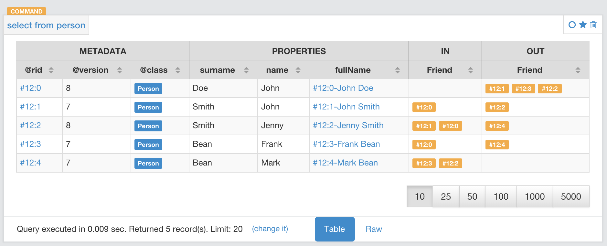
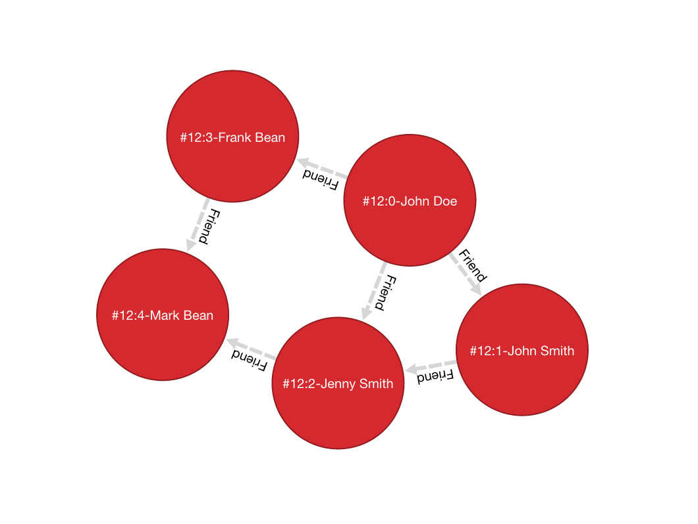

# SQL - MATCH

(since 2.2)

Match statements allows to query the db in a declarative way, using pattern matching.


## Syntax 

### Simplified
```
MATCH 
  {
    [class: <className>], 
    [as: <alias>], 
    [where: (<whereCondition>)]
  }
  .<functionName>(){
    [class: <className>], 
    [as: <alias>], 
    [where: (<whereCondition>)], 
    [while: (<whileCondition>)]
    [maxDepth: <number>]
  }*
RETURN <alias> [, <alias>]*
LIMIT <number>
```

- **className**: a valid target class name
- **alias**: alias for a node of the pattern
- **whereCondition**: filter condition (a normal WHERE contition supported in SQL) to match a node in the pattern. Here you can also  use $currentMatch and $matched [context variables](SQL-Match.md#context-variables). 
- **functionName**: a graph function representing a connection between two nodes (eg. ```out(), in(), outE(), inE()...```)
- **whileCondition**: a condition (a normal WHERE contition supported in SQL) that has to be met to allow the traversal of this path. Here you can also  use $currentMatch, $matched and $depth [context variables](SQL-Match.md#context-variables). Defining a While condition allows deep traversal and slightly changes the behavior of a match execution, see [below](SQL-Match.md#deep-traversal-while-condition) for details.
- **maxDepth**: the maximum depth for this single path
- **return** ```<alias> [, <alias>]*```: specifies the elements in the pattern that have to be returned. Can be one or more aliases defined in the ```as``` block, ```$matches``` to indicate all the defined alias, 
```$paths``` to indicate full traversed paths. 

### BNF
```
MatchStatement     := ( <MATCH> MatchExpression ( <COMMA> MatchExpression )* <RETURN> Identifier ( <COMMA> Identifier )* ( Limit )? )
	
MatchExpression	   := ( MatchFilter ( ( MatchPathItem | MultiMatchPathItem ) )* )
	
MatchPathItem	   := ( MethodCall ( MatchFilter )? )
	
MatchPathItemFirst := ( FunctionCall ( MatchFilter )? )
	
MultiMatchPathItem := ( <DOT> <LPAREN> MatchPathItemFirst ( MatchPathItem )* <RPAREN> ( MatchFilter )? )
	
MatchFilter        := ( <LBRACE> ( MatchFilterItem ( <COMMA> MatchFilterItem )* )? <RBRACE> )
	
MatchFilterItem    := ( ( <CLASS> <COLON> Expression )  | ( <AS> <COLON> Identifier ) | ( <WHERE> <COLON> <LPAREN> ( WhereClause ) <RPAREN> ) | ( <WHILE> <COLON> <LPAREN> ( WhereClause ) <RPAREN> ) | ( <MAXDEPTH> <COLON> Integer ) )
```

## Context Variables

MATCH statement uses the following context variables:

- ```$matched```: the current matched record, defined as a record whose attributes are all the aliases (```as```) 
explicitly defined in the statement. This can be used in ```where``` and ```while``` conditions to refer current partial match, or as a ```RETURN``` value
- ```$currentMatch```: the current (right) node during match
- ```$depth```: the traversal depth on a single path item, where a ```while``` condition is defined


## Examples

Sample dataset: People






### Get all people whose name is John
```SQL
MATCH {class: Person, as: people, where: (name = 'John')} RETURN people
```
result:

| people |
|--------|
| #12:0  |
| #12:1  |

### Get all people whose name is John and whose surname is Smith
```SQL
MATCH {class: Person, as: people, where: (name = 'John' and surname = 'Smith')} RETURN people
```

result:

| people |
|--------|
| #12:1  |


### Get all people whose name is John, together with their friends
```SQL
  MATCH {
    class: Person, 
    as: person, 
    where: (name = 'John')
  }.both('Friend'){
    as: friend
  }
  RETURN person, friend
```

| people | friend |
|--------|--------|
| #12:0  | #12:1  |
| #12:0  | #12:2  |
| #12:0  | #12:3  |
| #12:1  | #12:0  |
| #12:1  | #12:2  |

### Expanding attributes

MATCH statement can be used as a subquery inside another statement. This allows to obtain details and aggregate data from the inner select.

```SQL
SELECT 
person.name as name, person.surname as surname, 
friend.name as friendName, friend.surname as friendSurname 
FROM (
  MATCH {
    class: Person, 
    as: person, 
    where: (name = 'John')
  }.both('Friend'){
    as: friend
  }
  RETURN person, friend
)
```

| name   | surname  | friendName | friendSurname |
|--------|----------|------------|---------------|
| John   | Doe      | John       | Smith         |
| John   | Doe      | Jenny      | Smith         |
| John   | Doe      | Frank      | Bean          |
| John   | Smith    | John       | Doe           |
| John   | Smith    | Jenny      | Smith         |

### Friends of friends

```SQL
  MATCH {
    class: Person, 
    as: person, 
    where: (name = 'John' and surname = 'Doe')
  }.both('Friend')
   .both('Friend'){
    as: friendOfFriend
  }
  RETURN person, friendOfFriend
```
| people | friendOfFriend |
|--------|----------------|
| #12:0  | #12:0          |
| #12:0  | #12:1          |
| #12:0  | #12:2          |
| #12:0  | #12:3          |
| #12:0  | #12:4          |

### Exclude myself

```SQL
  MATCH {
    class: Person, 
    as: person, 
    where: (name = 'John' and surname = 'Doe')
  }.both('Friend')
   .both('Friend'){
    as: friendOfFriend,
    where: ($matched.person != $currentMatch)
  }
  RETURN person, friendOfFriend
```

| people | friendOfFriend |
|--------|----------------|
| #12:0  | #12:1          |
| #12:0  | #12:2          |
| #12:0  | #12:3          |
| #12:0  | #12:4          |

### Friends of friends, until level 6

```SQL
  MATCH {
    class: Person, 
    as: person, 
    where: (name = 'John' and surname = 'Doe')
  }.both('Friend'){
    as: friend,
    where: ($matched.person != $currentMatch)
    while: ($depth < 6)
  }
  RETURN person, friend
```
| people | friend         |
|--------|----------------|
| #12:0  | #12:0          |
| #12:0  | #12:1          |
| #12:0  | #12:2          |
| #12:0  | #12:3          |
| #12:0  | #12:4          |

### Nested paths: friends until depth 6, since a date

 Suppose this date is on the "Friend" edge.
 
```SQL
  MATCH {
    class: Person, 
    as: person, 
    where: (name = 'John')
  }.(
      bothE('Friend'){
        where: (date < ?)
      }.bothV()
  ){
      as: friend,
      while: ($depth < 6)
  }
  RETURN person, friend
```

In this case, the condition ```($depth < 6)``` refers to six times traversing the block:

```sql
(
      bothE('Friend'){
        where: (date < ?)
      }.bothV()
  )
```

### Multiple paths: friends of my friends who are also my friends

```SQL
  MATCH 
  {
    class: Person, 
    as: person, 
    where: (name = 'John' and surname = 'Doe')
  }.both('Friend')
   .both('Friend'){
    as: friend
  }
  ,
  { as: person }.both('Friend'){ as: friend }
  RETURN person, friend
```

| people | friend         |
|--------|----------------|
| #12:0  | #12:1          |
| #12:0  | #12:2          |

In this case our MATCH statement is made of two match expressions, the first one matches friends of friends, the second one matches direct friends.
These two expressions share common aliases (person and friend).

To match the whole statement, a result has to match both match expressions, where the alias values for the first expression have to be the same as for the second one.

### Common friends

Find common friends of John and Jenny.

```SQL
  MATCH 
  {
    class: Person, 
    where: (name = 'John' and surname = 'Doe')
  }.both('Friend'){
    as: friend
  }.both('Friend'){
    class: Person, 
    where: (name = 'Jenny')
  }
  RETURN friend
```

| friend |
|--------|
| #12:1  |

The same, with two match expressions:

```SQL
  MATCH 
  {
    class: Person, 
    where: (name = 'John' and surname = 'Doe')
  }.both('Friend'){
    as: friend
  }
  ,
  {
    class: Person, 
    where: (name = 'Jenny')
  }.both('Friend'){
    as: friend
  }
  RETURN friend
```

### Real use case: manager in an incomplete hierarchy

Suppose you have a hierarchy of departments as follows:

```
           [manager] department        
          (employees in department)    
                                       
                                       
                [m0]0                   
                 (e1)                  
                 /   \                 
                /     \                
               /       \               
           [m1]1        [m2]2
          (e2, e3)     (e4, e5)        
             / \         / \           
            3   4       5   6          
          (e6) (e7)   (e8)  (e9)       
          /  \                         
      [m3]7    8                       
      (e10)   (e11)                    
       /                               
      9                                
  (e12, e13)                         
```

Short description:
- Department 0 is the company itself, manager 0 ("m0") is the CEO
- e10 works at department 7, his manager is "m3"
- e12 works at department 9, this department has no direct manager, so e12's manager is "m3" (the upper manager)


To find the manager of a person:

```sql
select expand(manager) from (
  match {
      class:Employee, 
      where: (name = ?)
    }.out('WorksAt')
     .out('ParentDepartment'){
        while: (out('Manager').size() == 0),
        where: (out('Manager').size() > 0)
    }.out('Manager'){
    	as: manager
    }
  return manager
)

```

### Deep traversal (while condition)

A match path item will act in different ways if you have a ```while``` condition or not.

Suppose you have the following graph:

``` 
[name='a'] -FriendOf-> [name='b'] -FriendOf-> [name='c']
```

The following statement will return ```b``` only:

```sql
MATCH {
    class: Person,
    where: (name = 'a')
  }.out("FriendOf"){
    as: friend
  }
RETURN friend  
```

| friend |
|--------|
| b      |


This means that the path item ```out("FriendOf")``` will be traversed exactly once and only the result of that 
traversal will be returned

If you add a ```while``` condition:
```sql
MATCH {
    class: Person,
    where: (name = 'a')
  }.out("FriendOf"){
    as: friend,
    while: ($depth <= 1)
  }
RETURN friend  
```

| friend |
|--------|
| a      |
| b      |

The query will return both ```a``` and ```b```.

If you have a ```while``` condition on a match path item, this item will be evaluated **zero to N times**,
that means that **also the starting node** (```a``` in this case) **will be returned** as the result of zero traversal.

To exclude the starting point, you have to add a ```where``` condition, like following:

```sql
MATCH {
    class: Person,
    where: (name = 'a')
  }.out("FriendOf"){
    as: friend,
    while: ($depth <= 1)
    where: ($depth > 0)
  }
RETURN friend  
```

The general rule is the following:
- ```while``` condition defines if next traversal has to be executed (it is evaluated also at level zero, on the origin node)
- ```where``` condition defines if the current element (the origin node at the zero iteration, the right node on iteration > 0) 
Has to be returned as a result of the traversal

An example to understand: suppose you have a genealogical tree and you are interested in having a person, his grandfather,
the gradnfather of this grandfather and so on; so saying that the person is at level zero, his parents are at level 1, 
his grandparents are at level 2 and so on, you are interested in all ancestors at even level (level % 2 == 0)

This query does the trick:

```sql
MATCH {
    class: Person,
    where: (name = 'a')
  }.out("Parent"){
    as: ancestor,
    while: (true)
    where: ($depth % 2 = 0)
  }
RETURN ancestor  
```

## Best practices

A query can involve multiple multiple operations, based on the domain model and the use case. Some of them, like projection and aggregation, can easily be described with a SELECT statement, others, like pattern matching and deep traversal, are better described with a MATCH statement.

SELECT and MATCH statements should be used together (eg. subqueries), giving each statement the right responsibilities. Here we summarize some good practices:
- filtering based on record attributes for a single class is a trivial operation with both a SELECT or a MATCH statement, eg. finding all people whose name is 'John' can be written this way:
```sql
SELECT from Person where name = 'John'
```
or
```sql
MATCH {class: Person, as: person, where: (name = 'John')} RETURN preson
```

The efficiency is the same, both queries will use an index. With a select you will obtain expanded records, with a MATCH you will only obtain RIDs.

- filtering based on record attributes of connected elements (eg. neighbor vertices) is sometimes tricky using SELECT, while with MATCH it is a simple operation.

eg. find all people living in Rome and having a friend called 'John'. You can write this query in three different ways:

```sql
SELECT from Person where both('Friend').name contains 'John' and out('LivesIn').name contains 'Rome'
```

```sql
SELECT FROM (SELECT both('Friend') from Person where name 'John') where out('LivesIn').name contains 'Rome'
```

```sql
SELECT FROM (SELECT in('LivesIn') from City where name = 'Rome') where both('Friend').name contains 'John'
```

The first version is more readable, but it will not use indices, so it's the less optimal in terms of execution time.
The second and third versions will be able to use an index if it exists (on Person.name or City.name, both in the subquery), but they are much trickier to read. Which index is used depends only on the way you write the query, eg. if you only have an index on City.name (but not on Person.name), the second version will use no indexes.

With a MATCH statement, the query will become

```sql
MATCH 
  {
	class: Person, 
	where: (name = 'John')
  }.both("Friend"){
	as: result
  }.out('LivesIn'){
	class: City, 
	where: (name = 'Rome')
  }
RETURN result
```

The query executor will optimize the query for you, choosing indexes when they exist. 

Moreover, the query becomes much more readable, especially in complex cases (multiple nested SELECT).

- TRAVERSE statements are very limited, you should use MATCH instead:

A simple statement like
```sql
TRAVERSE out('Friend') from (SELECT from Person where name = 'John') while $depth < 3
```

can be written as
```sql
MATCH 
  {
	class: Person, 
	where: (name = 'John')
  }.both("Friend"){
	as: friend,
	while: ($depth < 3)
  }
RETURN friend
```

Now let's consider to have a 'since' date property on the 'Friend' edge and you want to traverse the relationship only for edges where 'since' is greater than a certain date. With a TRAVERSE statement it would be

```sql
TRAVERSE bothE('Friend')[since > date('2012-07-02', 'yyyy-MM-dd')].bothV() from (SELECT from Person where name = 'John') while $depth < 3
```

unfortunately this statement DOESN'T WORK in current release. You can express it with a MATCH statement:

```sql
MATCH 
  {
	class: Person, 
	where: (name = 'John')
  }.(
  	bothE("Friend"){
  		where: (since > date('2012-07-02', 'yyyy-MM-dd'))
  	}.bothV()
  ){
	as: friend,
	while: ($depth < 3)
  }
RETURN friend
```

- Projections and grouping operations are better expressed with a SELECT statement, so if you need to filter and do projection/aggregation in the same query, you can use SELECT and MATCH in the same statement.

This is particularly important when you expect a result that contains attributes from different connected records (cartesian product), eg. retrieve people names, their friends names and the date since when they are friends:

```
SELECT person.name as name, friendship.since as since, friend.name as friend
FROM (
	MATCH
	  {
	  	class: Person,
	  	as: person
	  }.bothE('Friend'){
	  	as: friendship
	  }.bothV(){
	  	as: friend,
	  	where: ($matched.person != $currentMatch)
	  }
	RETURN person, friendship, friend
)
```


