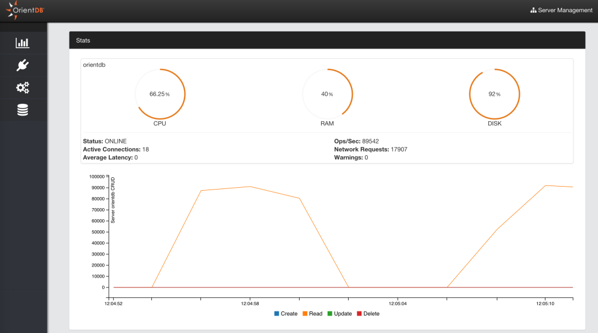
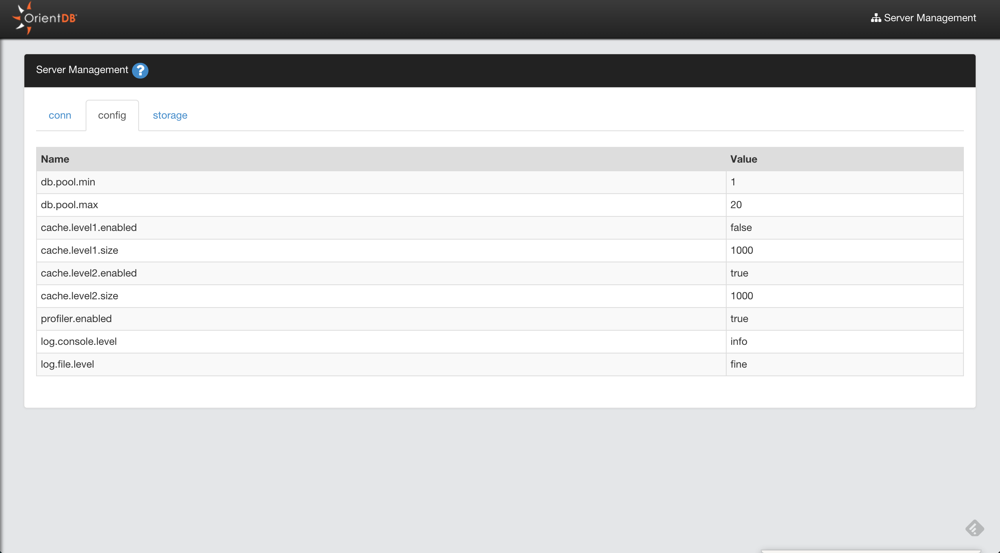
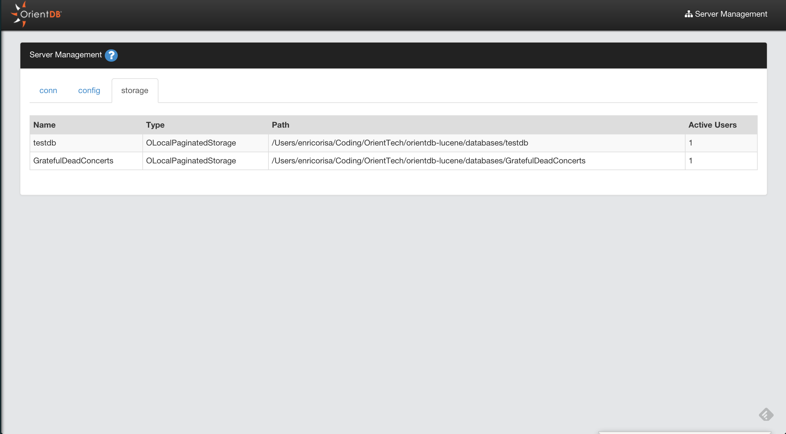

# Server Management
This is the section to work with OrientDB Server as DBA/DevOps. Starting from OrientDB 2.1 Studio has been enriched of features taken from the [Enterprise Edition](http://orientdb.com/enterprise/).

## Statistics
This page summarizes all the most important information about the server as:
- Server status
- Operations per second
- Active Connections
- Warnings
- CPU, RAM and DISK used
- Live chart with CRUD operations in real-time

##Connections
Displays all the active connections to the server. Connections can be [HTTP](OrientDB-REST.md) or [Binary](Network-Binary-Protocol.md). Each connection reports the following information:
-

##Configuration

## Storage

