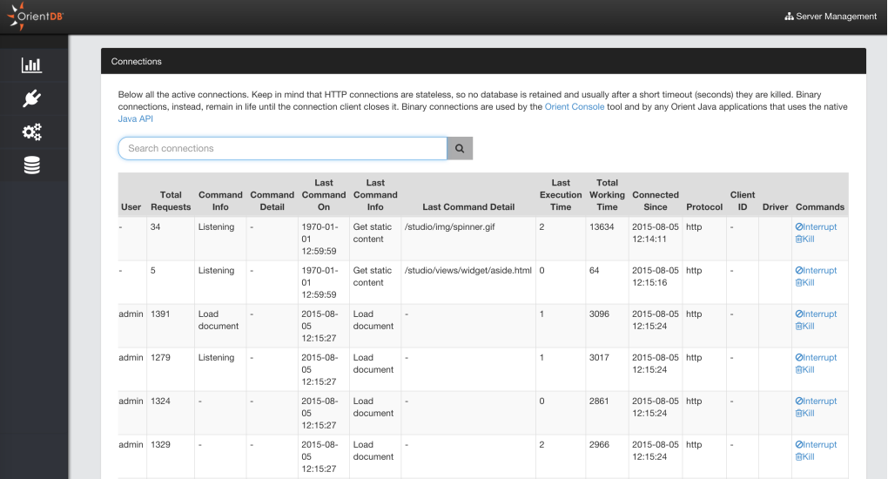
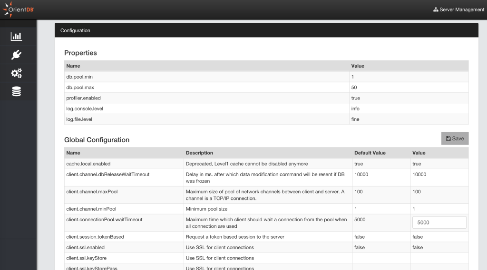
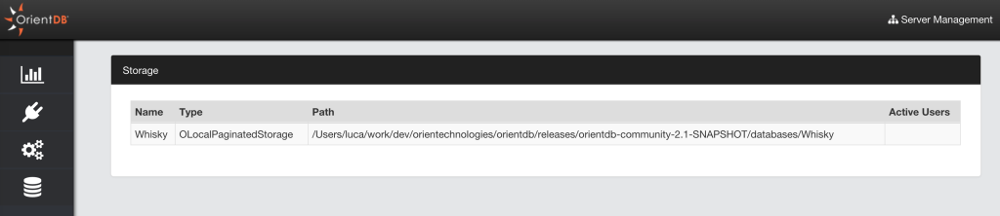

# Server Management
This is the section to work with OrientDB Server as DBA/DevOps. Starting from OrientDB 2.1 Studio has been enriched of features taken from the [Enterprise Edition](http://orientdb.com/enterprise/).

## Statistics
This page summarizes all the most important information about the current server and the other servers connected in cluster if any:
- `Server status`
- `Operations per second`
- `Active Connections`
- `Warnings`
- `CPU`, `RAM` and `DISK` used
- `Live chart` with CRUD operations in real-time

## Connections
Displays all the active connections to the server. Each connection reports the following information:
- `Session ID`, as the unique session number
- `Client`, as the unique client number
- `Address`, is the connection source
- `Database`, the database name used
- `User`, the database user
- `Total Requests`, as the total number of requests executed by the connection
- `Command Info`, as the running command
- `Command Detail`, as the detail about the running command
- `Last Command On`, is the last time a request has been executed
- `Last Command Info`, is the informaton about last operation executed
- `Last Command Detail`, is the informaton about the details of last operation executed
- `Last Execution Time`, is the execution time o last request
- `Total Working Time`, is the total execution time taken by current connection so far
- `Connected Since`, is the date when the connection has been created
- `Protocol`, is the protocol between [HTTP](OrientDB-REST.md) and [Binary](Network-Binary-Protocol.md)
- `Client ID`, a text representing the client connection
- `Driver`, the driver name

Each session can be interrupted or even killed.

## Configuration
This panel shows the Server settings divided in two boxes:
- `Properties`, as the custom settings in `config/orientdb-server-config.xml` file
- `Global Configuration`, as all the global configuration. Only few of them can be changed at run-time with the "Save" button

## Storages
This panel shows the [storages](Concepts.md#storage) used by the server. Below the information reported per storage:
- `Name`, is the storage name
- `Type`, where `OLocalPaginatedStorage` (plocal) means persstent and `ODirectMemoryStorage` (memory) is in memory only
- `Path`, as the path on server's file system where the storage is located
- `Active Users`. This infomation couldn't be updated with the real number of users that are using the database

