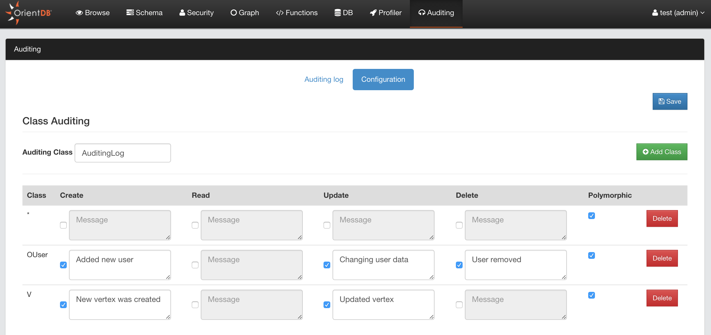
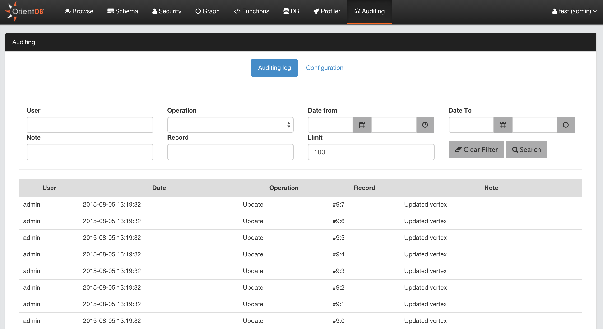

# Auditing (Enterprise only)

Studio 2.1 includes a new functionality called [Auditing](Auditing.md). To understand how Auditing works, please read the [Auditing](Auditing.md) page.

The Studio Auditing panel helps with configuring auditing by avoiding editing the `auditing-config.json` file manually.

By default all the auditing logs are saved as documents of class `AuditingLog`. If your account has enough privileges, you can directly query the auditing log. Example on retrieving last 20 logs: `select from AuditingLog order by @rid desc limit 20`. 

However, Studio provides a panel to filter the Auditing Log messages without using SQL.

