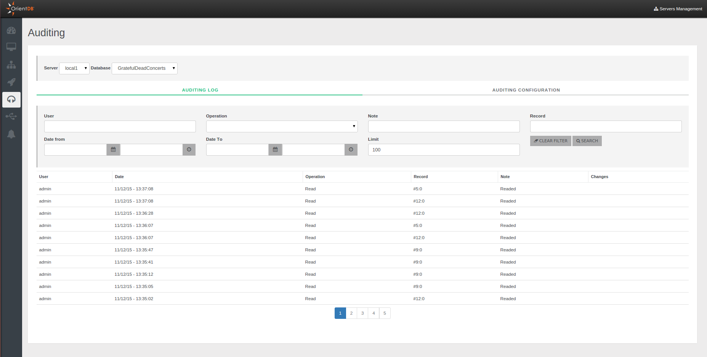
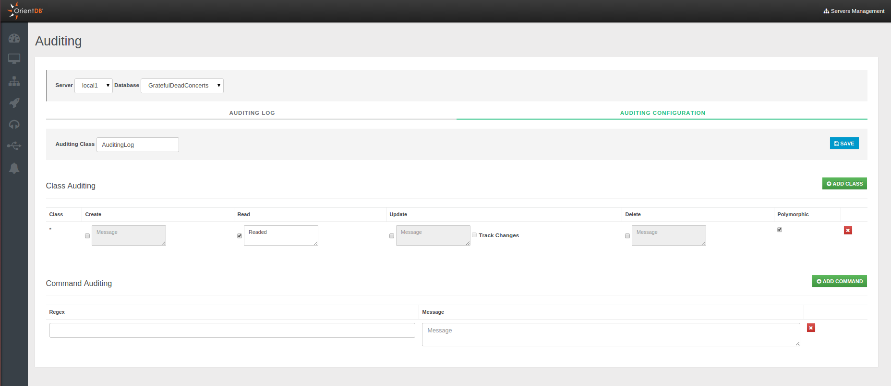

# Auditing

Studio 2.2 Enterprise Edition includes a functionality called [Auditing](Auditing.md). To understand how Auditing works, please read the [Auditing](https://github.com/orientechnologies/orientdb-docs/blob/master/Auditing.md) page on the [OrientDB Manual](http://orientdb.com/docs/last/index.html).

By default all the auditing logs are saved as documents of class `AuditingLog`. If your account has enough priviledges, you can directly query the auditing log. Example on retrieving last 20 logs: `select from AuditingLog order by @rid desc limit 20`. 

However, Studio provides a panel to filter the Auditing Log messages on a specific server without using SQL.

Studio Auditing panel helps you also on Auditing configuration of servers, avoiding to edit the `auditing-config.json` file under the database folder.

