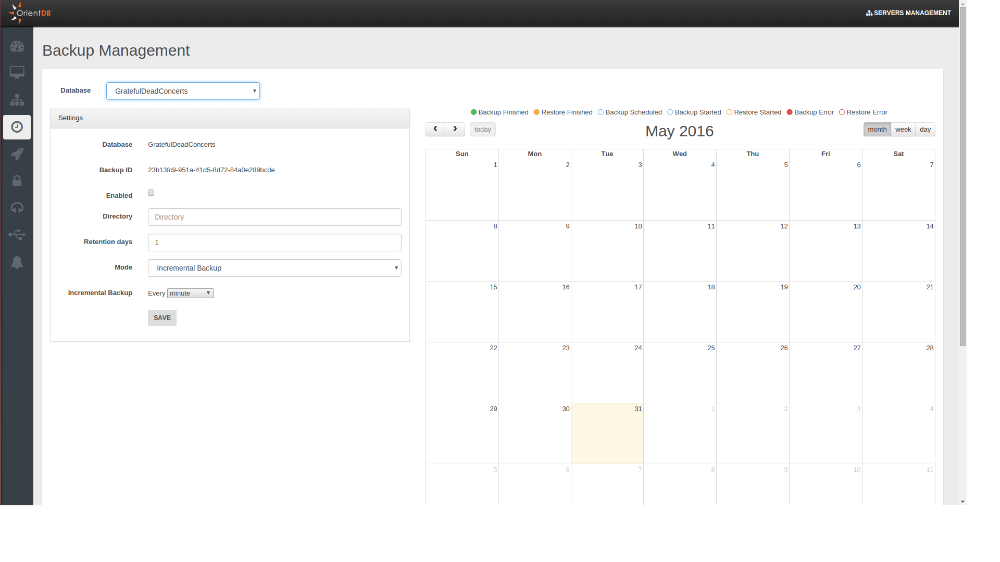

#Backup Management

Studio 2.2 Enterprise Edition includes a **Backup Manager** that allows you to schedule and perform your backups and easily execute and manage restores you may need.
You can enjoy this new functionality by reaching the **Backup Management** panel in the Server Management area, this is what you will find:



How you can see the panel is divided into two sections, on the left side you can schedule your backups, on the right side there is the calendar where you can check:
- the executed tasks (backup or restore)
- the scheduled backups
- eventual errors raised during the execution of a task

Now let's start seeing how you can schedule your backups.

## Backup scheduling

On the left you can find all the settings for your backup scheduling.


As first thing choose the **database** that you want backup. In the example above we have chosen the GratefulDeadConcerts database.
Then you must specify the **output directory** where you want to save your backups and the **retention days** of your backups.
Now you must select the **backup mode** you want to use:
- **Full backup**
- **Incremental Backup**
- **Full + Incremental Backup**

These modes will be analysed afterwards.

Once you have chosen the desired backup mode, you have to choose the **backup period** that indicates the time you want to wait between each backup and the next one.
Eventually you must flag the **Enabled** checkbox and click on the **Save** button in order to start the scheduling of the backups according to your settings.

Below we will examine briefly the three different backup strategies.

###Full backup
Through this mode when each period passes a **full backup** will be performed in the path you specified in the settings just discussed.
If you want know more about the full backup you can refer to the [Full Backup](Backup-and-Restore.md) page.


With the settings shown above a full backup will be performed every 5 minutes. Thus in our example after 5 minutes we will have the first backup, after 10 minutes the second one and so on.

```
/tmp/backup/full
          |
          |____________<backup-direcory1>                         
          |                      |____________<full-backup-file1>    // executed at 00:00:00
          |
          |____________<backup-direcory2>                         
          |                      |____________<full-backup-file2>    // executed at 00:00:00
          |
          |____________<backup-direcory3>                        
          |                      |____________<full-backup-file3>    // executed at 00:00:00
          ...
```


###Incremental Backup
If you prefer to execute an **incremental backup** you can select this mode.
As declared in the [Incremental Backup](Incremental-Backup-And-Restore.md) page the incremental backup generates smaller backup files by storing only the **delta** between two versions of the database.
Let's suppose we want execute a backup every 5 minutes: a **first full backup** will be performed, then it will be followed by a new **incremental backup**, containing  only the delta, **every 5 minutes**.


```
/tmp/backup/incremental
          |
          |____________<backup-direcory1>                         
                                |____________<full-backup-file0>    // executed at 00:00:00
                                |____________<incr-backup-file1>    // executed at 00:00:00
                                |____________<incr-backup-file2>    // executed at 00:00:00
                                |____________<incr-backup-file3>    // executed at 00:00:00
                                |____________<incr-backup-file4>    // executed at 00:00:00
                                ...

```


###Full + Incremental Backup
This mode follows an **hybrid approach** between the first two strategies, combining them according to your criteria. The first significant thing you can notice is that **you must specify two different backup-periods**:
- **Full Backup period**: it specifies how much time will be waited between two sequential full backups.
- **Incremental Backup period**: it specifies how much time will be waited between two sequential incremental backups.

Let's analyse in which way the two modes are combined. Suppose we decided to execute the full backup every 5 minutes and the incremental backup every minute as shown in the example below.


Thus we will obtain that every 5 minutes a new directory with a full backup will be added in the specified path, then in the following 4 minutes only incremental backups will be performed. As we set 1 minute for the incremental backup, we will have 4 incremental backups after the first full backup.
After 5 minutes a new full backup in another directory will be performed, and the following incrementals will be executed according to the delta relative to this second full backup and they will put in this second directory.
That's all, after another 5 minutes we will have a third directory with an initial full backup that will be followed by 4 incremental backups, ans so on.

```
/tmp/backup/full-incremental
          |
          |____________<backup-direcory1>                         
          |                      |____________<full-backup-file0>    // executed at 00:00:00
          |                      |____________<incr-backup-file1>    // executed at 00:00:00
          |                      |____________<incr-backup-file2>    // executed at 00:00:00
          |                      |____________<incr-backup-file3>    // executed at 00:00:00
          |                      |____________<incr-backup-file4>    // executed at 00:00:00
          |
          |____________<backup-direcory2>                         
          |                      |____________<full-backup-file0>    // executed at 00:00:00
          |                      |____________<incr-backup-file1>    // executed at 00:00:00
          |                      |____________<incr-backup-file2>    // executed at 00:00:00
          |                      |____________<incr-backup-file3>    // executed at 00:00:00
          |                      |____________<incr-backup-file4>    // executed at 00:00:00
          |
          |____________<backup-direcory3>                         
          |                      |____________<full-backup-file0>    // executed at 00:00:00
          |                      ...
          ...
```

In this way we can have a "checkpoint" for each different directory to use in order to restore the database to a specific moment. You can decide if delete or maintain old backups and for each of them you can exploit the incremental backup features at the same time. To achieve this goal and use this feature properly mind that **full backup period must be major than incremental backup period**, different settings may cause illogical behaviours.

##Restore

In the calendar you can visualize and filter all the tasks (with the eventual related errors) through the voices below:
- Backup Finished
- Restore Finished
- Backup Scheduled
- Backup Started
- Restore Started
- Backup Error
- Restore Error

Notice you can choose three different scopes: month, week and day.

Clicking on a backup you can examine additional info like execution timestamp, directory path, file name and file size.
Moreover you can remove the backup or carry out a restore starting from it.

 

Let's make a restore by clicking on the butto "Restore Backup". A new window will be opened.

 

As you can see you must select the database where you want restore the backup: notice you must specify a fresh database you just created manually or declare just a name and a new empty database will be automatically created for the restore procedure.
Below are reported all the files involved in the restore procedure: the number of files used to restore your database depends on the **backup mode** you chose for the selected backup task.

If the backup belongs to a Full Backup schedule, just a file will be involved for each restore procedure.


If the backup belongs to an Incremental Backup schedule, doesn't matter which file is selected, all the files in the directory will be processed during the restore.

 

If you chose a backup belonging to a Full + Incremental backup schedule, then will be evaluated all the files contained in the directory which contains the backup file you selected from the calendar.


