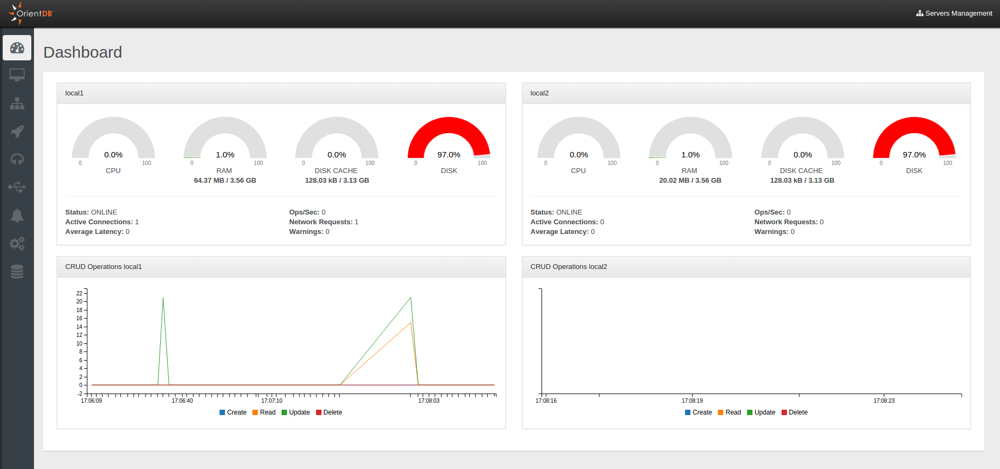

# Dashboard

Studio 2.2 Enterprise Edition includes a new easy to read and single-page Dashboard with costantly updated reports.
The Dashboard shows a graphical presentation of the current status and historical trends of each node joining your cluster. Performance indicators are reported in order to enable instantaneous and informed decisions which you can make at a glance.

Here you can see the Dashboard reporting the status of a cluster composed of two nodes.

For each node you can monitor several information divided in two main sections:
- System report
  - `CPU`, `RAM`, `DISK CACHE` and `DISK` used
  - `Status` of the node
  - `Operations per second`
  - `Active Connections`
  - `Network Request`
  - `Average Latency`
  - `Warnings`

- CRUD operations: includes a `Live Chart` of CRUD operations in real time.

