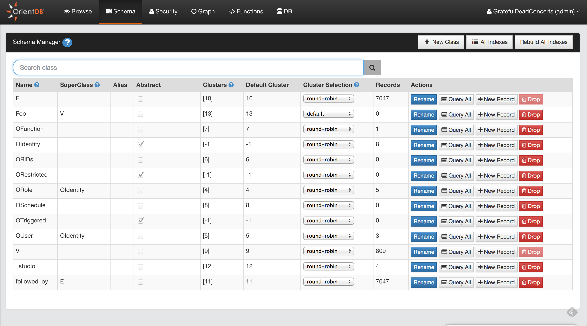
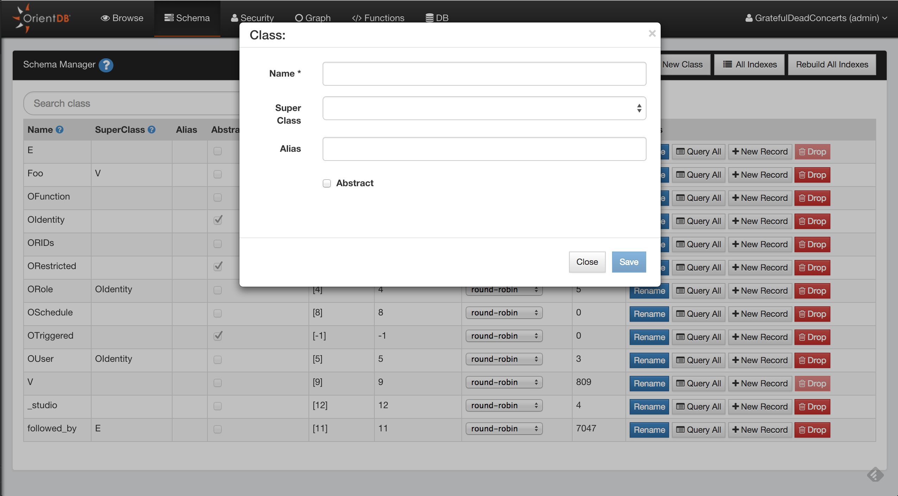
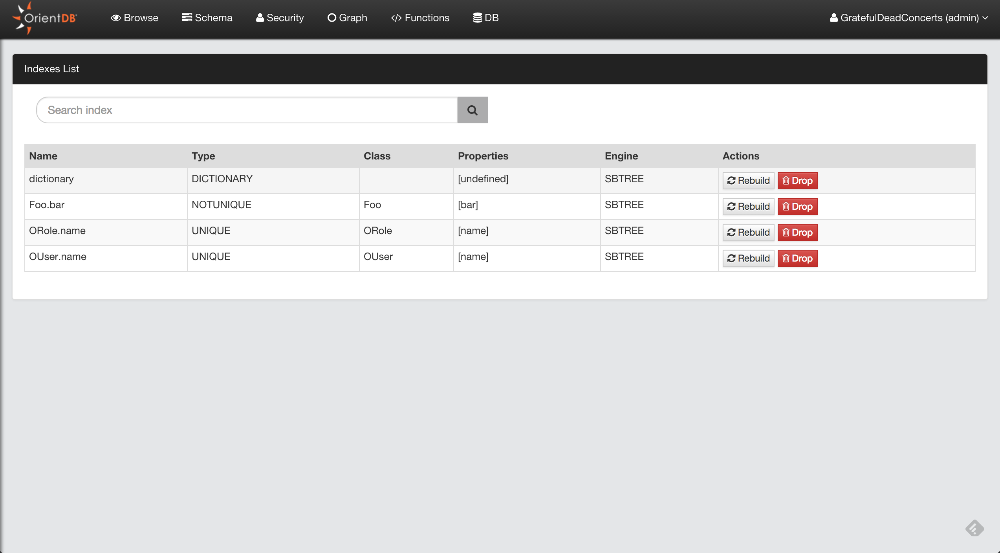

# Schema Manager

OrientDB can work in schema-less mode, schema mode or a mix of both. Here we'll discuss the schema mode. To know more about schema in OrientDB go [here](Schema.md)

Here you can :

* Browse all the Classes of your database
* Create a new Class
* Rename/Drop a Class
* Change the [cluster selection](SQL-Alter-Class.md) for a Class 
* [Edit](Class.md) a class by clicking on a class row in the table
* View all indexes created

## Create a new Class

To create a new Class, just click the **New Class** button.
Some information is required to create the new class.

* Name
* SuperClass
* Alias (Optional)
* Abstract 

Here you can find more information about [Classes](Schema.md#class)

## View all indexes

When you want to have an overview of all indexes created in your database, just click the **All indexes** button in the Schema UI. This will provide quick access to some information about indexes (name, type, properties, etc) and you can drop or rebuild them from here.

