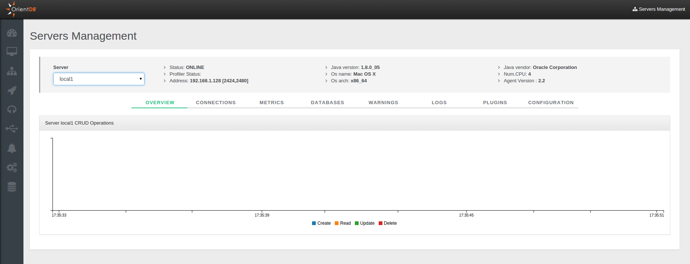
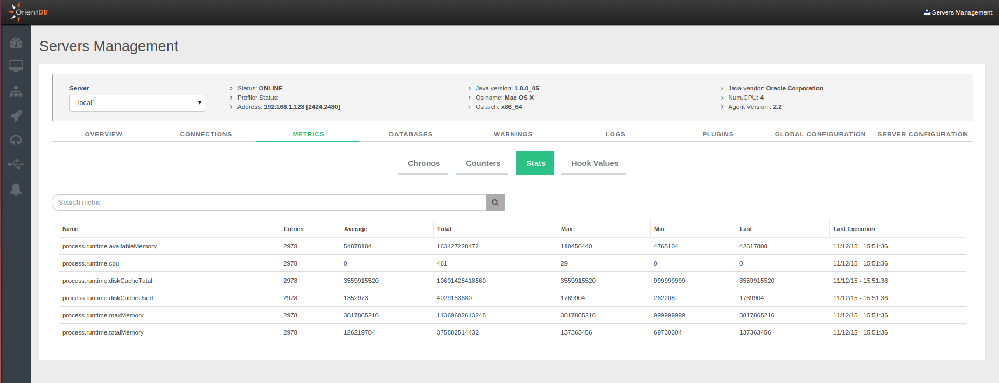
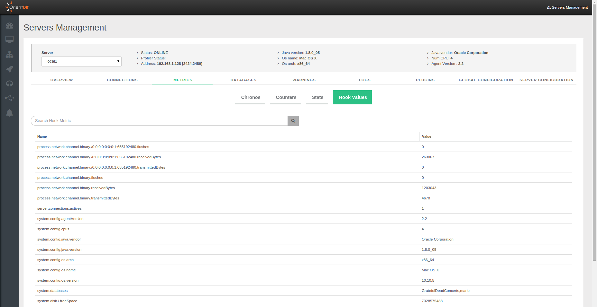
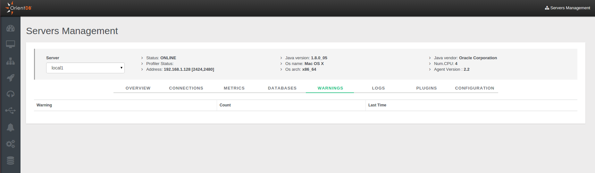
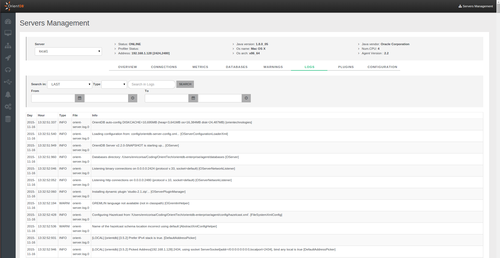
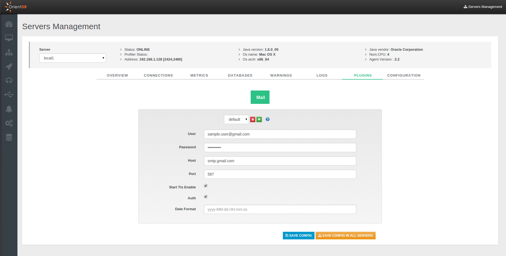
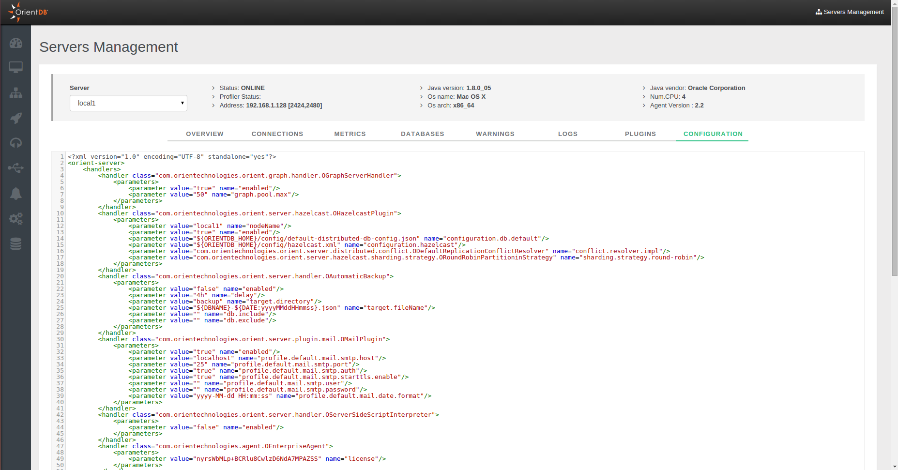

# Server Management
This is the section (available only for the Enterprise Edition) to work with OrientDB Server as DBA/DevOps. This control panel coming from OrientDB 2.1 Studio has been enriched with several new features for the new [Enterprise Edition](http://orientdb.com/enterprise/).

On the top of the page you can chose your server, visualize its system information and then navigate all statistics and facts related to it through the available tabs.

## Overview
This panel summarizes all the most important information about the current cluster:
- `CPU`, `RAM`, `DISK CACHE` and `DISK` used
- `Status`
- `Operations per second`
- `Active Connections`
- `Warnings`
- `Live chart` with CRUD operations in real-time

## Connections
It displays all the active connections to the server. For each connection reports the following information:
- `Session ID`, as the unique session number
- `Client`, as the unique client number
- `Address`, is the connection source
- `Database`, the database name used
- `User`, the database user
- `Total Requests`, as the total number of requests executed by the connection
- `Command Info`, as the running command
- `Command Detail`, as the detail about the running command
- `Last Command On`, is the last time a request has been executed
- `Last Command Info`, is the informaton about last operation executed
- `Last Command Detail`, is the informaton about the details of last operation executed
- `Last Execution Time`, is the execution time o last request
- `Total Working Time`, is the total execution time taken by current connection so far
- `Connected Since`, is the date when the connection has been created
- `Protocol`, is the protocol among [HTTP](OrientDB-REST.md) and [Binary](Network-Binary-Protocol.md)
- `Client ID`, a text representing the client connection
- `Driver`, the driver name
- `Commands`, a command button to `Interrupt` or `Kill` each session.

## Metrics
This panel shows all the metric in 4 different tabs. To know more about metrics you can view the [Profiler](https://github.com/orientechnologies/orientdb-docs/blob/master/Profiler.md) page on the [OrientDB Manual](http://orientdb.com/docs/last/index.html).
- `Chronos`

- `Counters` 

- `Stats`

- `Hook Values`

## Databases
It lists all databases created on the server. It is possible make a backup using the specific option.

## Warnings
It list all warning messages. For each you can see:
- `Warning`, as the warning message
- `Count`, as the number of that warnings
- `Last Time`, as the timestamp of the last warning message

## Logs
This panel shows all the logs present on the server. The information in each log row are presented divided as follows:
- `Day`
- `Hour`
- `Type`
- `File`
- `Info`

Moreover you can filter log messages through the specific panel, typing different parameters.

## Plugins
It helps you with the configuration of a new plugin, avoiding to edit the `config/orientdb-server-config.xml` configuration file.

## Configuration
You can consult in read-only mode the configuration of the server contained in the `config/orientdb-server-config.xml` file.

