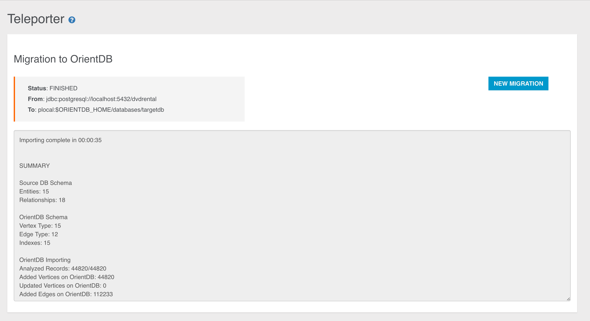
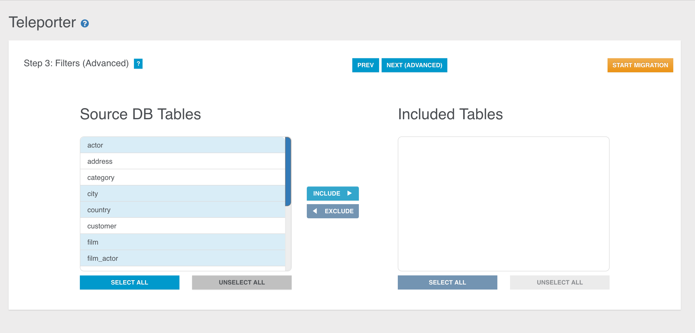
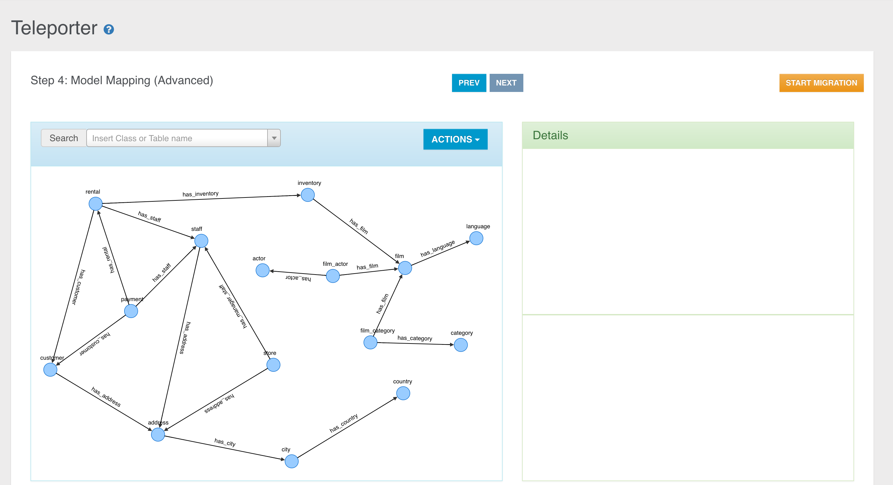
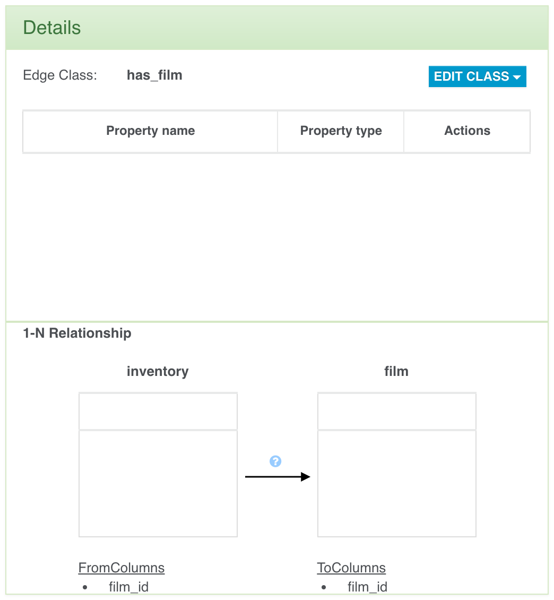
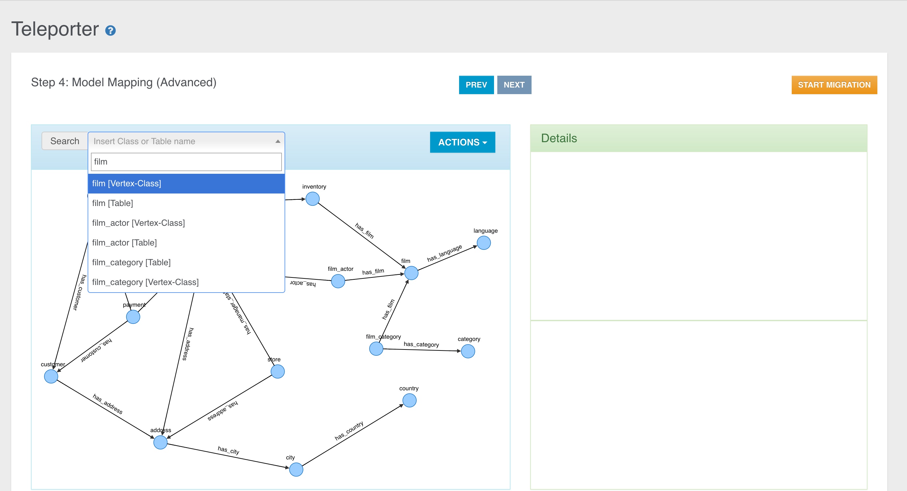
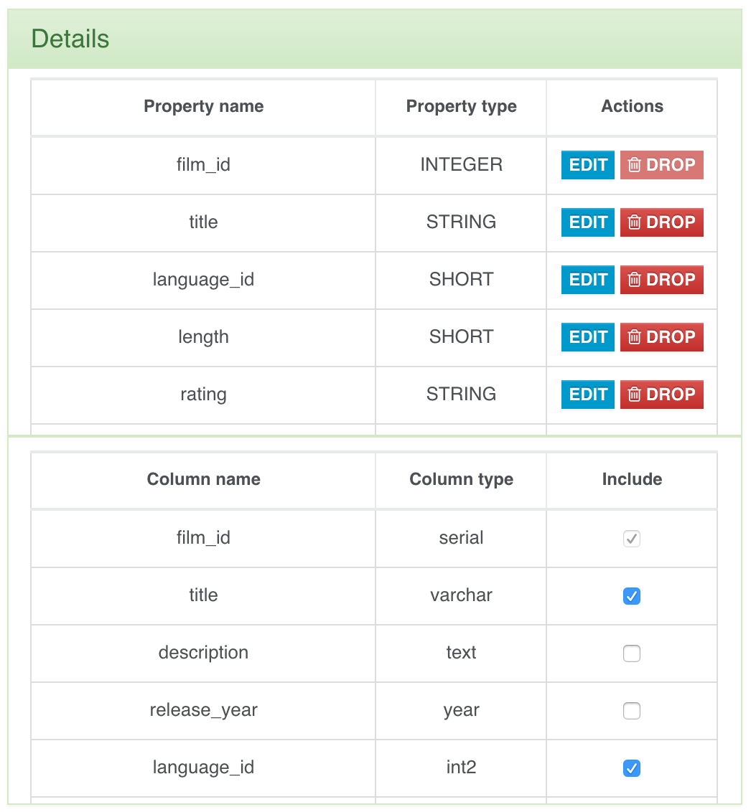
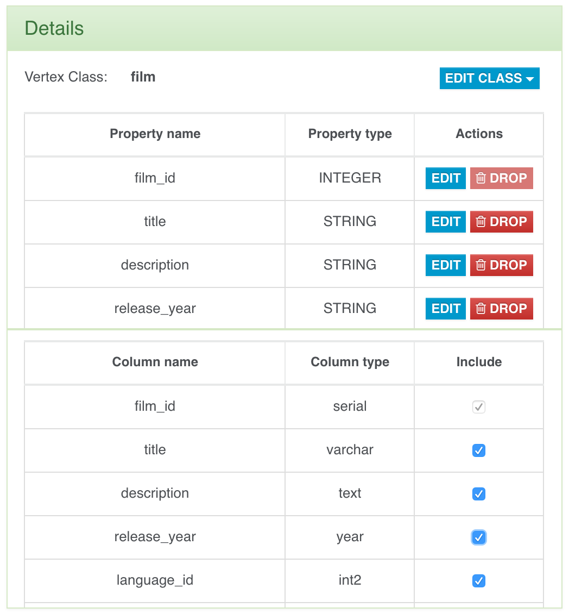
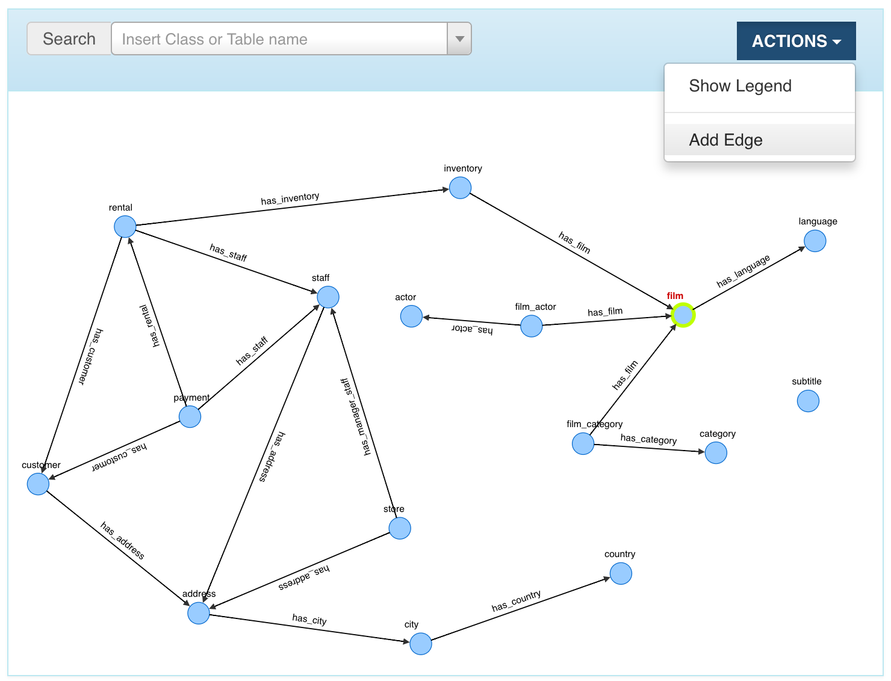
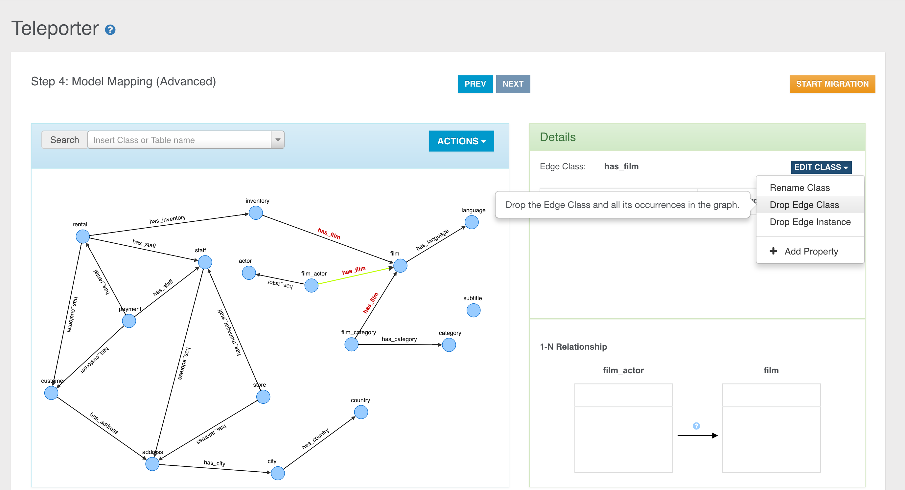

---
search:
   keywords: ['Studio', 'teleporter', 'enterprise']
---

# Teleporter

In Studio 2.2 you can configure the execution of the new Teleporter plugin, which allows you to import your relational database into OrientDB in few simple steps.
If you are interested in a detailed description of the tool, of its inner workings and features you can view the [Teleporter Documentation](Teleporter-Home.md).

NOTE: _This feature is available both for the [OrientDB Enterprise Edition](http://orientdb.com/orientdb-enterprise) and the [OrientDB Community Edition](http://orientdb.com/download/).

This visual tool consists in a wizard composed of 4 steps, where just **Step 1** and **Step 2** are necessary.
Let's have a look at each configuration step.

### Step 1

In the first step you have to type the following required parameters:
- `Database Driver`, as the driver name of the DBMS from which you want to execute the import. You have to choose among:
  - Oracle
  - SQLServer
  - Mysql
  - PostgreSQL
  - HyperSQL
- `Database Host`, as the host where you DBMS instance is running on
- `Port`, as the port where your DBMS is listening on
- `Database Name`, as the name of the source database
- `User Name`, as the username to access the source database (it may be blank)
- `Password`, as the password to access the source database (it may be blank)
- `OrientDB URL`, as the URL for the destination OrientDB graph database

After you typed all the required parameters for the migration you can test the connection.

### Step 2

In the second step you have to specify all the parameters about the OrientDB target database:
- `Connection protocol`, as the protocol adopted to write in OrientDB. You have to choose among:
  - plocal
  - memory
- `OrientDB Database Name`, as the name of the target database in OrientDB
- `Strategy`, as the strategy adopted during the migration
- `Name Resolver`, as the basic name resolver to adopt during names' resolution
- `Inheritance descriptor`, as the XML file containing all the info describing inheritance relationships present in the source database
- `Password`, as the password to access the source database (it may be blank)
- `Log Level`, as the log level adopted by Teleporter during the migration. You can choose among: 
  - NO
  - DEBUG
  - INFO
  - WARNING
  - ERROR
  

Now we have collected all the minimal info needed for the migration, so you can run your configured job through the `START MIGRATION` button, thus the job progress monitor will be displayed:

At the end of the migration, statistics and warnings about the process are reported as shown below:

Otherwise you can go on in your migrationg customisation jumping to the next step.

### Step 3

Here you can exploit Teleporter's filtering features: in the table on the left all the tables present in the source database are reported. If you want migrate just a subset of these tables you just have to select and move them in the right table through the specific buttons (you can also drag-and-drop the selected items).

You can perform the same operations also in the opposite direction, from the right table to the left one.

If the right table is empty, no filters will be applied. Instead, if the right table is not empty, just the selected tables will be imported while all the others will be filtered out. 
Thus, for example, this two configurations are equivalent:

Here too you can start your migration or go to the 4th and last configuration step.

### Step 4

In the last step Teleporter will provide you a Graph Model coming from the translation of the ER-Model inferred from the source database schema. The correspondent Graph Model is built according to basic mapping rules and your choices as well (filters applied, chosen strategy, name resolver adopted etc.).

You can see two panels, the Graph Panel on the left, containing the Graph Model built from Teleporter, and the Detail Panel on the right, reporting all the details about the current selected element in the left panel.

The details panel is divided into two sections... TODO!

This step is conceived to make very easy the graph model editing and the mapping with the source database schema. In fact you can modify the basic mapping 

  - Renaming classes (both for vertex and edge classes)
  - Excluding/re-including properties in a specific class mapped with a columns in the correspondent source table
  - Adding/dropping new properties
  - Properties editing
  - Edge adding
  - Investigating original schema data, both for tables and relationships
  
Let's have a deeper look at each of these operations.

###### Investigate Classes and source correspondent elements

1. Vertex class - Source Table

2. Edge Class - 1-N Relationship

Clicking the question poiints...TODO!

3. Edge Class - N-N Relationship

Clicking the question poiints...TODO!

###### Search Bar

In the graph model panel a useful search bar is provided to allow you fast vertex selecting according to the vertex class name or the source table name.

In the example above you can see that for each class we have two items, the vertex class name and the source table name. In this case each couple of items are equal because no classes were renamed nor a name resolver was adoted during the basic graph model building.

###### Class Renaming

You can rename a class just selecting an element in the graph (vertex or edge) and clicking the "Rename Class" button under the "Edit Class" dropdown menu.

Then you just have to choose the new name for the specific class.

The class will be renamed in the graph, in the search bar and in the detail panel of course.

###### Property Excluding

We have two ways to exclude a property mapped with a column in the source table:

1. Unflagging the correspondent column name in the source table perspective.

2. Dropping the property from the class perspective.

###### Property Dropping

TODO!

###### Property Adding

You can add new properties just clicking the "Add property" button under the "Edit Class" dropdown menu.

In the just opened window you can choose if add a new property never defined before, selecting the "Add new property" radio button, 

or re-include some excluded properties if any, selecting the "Include Property" radio button.

###### Property Including

We have two ways to exclude a property mapped with a column in the source table:

1. Flagging the correspondent column name in the source table perspective.

2. Including the property from the class perspective through the "Add property" button shown above.

###### Edge Adding

You can add an edge...TODO!

Then drag the edge...TODO!

A window will open...TODO!
Create new edge class...TODO!

Create new edge class instance...TODO!

###### Edge Dropping

You can delete:

1. Edge class with all its instances

2. A specific instance of an Edge Class

