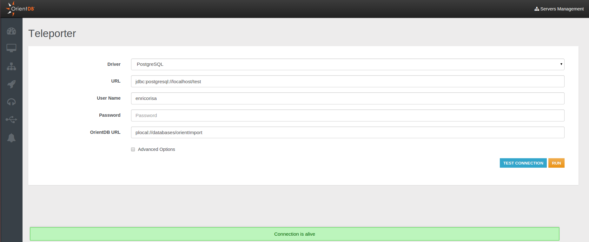
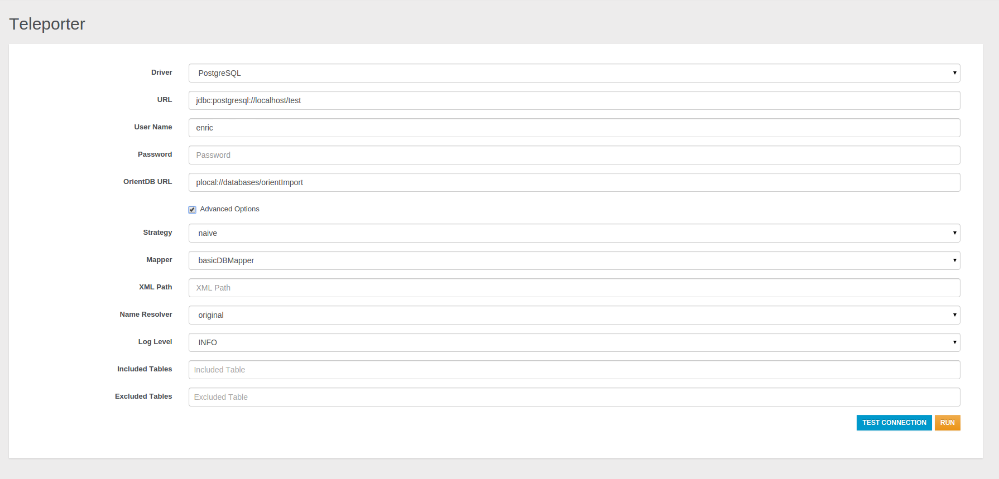
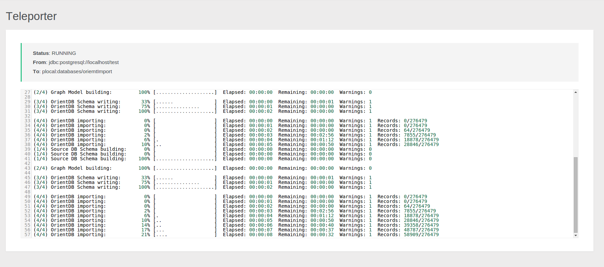
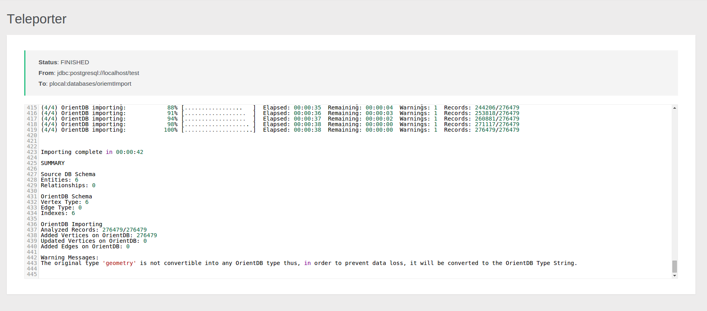

---
search:
   keywords: ['Studio', 'teleporter', 'enterprise']
---

# Teleporter

In Studio 2.2 Enterprise Edition you can configure the execution of the new Teleporter plugin, which allows you to import your relational database into OrientDB in few simple steps.
If you are interested in a detailed description of the tool, of its inner workings and features you can view the [Teleporter Documentation](Teleporter-Home.md).

NOTE: _This feature is available only in the [OrientDB Enterprise Edition](http://orientdb.com/orientdb-enterprise). If you are interested in a commercial license look at [OrientDB Subscription Packages](http://orientdb.com/support)_.

After you typed the required parameters for the migration you can test the connection.
The required parameters for the minimal import configuration are:
- `Driver`, as the driver name of the DBMS from which you want to execute the import (it's not case sensitive)
- `URL`, as the JDBC URL giving the location of the source database to import
- `User Name`, as the username to access the source database (it may be blank)
- `Password`, as the password to access the source database (it may be blank)
- `OrientDB URL`, as the URL for the destination OrientDB graph database

You can even access to the advanced import options explained in the [Teleporter Documentation](Teleporter-Home.md).

You can run your configured job through the `RUN` button, thus the job progress monitor will be displayed:

At the end of the migration, statistics and warnings about the process are reported as shown below:

