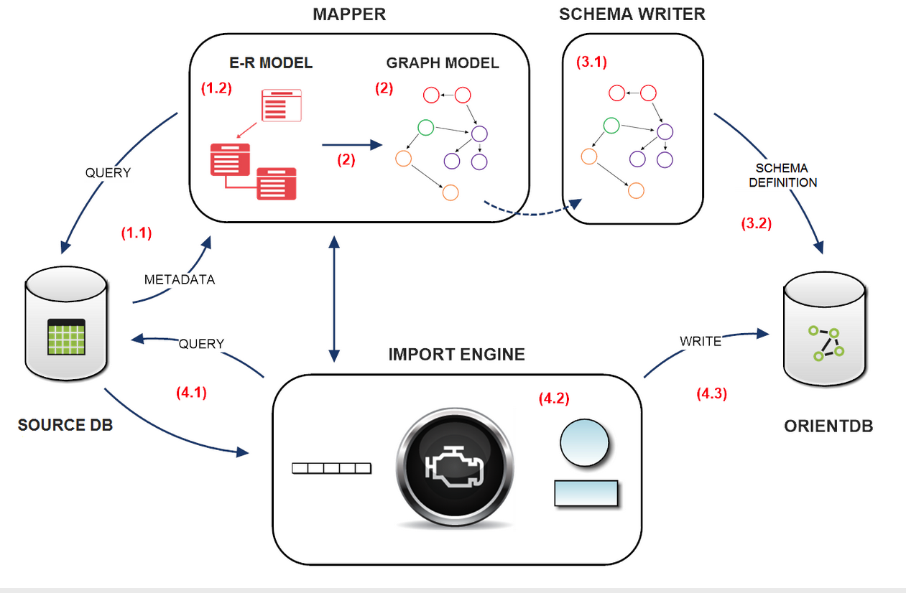
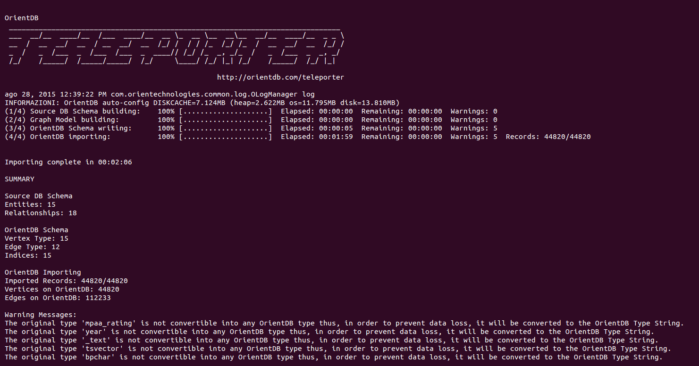

---
search:
   keywords: ['teleporter']
---

# Teleporter
**OrientDB Teleporter** is a tool that synchronizes a RDBMS to OrientDB database. You can use Teleporter to:
- Import your existing RDBMS to OrientDB
- Keep your OrientDB database synchronized with changes from the RDBMS. In this case the database on RDBMS remains the primary and the database on OrientDB a synchronized copy. [Synchronization](Teleporter-Sequential-Executions-and-One-Way-Synchronizer.md) is one way, so all the changes in OrientDB database will not be propagated to the RDBMS

Teleporter is fully compatible with several RDBMS that have a JDBC driver: we successfully tested Teleporter with Oracle, SQLServer, MySQL, PostgreSQL and HyperSQL. Teleporter manages all the necessary type conversions between the different DBMSs and imports all your data as Graph in OrientDB.

NOTE: _This feature is available only in the [OrientDB Enterprise Edition](http://orientdb.com/orientdb-enterprise). If you are interested in a commercial license look at [OrientDB Subscription Packages](http://orientdb.com/support)_.


## How Teleporter works
Teleporter looks for the specific DBMS meta-data in order to perform a logical inference of the source DB schema for the building of a corresponding graph model. Eventually the data importing phase is performed.

Teleporter has a pluggable importing strategy. Two strategies are provided out of the box:
- **naive** strategy, the simplest one
- **naive-aggregate** strategy. It performs a "naive" import of the data source. The data source schema is translated semi-directly in a correspondent and coherent graph model using an aggregation policy on the junction tables of dimension equals to 2    
     

To learn more about the two different execution strategies [click here.](Teleporter-Execution-Strategies.md)

## Usage
Teleporter is a tool written in Java, but can be used as a tool thanks to the teleporter.sh script (or .bat on Windows).

```
./oteleporter.sh -jdriver <jdbc-driver> -jurl <jdbc-url> -juser <username> 
                -jpasswd <password> -ourl <orientdb-url> [-s <strategy>]
                [-nr <name-resolver>] [-v <verbose-level>] 
                ([-include <table-names>] | [-exclude <table-names>]) 
                [-inheritance <orm-technology>:<ORM-file-url>] 
                [-conf <configuration-file-location>]
```

### Arguments
- **-jdriver** is the driver name of the DBMS from which you want to execute the import (it's not case sensitive)
- **-jurl** is the JDBC URL giving the location of the source database to import
- **-ourl** is the URL for the destination OrientDB graph database
- **-juser (optional)** is the username to access the source database
- **-jpasswd (optional)** is the password to access the source database
- **-s (optional)** is the strategy adopted during the importing phase. If not specified naive-aggregate strategy is adopted. Possible values: 
 - **naive**: performs a "naive" import of the data source. The data source schema is translated semi-directly in a correspondent and coherent graph model
 - **naive-aggregate**: performs a "naive" import of the data source. The data source schema is translated semi-directly in a correspondent and coherent graph model using an aggregation policy on the junction tables of dimension equals to 2
- **-nr (optional)** is the name of the resolver which transforms the names of all the elements of the source database
  according to a specific convention (if not specified original convention is adopted). Possible values: 
 - **original**: maintains the original name convention
 - **java**: performs name transformations on all the elements of the data source according to the Java convention
- **-v (optional)** is the level of verbosity printed to the output during the execution (if not specified INFO level will be adopted). Levels:
 - **0**: NO logging messages will be printed
 - **1**: DEBUG level logging messages
 - **2**: INFO level logging messages (default)
 - **3**: WARNING level logging messages
 - **4**: ERROR level logging messages
- **-include (optional)** allows you to import only the listed tables
- **-exclude (optional)** excludes the listed tables from the importing process
- **-inheritance (optional)** executes the import taking advantage of OrientDB's polymorphism 
- **-config** allows you to define a custom configuration for your importing job

## Access Credentials
By convention three users are always created by default each time a new database is built. Passwords are the same as the user name. Default users are:

- `admin`, with default password "`admin`", has access to all functions without limitation.
- `reader`, with default password "`reader`", is the classic read-only user. The reader can read any records but can't modify or delete them and has no access to internal information such as users and roles, themselves.
- `writer`, with the default password "`writer`", is like the user reader but can also create, update, and delete records.

For further informations about the Security of the OrientDB database [click here.](https://github.com/orientechnologies/orientdb-docs/blob/master/Database-Security.md)

## Examples
   
### Importing "testdb" from PostgreSQL DBMS with default parameters

Using plocal connection:
```
./oteleporter.sh -jdriver postgresql -jurl jdbc:postgresql://localhost:5432/testdb 
                -juser username -jpasswd password -ourl plocal:$ORIENTDB_HOME/databases/testdb
```   
Using remote connection:
```
./oteleporter.sh -jdriver postgresql -jurl jdbc:postgresql://localhost:5432/testdb 
                -juser username -jpasswd password -ourl remote:localhost/testdb
```   


With these parameters it will be performed an import according to the default settings:

- strategy adopted: **naive-aggregate**
- name resolver: **original name resolver**
- level of verbosity: **INFO** (2nd level)

### Importing "testdb" from PostgreSQL DBMS with customized optional parameters

Using plocal connection:
```
./oteleporter.sh -jdriver postgresql -jurl jdbc:postgresql://localhost:5432/testdb 
                -juser username -jpasswd password -ourl plocal:$ORIENTDB_HOME/databases/testdb 
                -s naive -nr java -v 1
```             
Using remote connection:
```
./oteleporter.sh -jdriver postgresql -jurl jdbc:postgresql://localhost:5432/testdb 
                -juser username -jpasswd password -ourl remote:localhost/testdb 
                -s naive -nr java -v 1
```  

With these parameters it will be performed an import according to the chosen settings:

- strategy adopted: **naive**
- name resolver: **java name resolver**
- level of verbosity: **DEBUG** (1st level)


## Teleporter Execution
Teleporter execution consists of 4 steps:     
        
1. **Source DB Schema Building:** the source database schema is built by querying the source DB metadata.      
2. **Graph Model Building:** a correspondent and coherent Graph Model is built.       
3. **OrientDB Schema Writing:** the OrientDB schema is written according to the Graph Model in memory.      
4. **OrientDB importing:** importing data from source database to OrientDB.

Thus the whole workflow is:




Below is reported a Teleporter execution dump:             


