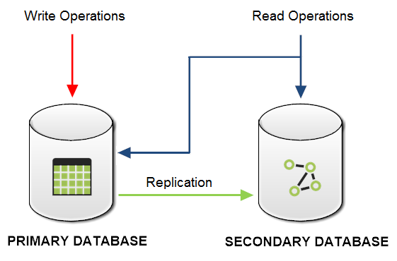

# Sequential Executions and One-Way Synchronizer
Teleporter is conceived to support many sequential executions from the same source DB to the same graph DB of OrientDB, in this way you can:

- **personalize your import,** combining the different strategies and settings by including or excluding the chosen tables and by running Teleport more times in order to obtain a more complex and customized import strategy
- **use it as a one-way synchronizer** and maintain a copy of your DB: all the changes applied to the source DB (primary DB) are propagated to the imported graph DB, but not vice versa.

A sample migration scenario is reported below:

##Synchronization policy
Teleporter propagates the applied changes of the source DB both for the schema and for the records following the policy described below:       

**1. SCHEMA SYNCHRONIZATION (Full Synchronization)**      

| SOURCE DB SCHEMA |         | TARGET ORIENTDB SCHEMA | SYNCH |
|------------------|---------|------------------------|-------|       
| Add Operation    |   -->   | Add Operation          |  YES  |  
| Delete Operation |   -->   | Delete Operation       |  YES  |
| Update Operation |   -->   | Update Operation       |  YES  |    
****
**2. RECORDS SYNCHRONIZATION (Delete-less Synchronization)**   

| SOURCE DB        |         | TARGET ORIENTDB GRAPHDB | SYNCH |
|------------------|---------|-------------------------|-------|        
| Add Operation    |   -->   | Add Operation           |  YES  |       
| Delete Operation |   -->   | No Operation            |  NO  |
| Update Operation |   -->   | Update Operation        |  YES  |   

