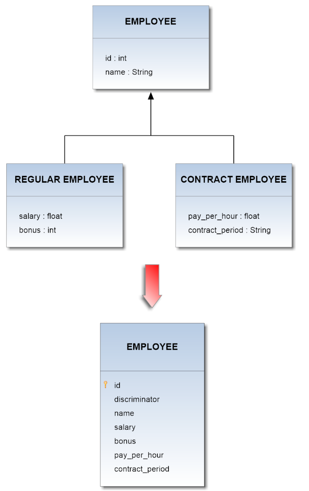
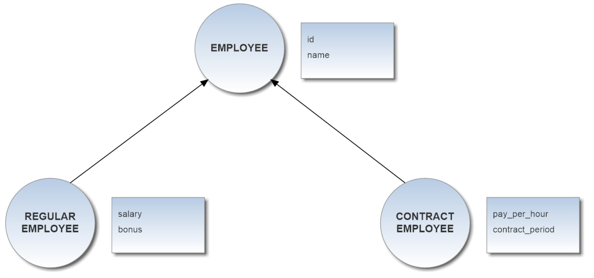

# Single Table Inheritance

Single Table strategy is the simplest and typically the best performing solution. By this inheritance strategy, we can map the whole hierarchy through a single table. The table will have a column for every attribute of every class in the hierarchy and an extra column (also known as **discriminator** column) is created in the table to identify the class.    

## Example
     
Now suppose you want to map the whole hierarchy given below into a coherent relational database schema. The **Employee** class is a superclass both for **Regular_Employee** and **Contract_Employee** classes. The **type** attribute acts as discriminator column.  
The application of the above described pattern leads to the DB schema shown in the following diagram:       

       

The correspondent mapping file for this hierarchy should be:
```
<?xml version='1.0' encoding='UTF-8'?>  
<!DOCTYPE hibernate-mapping PUBLIC 
   "-//Hibernate/Hibernate Mapping DTD 3.0//EN"
   "http://www.hibernate.org/dtd/hibernate-mapping-3.0.dtd">

<hibernate-mapping>
	<class name="Employee" table="EMPLOYEE"
		discriminator-value="emp">
		<id name="id" column="id">
			<generator class="increment"></generator>
		</id>

		<discriminator column="type" type="string"></discriminator>
		<property name="name" column="name"></property>

		<subclass name="Regular_Employee"
			discriminator-value="reg_emp">
			<property name="salary" column="salary"></property>
			<property name="bonus" column="bonus"></property>
		</subclass>

		<subclass name="Contract_Employee"
			discriminator-value="cont_emp">
			<property name="payPerHour" column="pay_per_hour"></property>
			<property name="contractDuration" column="contract_duration"></property>
		</subclass>
	</class>
</hibernate-mapping>  
```     

Taking advantage of this inheritance-feature on the proposed model above, you will get the following schema in OrientDB:      

    

If you deal with a multi-level inheritance relationships in the DB, you have to represent them in the ORM file by recursively nesting each definition according to the hierarchical dependences being between the Entities of the model.
