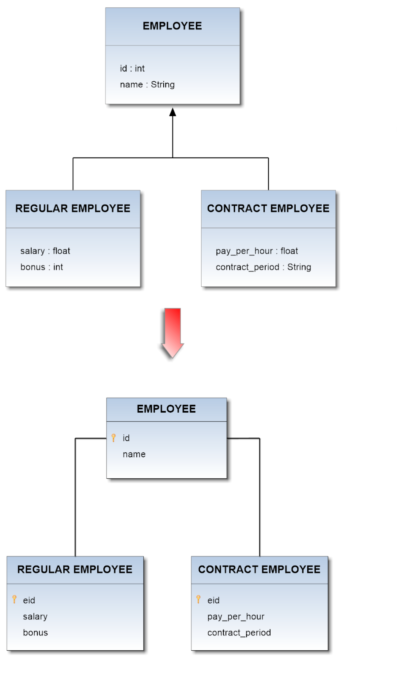

# Table Per Class Inheritance
Table Per Class strategy is the most logical inheritance solution because it mirrors the object model in the data model. In this pattern a table is defined for each class in the inheritance hierarchy to store only the local attributes of that class. 
All classes in the hierarchy must share the same id attribute.  

Some JPA providers support Table Per Class Inheritance with or without a discriminator column, some required the discriminator column, and some don't support the discriminator column. This pattern doesn't seem to be fully standardized yet. On Hibernate a discriminator column is supported but not required.
     
## Example

Now suppose you want to map the whole hierarchy given below into a coherent relational database schema. The **Employee** class is a superclass both for **Regular_Employee** and **Contract_Employee** classes.    
The application of the above described pattern leads to the DB schema shown in the following diagram:  

       

There are two equivalent mapping file to represent this hierarchy:     
1.
```
<?xml version='1.0' encoding='UTF-8'?>  
<!DOCTYPE hibernate-mapping PUBLIC 
   "-//Hibernate/Hibernate Mapping DTD 3.0//EN"
   "http://www.hibernate.org/dtd/hibernate-mapping-3.0.dtd">

<hibernate-mapping>
	<class name="Employee" table="EMPLOOYEE">
		<id name="id" column="id">
			<generator class="increment"></generator>
		</id>

		<property name="name" column="name"></property>

		<joined-subclass name="Regular_Employee"
			table="REGULAR EMPLOYEE">
			<key column="eid"></key>
			<property name="salary" column="salary"></property>
			<property name="bonus" column="bonus"></property>
		</joined-subclass>

		<joined-subclass name="Contract_Employee"
			table="CONTRACT EMPLOYEE">
			<key column="eid"></key>
			<property name="payPerHour" column="pay_per_hour"></property>
			<property name="contractDuration" column="contract_duration"></property>
		</joined-subclass>
	</class>
</hibernate-mapping>      
```     
2.
```
<?xml version='1.0' encoding='UTF-8'?>  
<!DOCTYPE hibernate-mapping PUBLIC 
   "-//Hibernate/Hibernate Mapping DTD 3.0//EN"
   "http://www.hibernate.org/dtd/hibernate-mapping-3.0.dtd">

<hibernate-mapping>
	<class name="Employee" table="EMPLOYEE">
		<id name="id" column="id">
			<generator class="increment"></generator>
		</id>
        <discriminator column="type" type="string" />
		<property name="name" column="name"></property>

		<subclass name="Regular_Employee" discriminator-value="R">
			<join table="REGULAR EMPLOYEE">
				<key column="eid"></key>
				<property name="salary" column="salary"></property>
				<property name="bonus" column="bonus"></property>
			</join>
		</subclass>

		<subclass name="Contract_Employee" discriminator-value="C">
			<join table="CONTRACT EMPLOYEE">
				<key column="eid"></key>
				<property name="payPerHour" column="par_per_hour"></property>
				<property name="contractDuration" column="contract_duration"></property>
			</join>
		</subclass>
	</class>
</hibernate-mapping>  
```     

Taking advantage of this inheritance-feature on the proposed model above, you will get the following schema in OrientDB:      

     

If you deal with a multi-level inheritance relationships in the DB, you have to represent them in the ORM file by recursively nesting each definition according to the hierarchical dependences being between the Entities of the model.
