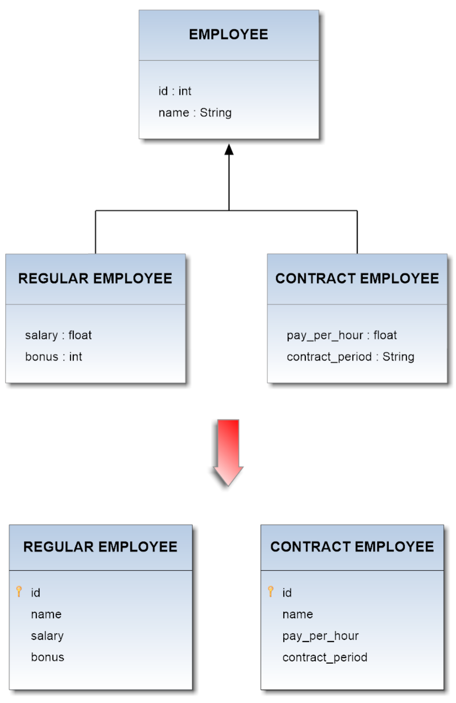

# Table Per Concrete Class Inheritance
In Table Per Concrete Class strategy a table is defined for each concrete class in the inheritance hierarchy to store all the attributes of that class and all of its superclasses. This strategy is optional in several ORM technologies (e.g. JPA), and querying root or branch classes can be very difficult and inefficient.      
      
## Example
      
Now suppose you want to map the whole hierarchy given below into a coherent relational database schema. The **Employee** class is a superclass both for **Regular_Employee** and **Contract_Employee** classes.    
The application of the above described pattern leads to the DB schema shown in the following diagram:    

       

The correspondent mapping file for this hierarchy should be:   
```
<?xml version='1.0' encoding='UTF-8'?>  
<!DOCTYPE hibernate-mapping PUBLIC 
   "-//Hibernate/Hibernate Mapping DTD 3.0//EN"
   "http://www.hibernate.org/dtd/hibernate-mapping-3.0.dtd">

<hibernate-mapping>
	<class name="Employee" table="EMPLOYEE">
		<id name="id" column="id">
			<generator class="increment"></generator>
		</id>

		<property name="name"  column="name"></property>

		<union-subclass name="Regular_Employee"
			table="REGULAR EMPLOYEE">
			<property name="salary" column="salary"></property>
			<property name="bonus" column="bonus"></property>
		</union-subclass>

		<union-subclass name="Contract_Employee"
			table="CONTRACT EMPLOYEE">
			<property name="payPerHour" column="pay_per_hour"></property>
			<property name="contractDuration" column="contract_duration"></property>
		</union-subclass>
	</class>
</hibernate-mapping>      
```     

Taking advantage of this inheritance-feature on the proposed model above, you will get the following schema in OrientDB:      

     

If you deal with a multi-level inheritance relationships in the DB, you have to represent them in the ORM file by recursively nesting each definition according to the hierarchical dependences being between the Entities of the model.
