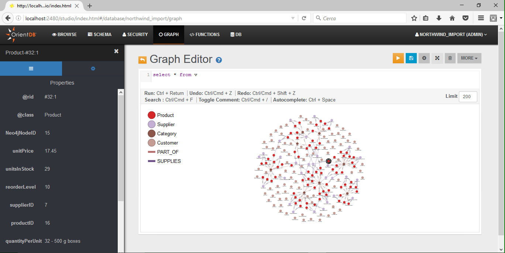
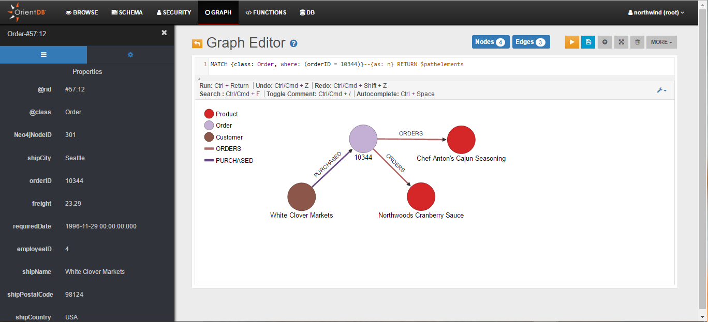

---
search:
   keywords: ['neo4j to orientdb importer', 'import', 'Neo4j', 'migration', 'northwind', 'cypher', 'tutorial']
---

# Tutorial: Importing the *northwind* Database from Neo4j

In this tutorial we will use the [_Neo4j to OrientDB Importer_](OrientDB-Neo4j-Importer.md) to import the Neo4j *northwind* example database into OrientDB.

For general information on the possible Neo4j to OrientDB migration strategies, please refer to the [Import from Neo4j](Import-from-Neo4j-into-OrientDB.md) section. 

>Neo4j and Cypher are registered trademark of Neo Technology, Inc.


## Preparing for the migration

Please download and install OrientDB:

<pre><code class="lang-sh">$ wget {{ book.download_multiOS }} -O orientdb-community-{{book.lastGA}}.zip
$ unzip orientdb-community-{{book.lastGA}}</code></pre>

Download and install the _Neo4j to OrientDB Importer_:

<pre><code class="lang-sh">$ wget http://central.maven.org/maven2/com/orientechnologies/orientdb-neo4j-importer/{{book.lastGA}}/orientdb-neo4j-importer-{{book.lastGA}}.tar.gz
$ tar xfv orientdb-neo4j-importer-{{book.lastGA}}.tar.gz -C orientdb-community-{{book.lastGA}} --strip-components=1 </code></pre>

For further information on the OrientDB's installation, please refer to this [section](Tutorial-Installation.md).

For further information on the _Neo4j to OrientDB Importer_ installation, please refer to this [section](OrientDB-Neo4j-Importer.md#installation).


## Starting the migration

Assuming that:

* `/home/santo/neo4j/neo4j-community-3.0.7/lib` is the full path to the directory that includes the Neo4j's libraries

* `/home/santo/data/graph.db_northwind` is the full path to the directory that contains the Neo4j's _northwind_ database

* `/home/santo/orientdb/orientdb-community-2.2.12/databases/northwind_import` is the full path to the directory where you would like to migrate the _northwind_ database

* that no Neo4j and OrientDB servers are running on those directories

you can import the _northwind_ database with a command similar to the following:

```
./orientdb-neo4j-importer.sh \
  -neo4jlibdir /home/santo/neo4j/neo4j-community-3.0.7/lib \
  -neo4jdbdir /home/santo/neo4j/data/graph.db_northwind \
  -odbdir /home/santo/orientdb/orientdb-community-2.2.12/databases/northwind_import
```

For further information on how to use the _Neo4j to OrientDB Importer_, please refer to this [section](OrientDB-Neo4j-Importer.md#usage).


## Migration output

The following is the output that is written by the _Neo4j to OrientDB Importer_ during the `northwind` database migration:

```
Neo4j to OrientDB Importer v.2.2.12-SNAPSHOT - Copyrights (c) 2016 OrientDB LTD

WARNING: 'o' option not found. Defaulting to 'false'.

Please make sure that there are no running servers on:
  '/home/santo/neo4j/data/graph.db_northwind' (Neo4j)
and:
  '/home/santo/orientdb/orientdb-community-2.2.12/databases/northwind_import' (OrientDB)

Initializing Neo4j...Done

Initializing OrientDB...Done

Importing Neo4j database:
  '/home/santo/neo4j/data/graph.db_northwind'
into OrientDB database:
  '/home/santo/orientdb/orientdb-community-2.2.12/databases/northwind_import'

Getting all Nodes from Neo4j and creating corresponding Vertices in OrientDB...
  1035 OrientDB Vertices have been created (100% done)
Done

Creating internal Indices on property 'Neo4jNodeID' on all OrientDB Vertices Classes...
  5 OrientDB Indices have been created (100% done)
Done

Getting all Relationships from Neo4j and creating corresponding Edges in OrientDB...
  3139 OrientDB Edges have been created (100% done)
Done

Getting Constraints from Neo4j and creating corresponding ones in OrientDB...
  0 OrientDB Indices have been created
Done

Getting Indices from Neo4j and creating corresponding ones in OrientDB...
  5 OrientDB Indices have been created (100% done)
Done

Import completed!

Shutting down OrientDB...Done
Shutting down Neo4j...Done

===============
Import Summary:
===============

- Found Neo4j Nodes                                                        : 1035
-- With at least one Label                                                 :  1035
--- With multiple Labels                                                   :   0
-- Without Labels                                                          :  0
- Imported OrientDB Vertices                                               : 1035 (100%)

- Found Neo4j Relationships                                                : 3139
- Imported OrientDB Edges                                                  : 3139 (100%)

- Found Neo4j Constraints                                                  : 0
- Imported OrientDB Constraints (Indices created)                          : 0

- Found Neo4j (non-constraint) Indices                                     : 5
- Imported OrientDB Indices                                                : 5 (100%)

- Additional created Indices (on vertex properties 'Neo4jNodeID')          : 5

- Total Import time:                                                       : 29 seconds
-- Initialization time                                                     :  7 seconds
-- Time to Import Nodes                                                    :  6 seconds (181.67 nodes/sec)
-- Time to Import Relationships                                            :  7 seconds (459.79 rels/sec)
-- Time to Import Constraints and Indices                                  :  4 seconds (1.21 indices/sec)
-- Time to create internal Indices (on vertex properties 'Neo4jNodeID')    :  4 seconds (1.22 indices/sec)
```


## Connecting to the newly imported Database

General information on how to connect to a newly imported database can be found in [this](OrientDB-Neo4j-Importer.md#connecting-to-the-newly-imported-database) section. 

The following is a partial visualization of the _northwind_ database done with the Graph Editor included in the OrientDB's [Studio](Studio-Home-page.md) tool:



As you can see from the _Limit_ field, the visualization is limited to 200 vertices.

The following, instead, is the graph returned by the following [MATCH](SQL-Match.md) query (the query returns all nodes connected to the Order with `orderID` 10344):

```sql
MATCH {class: Order, where: (orderID = 10344)}--{as: n} RETURN $pathelements
```



From Studio's [Schema Manager](Studio-Schema.md), you can check all imported Vertex Classes (node Labels in Neo4j), Edge Classes (Relationship Types in Neo4j), and Indexes:


`V` and `E` are special classes: they include all Vertices and all Edges.