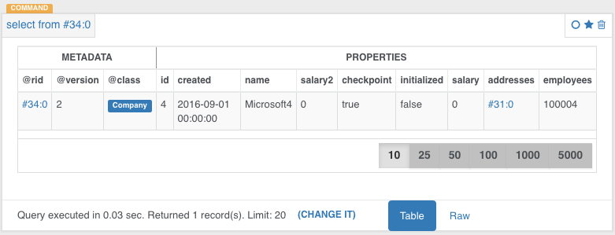

---
search:
   keywords: ["tutorial", "record ID", "rid", "load"]
---


<!-- last modified 2016-09-01 Matt -->

# Record ID

Now that you understand how [classes](Tutorial-Classes.md) model your data in OrientDB and how [clusters](Tutorial-Clusters.md) organize data within those classes we can talk about how records are physically stored and retrieved. In this section of the tutorial you will learn...
- How a record is uniquely identified within a database. 
- How many records your database in OrientDB is capable of managing (thousands of trillions). 
- How to directly access any record in your database by using its Record ID with [console](Tutorial-Run-the-console.md) and [studio](Tutorial-Run-the-studio.md).

In OrientDB, each record has its own self-assigned unique ID within the database called [Record ID](Concepts.md#wiki-RecordID) or RID. It is composed of two parts:

```
#<cluster-id>:<cluster-position>
```

That is,

- `<cluster-id>` The cluster identifier.
- `<cluster-position>` The position of the data within the cluster.

Each database can have a maximum of 32,767 clusters, or 2<sup>15</sup> - 1.  Each cluster can handle up to 9,223,372,036,780,000 records, or 2<sup>63</sup>, namely 9,223,372 billion records.

> The maximum size of a database is 2<sup>78</sup> records, or 302,231,454,903 trillion records.  Due to limitations in hardware resources, OrientDB has not been tested at such high numbers, but there are users working with OrientDB in the billions of records range.

## Loading Records

Each record has a [Record ID](Concepts.md#RecordID), which notes the physical position of the record inside the database. What this implies is that when you load a record by its RID, the load is significantly faster than it would be otherwise.

In document and relational databases the more data that you have, the slower the database responds. OrientDB handles relationships as physical links (edges) to the records. The relationship is only assigned once (when the edge is created), thus a look-up by RID takes a constant order of time `O(1)`. You can compare this to relational databases, which compute the relationship every time the database is run `O(log N)`.  In OrientDB, the size of a database does not effect the traverse speed. The speed remains constant, whether for one record or one hundred billion records. This is a critical feature in the age of Big Data.

### Console Load

To directly load a record, use the [`LOAD RECORD`](Console-Command-Load-Record.md) command in the console.

<pre>
orientdb> <code class="lang-sql userinput">LOAD RECORD #34:0</code>

DOCUMENT @class:Company @rid:#34:0 @version:2
+----+-----------+---------------------+
|#   |NAME       |VALUE                |
+----+-----------+---------------------+
|0   |id         |4                    |
|1   |created    |2016-09-01 00:00:00  |
|2   |name       |Microsoft4           |
|3   |salary2    |0.0                  |
|4   |checkpoint |true                 |
|5   |initialized|false                |
|6   |salary     |0.0                  |
|7   |addresses  |[NOT LOADED: #31:0]  |
|8   |employees  |100004               |
+----+-----------+---------------------+
</pre>

The [`LOAD RECORD`](Console-Command-Load-Record.md) command returns some useful information about this record. It shows that:

- The record is a [document](Concepts.md#document). OrientDB supports different types of records, but document is the only type covered in this chapter.

- It belongs to the `Company` class.

- Its current version is `2`. OrientDB uses an [MVCC system](Transactions.md#Optimistic-Transaction).  Every time you update a record, its version increments by one.

- We have different field types: 
   - floats for `salary` and `salary2`
   - integers for `employees` and `id`
   - string for `name` 
   - booleans for `initialized` and `checkpoint`
   - date-time for `created`.

- The field `addresses` has been `NOT LOADED`. It is also a `LINK` to another record, `#31:0`.  This is a relationship. For more information on this concept, see [Relationships](Tutorial-Relationships.md).  

### Studio Load

OrientDB studio does not support the `LOAD RECORD` command. You will use SQL syntax in order to retrieve the a record by record ID when using Studio. We haven't gotten to OrientDB's SQL yet but for now you should just know that OrientDB does support it's own flavor of SQL. In it you do not have to use the `*` to project all columns of a record. 

To do a direct look-up by Record ID we simply go to the browser window in Studio and type the following into the query editor:

<pre>
<code class="lang-sql userinput">select from #34:0</code>
</pre>

Then press the green 'run' button, to see the record you selected.

This code tells OrientDB to project all attributes and values of the record whose ID is passed in. 



## Congratulations

You now know a little bit about how records are stored and retrieved in OrientDB. With practice you will gain an intuition for how to use Record IDs directly to optimize your queries. Seeing as OrientDB can hold trillions of records, it is advantageous to leverage a direct look-up by Record ID whenever possible for big data sets.

Next we will move on to relationships in OrientDB.
