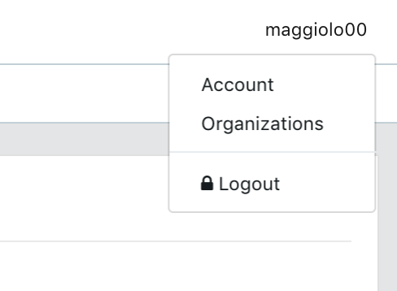
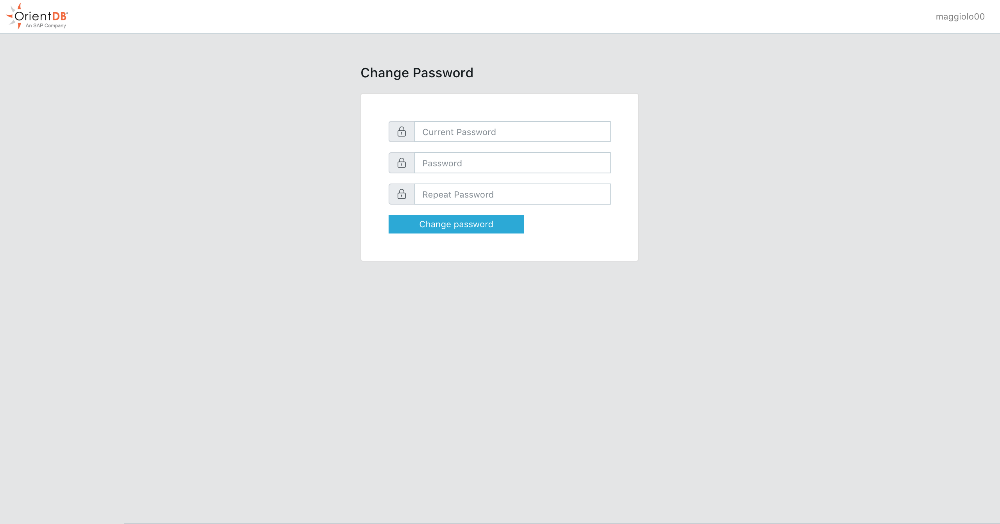
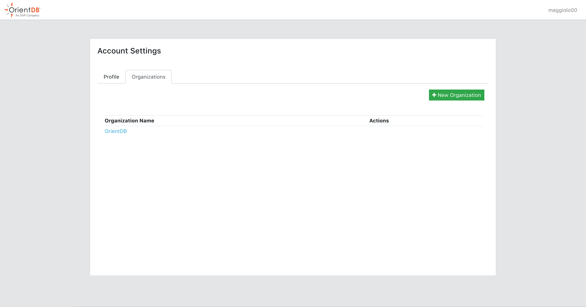
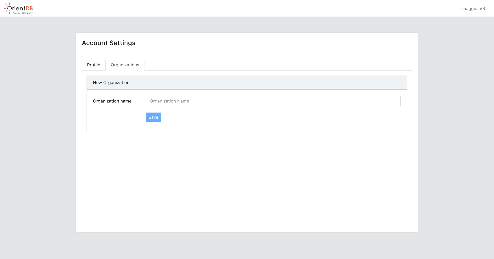

search:
   keywords: ['CLOUD', 'DASHBOARD']
---

## Cloud Account

To use the cloud dashboard click [here](https://cloud.orientdb.com/#/create-account) and create an account by filling the form.

Follow the instructions on the registration email in order to activate the account.

Once the account is activated you can login [here](https://cloud.orientdb.com/#/login) by using the username and password provided in the registration form.

Once logged in you can

- Edit your account
- Organization management

By using your profile menu

### Edit your account

Here you can edit your basic information.

Or change password by clicking on "Change Password" 

### Organization management

Here you can see all your organizations and create new ones.

When you create an organization you are automatically added as Organization Administrator.

To create an organization

1. Go to "Organizations" (Dropdown menu and click on "Organizations")
2. Click "New Organization"
3. Enter the name of the Organization
4. Click Save

Once created you will be redirected to the newly organization management [page](Cloud-Organizations-Projects.md).

