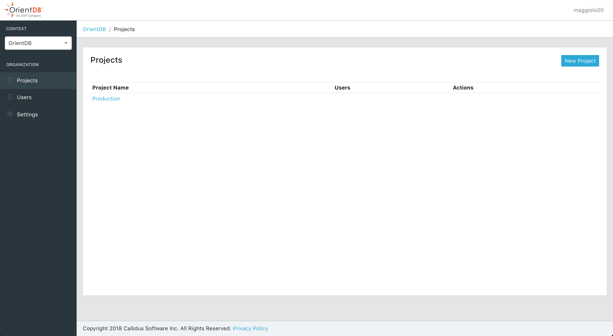

search:
   keywords: ['CLOUD', 'DASHBOARD']
---

## Organizations and Projects

### Organizations

An organization can contain multiple projects.

> To create a an organization follow this [documentation](Cloud-Account.md#organization-management) 

In the organization structure you can:

- [Manage all projects in the organization](#manage-projects)
- [Manage users](#manage-users)
- [View organization settings](#organization-settings)

#### Manage Projects

By clicking "Projects" in the sidebar menu of the Organization panel you can view all the projects associated within the selected organization.

#### Create a new project

> To create a new project for an organization you must be an administrator of the organization. 

1. Select an Organizzation 
2. Go to the project list [page](#manage-projects)
3. Click "New Project"
4. Enter the name of the project
5. Click "Save"

Once the project is created you can start to monitor OrientDB instances within the project.

See also [Projects](Cloud-Projects.md).

#### Manage users

By clicking "Users" in the sidebar menu of the Organization panel you can view all the users associated within the selected organization.

##### Add User

> To associate user to an organization you must be an administrator of the organization. 

1. Select an Organizzation 
2. Go to the users list [page](#manage-users)
3. Click "Add User"
4. Enter the email and the role for the user.
5. Click "Add User"

> Supported roles are Admin and Member. Member role are read only within the organization.

#### Organization settings

