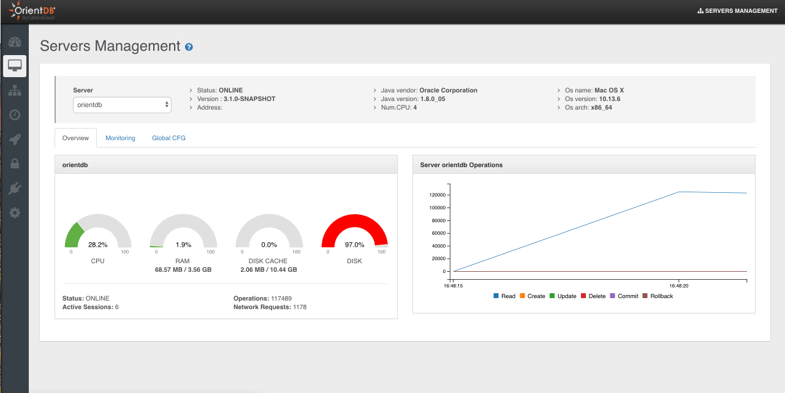
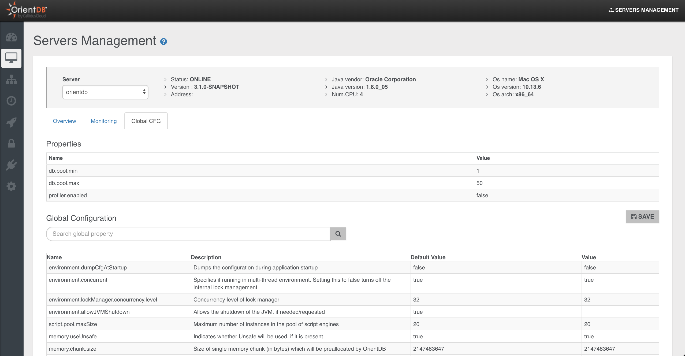

# Server Management

This is the section to work with OrientDB Server as DBA/DevOps with [Enterprise Edition](http://orientdb.com/enterprise/).

> Only users with grant `server.metrics` can see this section 
> 
This page contains detailed information about the selected node.

General information are:

- `Number of CPUs`
- `Status of the node`
- `Java information`
- `OS information`
- `OrientDB version`

Then 3 sub-sections are available:

- Overview
- Monitoring
- Global Configuration

## Overview
This page summarizes all the most important information about the current server:

- `Server status`
- `Operations`
- `Active Sessions`
- `CPU`, `RAM` and `DISK` used
- `Live chart` with CRUD operations in real-time

## Monitoring

### Connections

Displays all the active sessions to the server. Each session reports the following information:

- `Session ID`, as the unique session number
- `Client`, as the unique client number
- `Address`, is the connection source
- `Database`, the database name used
- `User`, the database user
- `Total Requests`, as the total number of requests executed by the connection
- `Command Info`, as the running command
- `Command Detail`, as the detail about the running command
- `Last Command On`, is the last time a request has been executed
- `Last Command Info`, is the informaton about last operation executed
- `Last Command Detail`, is the informaton about the details of last operation executed
- `Last Execution Time`, is the execution time o last request
- `Total Working Time`, is the total execution time taken by current connection so far
- `Connected Since`, is the date when the connection has been created
- `Protocol`, is the protocol between [HTTP](../misc/OrientDB-REST.md) and [Binary](../internals/Network-Binary-Protocol.md)
- `Client ID`, a text representing the client connection
- `Driver`, the driver name

Each session can be interrupted or even killed.

### Threads

This panel show the thread dump of the selected server.

## Global CFG
This panel shows the Server settings divided in two boxes:
- `Properties`, as the custom settings in `config/orientdb-server-config.xml` file
- `Global Configuration`, as all the global configuration. Only few of them can be changed at run-time with the "Save" button

