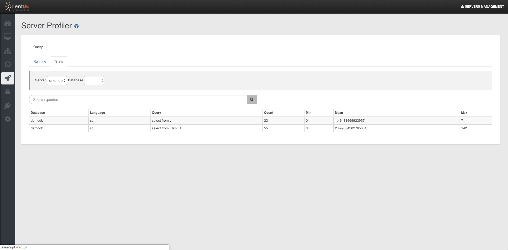

---
search:
   keywords: ['Studio', 'Server','Profiler']
---


# Server Profiler

> Only users with grant `server.metrics` can see this section 


This sections contains information about Queries:

- Real Time queries
- Statistics about queries

### Running Queries

Displays information about running queries in OrientDB Server. Each query report the following infos:

- `Query ID`, as the unique query number
- `Session ID`, the session id used for the query
- `Database`, the database used
- `User`, the database user
- `Language`, The language used. SQL or Gremlin
- `Statement`, the actual text of the query
- `Start Time`, when the query was started
- `Elapsed Time`, the actual timing of the query in milliseconds


### Queries stats

Displays statistics about executed queries in OrientDB Server. Each query report the following infos:


- `Database`, the database used
- `Language`, The language used. SQL or Gremlin
- `Query`, the actual text of the query
- `Count`, how many times the query was executed
- `Min`, the minimum execution time of the query
- `Mean`, the mean execution time of the query
- `Max`, the maximume execution time of the query




## HTTP APIs


### Retrieve running queries via HTTP

GET | Basic Auth

```
http://<server>[<:port>]/sqlProfiler/running?server=<name>
```

where
`<name>` : should be the name of the node in case of distributed version of orientdb.