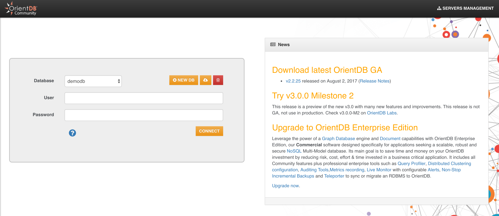

## Minute 1 - create a db

Open your favourite browser (modern browser, no IE please!) and enter the following URL:

http://localhost:2480/studio/index.html

You will see this page:

- Click on "NEW DB"



- enter "test" as database name 
- enter the root password


- Then click on "CREATE DATABASE"

**Good job! You just created your first database!** 

Now, to make sure that everything is OK, try to enter the following query

```sql
SELECT * FROM OUser
```

and click the green "RUN" button. You should see the three default users that OrienDB creates for you: admin, reader and writer


