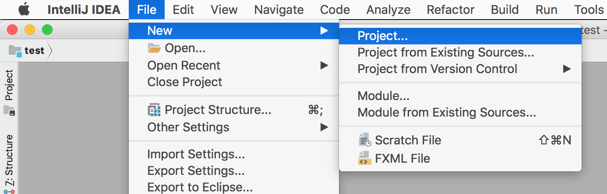
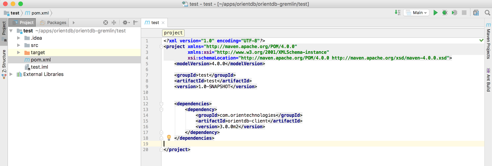

# OrientDB for Java Developers in Five Minutes

In the [previous step](java-1.md) you created your first database, now it's time to create a Java application that can connect to the DB,
query and manipulate it.

From now on, for this tutorial we will use IntelliJ Idea, but you can use any IDE that supports Java 8 and Maven.

## Step 3/5 - Create a Maven project

Open IntelliJ Idea and:

- choose the menu **File** -> **new** -> **Project...**



- from the left menu, choose **Maven**
- make sure that **Project SDK** is greater or equal to 1.8
- click **Next**


- choose your **GroupId** and **ArtifactId** (we will use "test" "test", as this is what we are doing  ;-) )
- click **Next** twice


Now open **pom.xml** file and add the following dependency:

```xml
    <dependencies>
        <dependency>
            <groupId>com.orientechnologies</groupId>
            <artifactId>orientdb-client</artifactId>
            <version>3.0.0</version>
        </dependency>
    </dependencies>
```
>>IMPORTANT: make sure you are using the same client version as the server you are using.

and enable Java 8 as target compiler

```
    <build>
        <plugins>
            <plugin>
                <groupId>org.apache.maven.plugins</groupId>
                <artifactId>maven-compiler-plugin</artifactId>
                <configuration>
                    <source>1.8</source>
                    <target>1.8</target>
                </configuration>
            </plugin>
        </plugins>
    </build>
```

Click on "automatically import dependencies" if needed



Now you are ready for the [Next Step - Open a DB Connection and Create the DB Schema >>>](java-3.md)
