# Demo Database

Starting with OrientDB v.3.0 a new demo database (`DemoDB`)  is included.


## Introduction

The demo database can help you understand better OrientDB features and capabilities and replace the old demo database `GratefulDeadConcerts`. 

_Note:_ Random-generated data is used in the `DemoDB`, including data used for Emails, Names, Surnames, Phone Numbers and Reviews.

This Section introduced the `DemoDB` database, its Data Model, and includes some queries that is possible to execute on it.


### Version

`DemoDB` has a version that is in general not linked to the Server version you are running. You can check version of your `DemoDB` by executing the following SQL query:

```sql
SELECT `Version` FROM `DBInfo`
```

### Location

The demo database is located in the `databases` directory under $ORIENTDB_HOME (e.g. `D:\orientdb\orientdb-community-3.0.0\databases\DemoDB`.


### Connecting to the Demo Database

It is possible to connect to `DemoDB` using the three standard OrientDB Users:

- `read` / `read`
- `write` / `write`
- `admin` / `admin`


## Using the Demo Database with version 2.2.x


## Data Model

`DemoDB` is the database of an hypothetical Travel Agency that runs a public Social Platform as well.

Users (that are stored in the database in the class _Profiles_) can freely register to the social platform and start making friends (friendship is expressed via the _HasFriend_ edge).

Some of the users can become Customers. When this happens the application in use at the Social Travel Agency creates a vertex in the _Customers_ class and links it to the associated Profile via an _HasProfile_ edge.

When Customers are created, they are automatically linked to a Country as well, via an _IsFromCountry_ edge. 

Orders made by Customers are stored in the vertex class _Orders_. Each customer can make one or more orders, and the _HasCustomer_ edge is used to connect orders to customers.

When customers start visiting Attractions (like Castles, Momuments, Theatres or Archaeological Sites) or using Services (like Hotels or Restaurants) edges are created to link that specific customer with that specific attraction or service (_HasVisited_, _HasStayed_, and _HasEaten_ edges are used).

The Social Travel Agency also stores some reviews in the vertex class _Reviews_. Reviews are linked to customers via the _MadeReview_ edge, and to an attraction or service via the _HasReview_ edge.

Data model is reported in the image below:

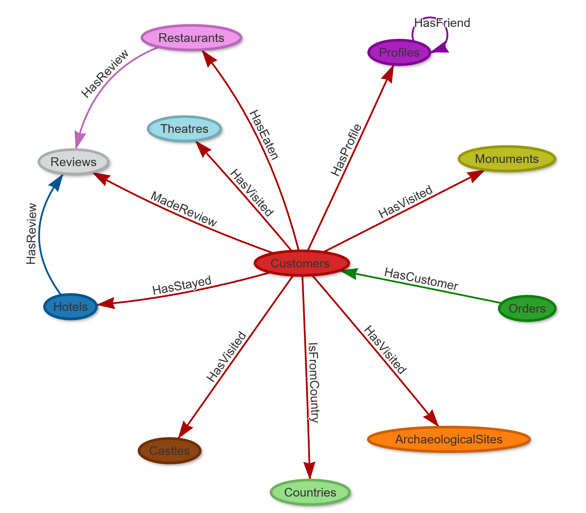


### Inheritance

Inheritance in the Vertex and Edge classes is reported in the image below:

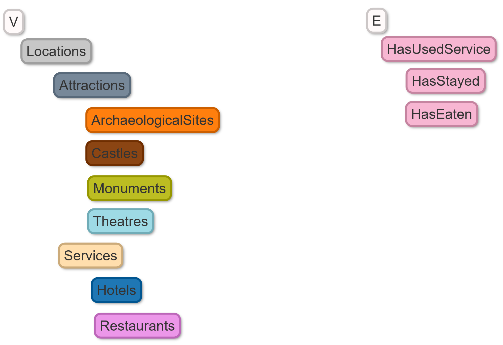


## Queries

Some query examples are reported below.

The following table can help you navigate through all examples:

| PROFILES | FRIENDSHIP | LOCATIONS | REVIEWS | SERVICES | CUSTOMERS | RECOMMENDATIONS | BUSINESS OPPORTUNITIES
|----------|------------|---------|----------|-----------|-----------------|
|   | {{book.demodb-query-1-text}} [Link](DemoDB.md) | {{book.demodb-query-1-text}} [Link](DemoDB.md) | {{book.demodb-query-1-text}} [Link](DemoDB.md) | {{book.demodb-query-1-text}} [Link](DemoDB.md) |   |   | {{book.demodb-query-7-text}} [Link](DemoDB.md) |
|   | {{book.demodb-query-2-text}} [Link](DemoDB.md) | {{book.demodb-query-2-text}} [Link](DemoDB.md) | {{book.demodb-query-2-text}} [Link](DemoDB.md) | {{book.demodb-query-2-text}} [Link](DemoDB.md) |   |   |  |
|   | {{book.demodb-query-3-text}} [Link](DemoDB.md) | {{book.demodb-query-3-text}} [Link](DemoDB.md) | {{book.demodb-query-3-text}} [Link](DemoDB.md) | {{book.demodb-query-3-text}} [Link](DemoDB.md) |   |   |  |
|   | {{book.demodb-query-4-text}} [Link](DemoDB.md) | {{book.demodb-query-4-text}} [Link](DemoDB.md) | {{book.demodb-query-4-text}} [Link](DemoDB.md) | {{book.demodb-query-4-text}} [Link](DemoDB.md) |   |   |  |
|   | {{book.demodb-query-5-text}} [Link](DemoDB.md) | {{book.demodb-query-4-text}} [Link](DemoDB.md) | {{book.demodb-query-4-text}} [Link](DemoDB.md) | {{book.demodb-query-4-text}} [Link](DemoDB.md) |   |   |  |
|   | {{book.demodb-query-6-text}} [Link](DemoDB.md) | {{book.demodb-query-4-text}} [Link](DemoDB.md) | {{book.demodb-query-4-text}} [Link](DemoDB.md) | {{book.demodb-query-4-text}} [Link](DemoDB.md) |   |   |  |
|   | {{book.demodb-query-7-text}} [Link](DemoDB.md) | {{book.demodb-query-4-text}} [Link](DemoDB.md) | {{book.demodb-query-4-text}} [Link](DemoDB.md) | {{book.demodb-query-4-text}} [Link](DemoDB.md) |   |   |  |

### Tips

 


### FRIENDSHIP

### Friendship - Example 1

{{book.demodb-query-1-text}}:

<pre><code class="lang-sql">{{book.demodb-query-1-sql}} 
RETURN {{book.demodb-query-1-return_graph}} 
</code></pre>

In the _Graph Editor_ included in [Studio](../studio/Studio-Home-page.md), using {{book.demodb-query-1-return_graph}} as `RETURN` clause, this is the obtained graph:

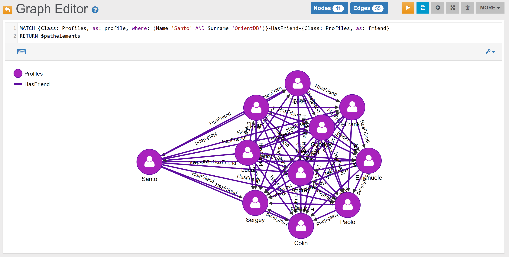

In the _Browse Tab_ of [Studio](../studio/Studio-Home-page.md), using {{book.demodb-query-1-return_browse}} as `RETURN` clause, this is the obtained list of records (only few records are shown in the image below):

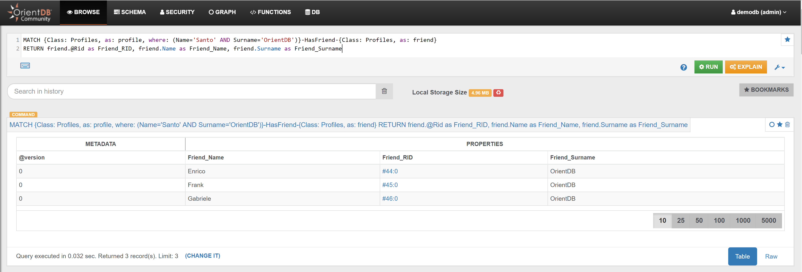


### Friendship - Example 2

{{book.demodb-query-2-text}}:

<pre><code class="lang-sql">{{book.demodb-query-2-sql}} 
RETURN {{book.demodb-query-2-return_graph}} 
</code></pre>

In the _Graph Editor_ included in [Studio](../studio/Studio-Home-page.md), using {{book.demodb-query-2-return_graph}} as `RETURN` clause, this is the obtained graph:

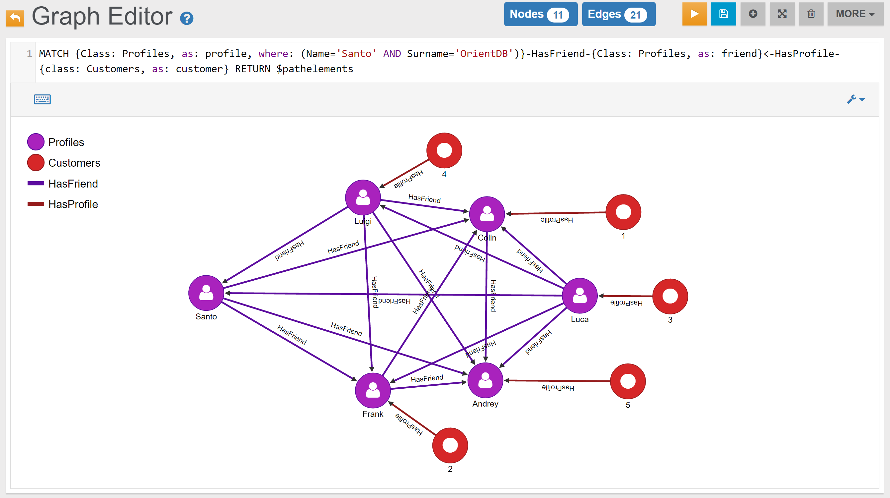

In the _Browse Tab_ of [Studio](../studio/Studio-Home-page.md), using {{book.demodb-query-2-return_browse}} as `RETURN` clause, this is the obtained list of records (only few records are shown in the image below):

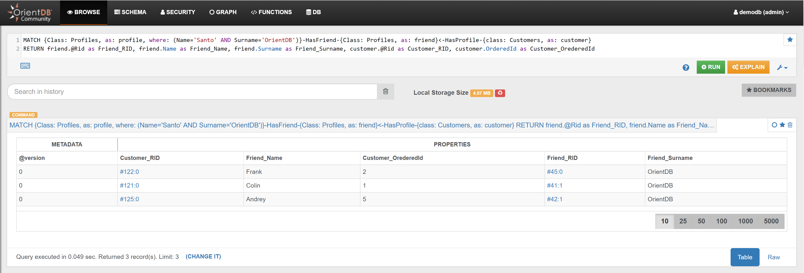


### Friendship - Example 3

{{book.demodb-query-3-text}}:

<pre><code class="lang-sql">{{book.demodb-query-3-sql}} 
RETURN {{book.demodb-query-3-return_graph}} 
</code></pre>

In the _Graph Editor_ included in [Studio](../studio/Studio-Home-page.md), using {{book.demodb-query-3-return_graph}} as `RETURN` clause, this is the obtained graph:

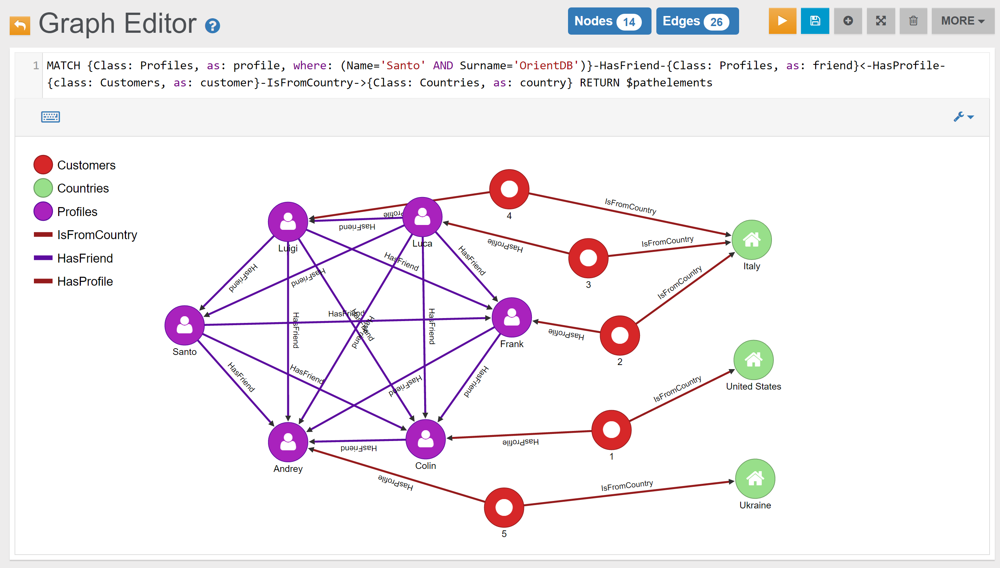

In the _Browse Tab_ of [Studio](../studio/Studio-Home-page.md), using {{book.demodb-query-3-return_browse}} as `RETURN` clause, this is the obtained list of records (only few records are shown in the image below):

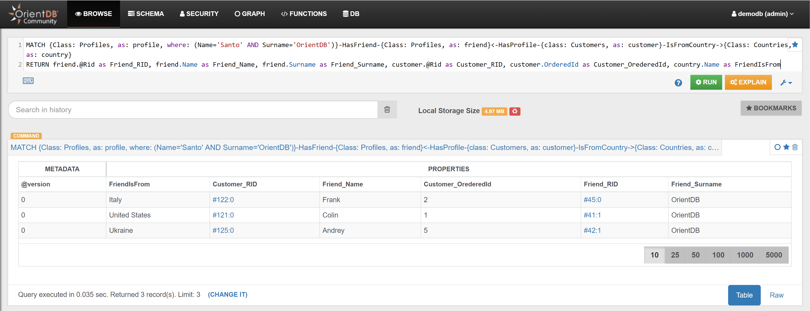


### Friendship - Example 4

{{book.demodb-query-4-text}}:

<pre><code class="lang-sql">{{book.demodb-query-4-sql}} 
RETURN {{book.demodb-query-4-return_graph}} 
</code></pre>

In the _Graph Editor_ included in [Studio](../studio/Studio-Home-page.md), using {{book.demodb-query-4-return_graph}} as `RETURN` clause, this is the obtained graph:


In the _Browse Tab_ of [Studio](../studio/Studio-Home-page.md), using {{book.demodb-query-4-return_browse}} as `RETURN` clause, this is the obtained list of records (only few records are shown in the image below):

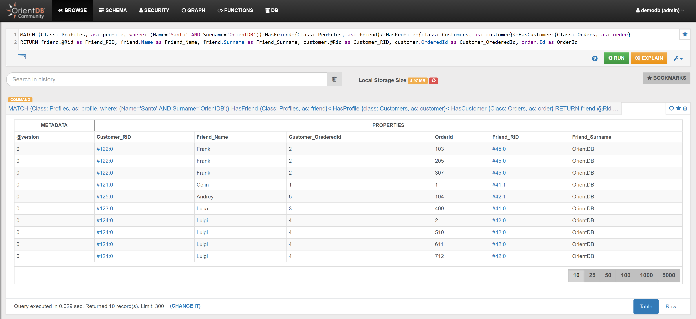


### Friendship - Example 5

{{book.demodb-query-5-text}}:

In the _Graph Editor_ included in [Studio](../studio/Studio-Home-page.md), using the query below, this is the obtained graph:

<pre><code class="lang-sql">{{demodb_query_5_sql_graph}}</code></pre>


In the _Browse Tab_ of [Studio](../studio/Studio-Home-page.md), using the query below, this is the obtained list of records (only few records are shown in the image below):

<pre><code class="lang-sql">{{book.demodb_query_5_sql_browse}}</code></pre>

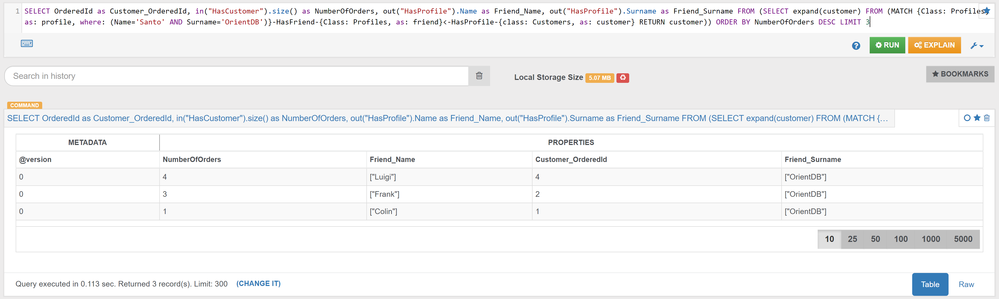


### Friendship - Example 6

{{book.demodb-query-6-text}}:

In the _Graph Editor_ included in [Studio](../studio/Studio-Home-page.md), using the query below, this is the obtained graph:

<pre><code class="lang-sql">{{demodb_query_6_sql_graph}}</code></pre>


In the _Browse Tab_ of [Studio](../studio/Studio-Home-page.md), using the query below, this is the obtained list of records (only few records are shown in the image below):

<pre><code class="lang-sql">{{book.demodb_query_6_sql_browse}}</code></pre>


You may find in a similar way the top 3 Customers, among Santo's Friends, that has stayed at the highest number of Hotels, or has eaten at the highest number of Restaurants. Just use `out("HasStayed").size()` or `out("HasEaten").size()` instead of `out("HasVisited").size()` (you may also consider to modify the alias, from `NumberOfVisits` to `NumberOfHotels` and `NumberOfRestaurants`.


### Friendship - Example 7

{{book.demodb-query-7-text}}:

In the _Graph Editor_ included in [Studio](../studio/Studio-Home-page.md), using the query below, this is the obtained graph:

<pre><code class="lang-sql">{{demodb_query_7_sql_graph}}</code></pre>


In the _Browse Tab_ of [Studio](../studio/Studio-Home-page.md), using the query below, this is the obtained list of records (only few records are shown in the image below):

<pre><code class="lang-sql">{{book.demodb_query_7_sql_browse}}</code></pre>

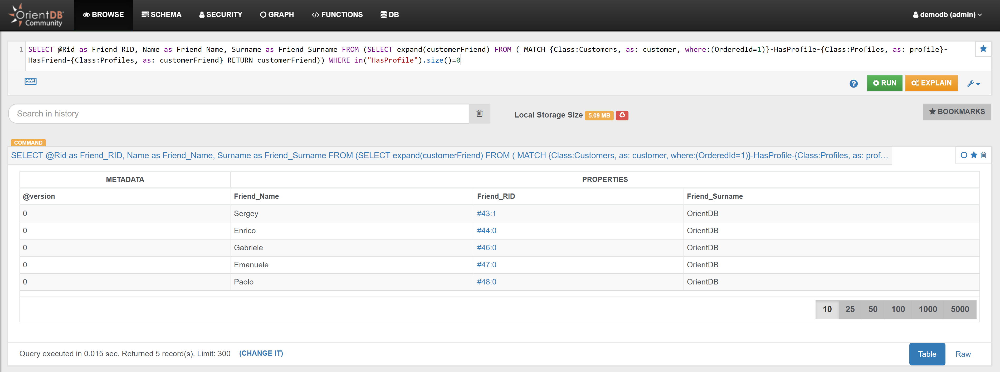


### LOCATIONS 

#### Example 1 

Find all Attractions connected with Customer with OrderedId 1
```sql
MATCH {class: Customers, as: customer, where: (OrderedId=1)}--{Class: Attractions} 
RETURN $pathelements
```

#### Example 2

Find all Services connected with Customer with OrderedId 1
```sql
MATCH {class: Customers, as: customer, where: (OrderedId=1)}--{Class: Services} 
RETURN $pathelements
```

#### Example 3

Find all Locations visited by Customer with OrderedId 1
```sql
MATCH {as: n}<-HasVisited-{class: Customers, as: customer, where: (OrderedId=1)} 
RETURN $pathelements
```

#### Example 4

Find all Locations visited by Profile2 friends
```sql
MATCH {Class: Profiles, as: profile, where: (Id=2)}-HasFriend->{Class: Profiles, as: friend}<-HasProfile-{Class: Customers, as: customer}-HasVisited->{Class: Attractions, as: attraction} 
RETURN attraction.Name
```


### REVIEWS 

#### Example 1

Find number of reviews per star
```sql
SELECT Stars, count(*) as count FROM HasReview GROUP BY Stars ORDER BY count DESC
```

#### Example 2

Find all reviewed Services
```sql
MATCH {class: Services, as: s}-HasReview->{class: Reviews, as: r} 
RETURN $pathelements
```

#### Example 3

Find all reviewed Services and the Customer who made the review 
```sql
MATCH {class: Services, as: s}-HasReview->{class: Reviews, as: r}<-MadeReview-{class: Customers, as: c} 
RETURN $pathelements 
```

#### Example 4

Find the numbers of reviews per Service 
```sql
SELECT *, out("HasReview").size() AS ReviewNumbers FROM `Services` ORDER BY ReviewNumbers DESC 
```

#### Example 5

**Example 5.1**

Find the 3 Places that have most reviews
```sql
SELECT *, out("HasReview").size() AS ReviewNumbers FROM `Services` ORDER BY ReviewNumbers DESC LIMIT 3
```

**Example 5.2**

Find the 3 Hotels that have most reviews 
```sql
SELECT *, out("HasReview").size() AS ReviewNumbers FROM `Hotels` ORDER BY ReviewNumbers DESC LIMIT 3
```

**Example 5.3**

Find the 3 Restaurants that have most reviews 
```sql
SELECT *, out("HasReview").size() AS ReviewNumbers FROM `Restaurants` ORDER BY ReviewNumbers DESC LIMIT 3
```

#### Example 6

Find the 3 Customers who made more reviews

```sql
SELECT *, out("MadeReview").size() AS ReviewNumbers FROM `Customers` ORDER BY ReviewNumbers DESC LIMIT 3
```

### SERVICES 

#### Example 1

**Example 1.1**

Find the 3 Hotels that have been booked most times
```sql
SELECT *, in("HasStayed").size() AS NumberOfBookings FROM Hotels ORDER BY NumberOfBookings DESC LIMIT 3
```

**Example 1.2**

Find the 3 Restaurants that have been used most times
```sql
SELECT *, in("HasEaten").size() AS VisitsNumber FROM Restaurants ORDER BY VisitsNumber DESC LIMIT 3
```

for the visualization in Studio:
{{Name}} ({{NumberOfBookings}})

#### Example 2

**Example 1.1**

Find the 3 Hotels that have most reviews 
```sql
SELECT *, out("HasReview").size() AS ReviewNumbers FROM `Hotels` ORDER BY ReviewNumbers DESC LIMIT 3
```

**Example 1.2**

Find the 3 Restaurants that have most reviews 
```sql
SELECT *, out("HasReview").size() AS ReviewNumbers FROM `Restaurants` ORDER BY ReviewNumbers DESC LIMIT 3
```

#### Example 3

**Example 1.1**

Find the top 3 nationality of the tourists that eaten at Restaurant with Id 13
```sql
SELECT Name, count(*) as CountryCount FROM (SELECT expand(out('IsFromCountry')) AS countries FROM ( SELECT expand(in("HasEaten")) AS customers FROM Restaurants WHERE Id='13' UNWIND customers) unwind countries) GROUP BY Name ORDER BY CountryCount DESC LIMIT 3
```

**Example 1.2**

Find the top 3 nationality of the tourists that staied at Hotel with Id 13
```sql
SELECT Name, count(*) as CountryCount FROM (SELECT expand(out('IsFromCountry')) AS countries FROM ( SELECT expand(in("HasStayed")) AS customers FROM Hotels WHERE Id='13' UNWIND customers) unwind countries) GROUP BY Name ORDER BY CountryCount DESC LIMIT 3
```

### CUSTOMERS 
	
#### Example 1

Find everything that is connected (1st degree) to Customer with Id 1 
```sql
MATCH {class: Customers, as: c, where: (OrderedId=1)}--{as: n} RETURN $pathelements
```
#### Example 2

Find all Orders placed by Customer with Id 1  
```sql
MATCH {class: Customers, as: c, where: (OrderedId=1)}<-HasCustomer-{class: Orders, as: o} 
RETURN $pathelements
```
#### Example 3

Find the 3 Customers who placed most Orders
```sql
SELECT *, in("HasCustomer").size() AS NumberOfOrders FROM Customers ORDER BY NumberOfOrders DESC LIMIT 3
```
#### Example 4

Find all Locations connected to Customer with Id 1
```sql
MATCH {class: Customers, as: customer, where: (OrderedId=1)}--{Class: Locations} 
RETURN $pathelements
```	
#### Example 5

Find all Locations connected to Customer with Id 2, and their Reviews (if any) 
```sql
MATCH {class: Customers, as: c, where: (OrderedId=2)}--{class: Locations, as: loc}-HasReview-{class: Reviews, as: r, optional: true} 
RETURN $pathelements
```
#### Example 6

Find the other Customers that visited the Locations visited by Customer with Id 1
```sql
MATCH {class: Customers, as: c, where: (OrderedId=1)}--{class: Locations, as: loc}--{class: Customers, as: otherCustomers, where: (OrderedId<>1)} 
RETURN otherCustomers.OrderedId, loc.Name, loc.Type
```
#### Example 7

Same as before, but now returns also their Profile names, surnames and emails 
```sql
MATCH {class: Customers, as: c, where: (OrderedId=1)}--{class: Locations, as: loc}--{class: Customers, as: otherCustomers, where: (OrderedId<>1)}-HasProfile->{class: Profiles, as: profile} 
RETURN otherCustomers.OrderedId, loc.Name, loc.Type, profile.Name, profile.Surname, profile.Email
```
#### Example 8

Find all the places where Customer with Id 1 has stayed
```sql
MATCH {as: n}<-HasStayed-{class: Customers, as: c, where: (OrderedId=1)} 
RETURN $pathelements
```
#### Example 9

Find all places where Customer with Id 1 has eaten
```sql
MATCH {as: n}-HasEaten-{class: Customers, as: c, where: (OrderedId=1)} 
RETURN $pathelements
```

#### Example 10


Find the 3 Customers who made more reviews

```sql
SELECT *, out("MadeReview").size() AS ReviewNumbers FROM `Customers` ORDER BY ReviewNumbers DESC LIMIT 3
```

### RECOMMENDATIONS

#### Example 1

Recommend some friends to Profile with Id 1 (friends of friends)
```sql
MATCH {class: Profiles, as: profile, where: (Id=1)}.both('HasFriend').both('HasFriend'){as: friendOfFriend, where: ($matched.profile != $currentMatch)} 
RETURN profile, friendOfFriend 
```

#### Example 2

Recommend some Hotels to Customer with OrderedId 1	
```sql
MATCH 
  {Class: Customers, as: customer, where: (OrderedId=1)}-HasProfile->{class: Profiles, as: profile},
  {as: profile}-HasFriend->{class: Profiles, as: friend},
  {as: friend}<-HasProfile-{Class: Customers, as: customerFriend},
  {as: customerFriend}-HasStayed->{Class: Hotels, as: hotel},
  {as: customerFriend}-MadeReview->{Class: Reviews, as: review},
  {as: hotel}-HasReview->{as: review}
RETURN $pathelements
```

To filter additionally, and suggest only the 4 and 5-rated hotels, it is possible to add a filter condition on the 'HasReview' edge (property 'Stars'):

```sql
MATCH
  {Class: Customers, as: customer, where: (OrderedId=1)}-HasProfile->{class: Profiles, as: profile},
  {as: profile}-HasFriend->{class: Profiles, as: friend},
  {as: friend}<-HasProfile-{Class: Customers, as: customerFriend},
  {as: customerFriend}-HasStayed->{Class: Hotels, as: hotel},
  {as: customerFriend}-MadeReview->{Class: Reviews, as: review},
  {as: hotel}.outE('HasReview'){as: ReviewStars, where: (Stars>3)}.inV(){as: review}
RETURN hotel, ReviewStars.Stars  
```
 
