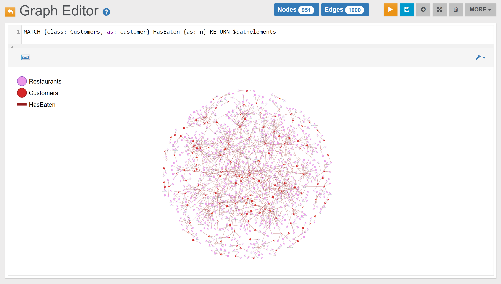

## Graph Portions

This Section includes some screen-shots on "portions" of the `demodb` graph.



### Profiles

The graph below includes vertices in the _Profiles_ class. 

Some profiles have no friends, and ten profile "communities" are easily identifiable (a "community" is a group of highly connected profiles):

### Customer-Country Relationship

The graph below shows the relationships between all customers and their countries of origin:

### Customer-Restaurant Relationship

Relationships between customers and restaurants are reported in the graph below:

