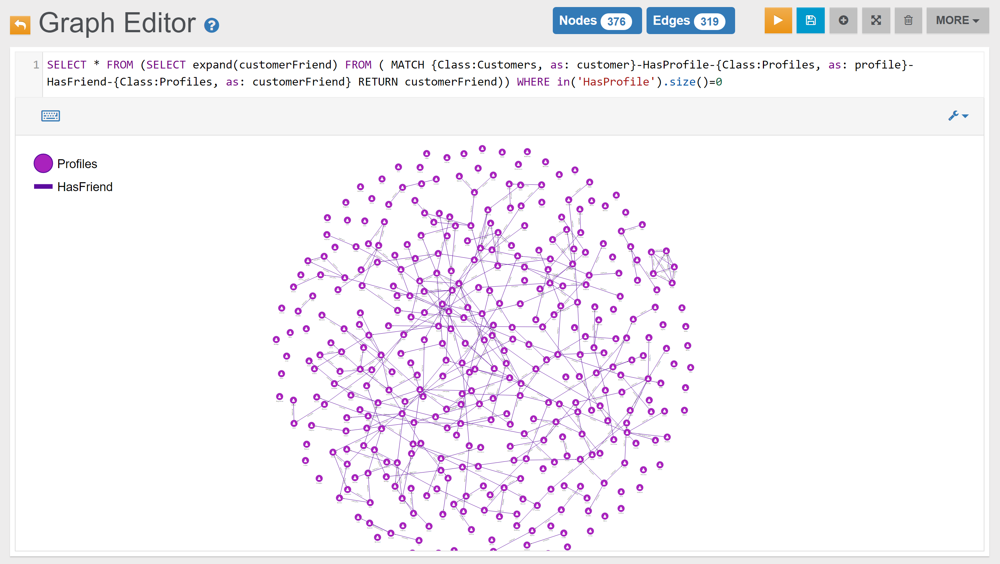

### Business-Opportunities 

#### Example 1



#### Example 2

{{book.demodb_query_14_text}}:

In the _Graph Editor_ included in [Studio](../studio/README.md), using the query below, this is the obtained graph:

<pre><code class="lang-sql">{{book.demodb_query_14_sql_graph}}</code></pre>

In the _Browse Tab_ of [Studio](../studio/README.md), using the query below, this is the obtained list of records (only few records are shown in the image below):

<pre><code class="lang-sql">{{book.demodb_query_14_sql_browse}}</code></pre>

