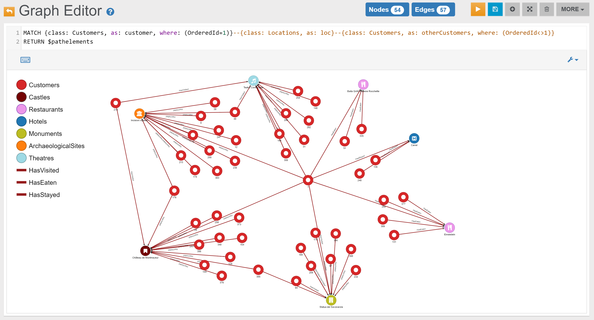

# Customers 
	
## Example 1

Find everything that is connected (1st degree) to Customer with OrderedId 1:

```sql
MATCH {class: Customers, as: c, where: (OrderedId=1)}--{as: n} 
RETURN $pathelements
```

In the _Graph Editor_ included in [Studio](../../../studio/README.md), using _'RETURN $pathelements'_ as `RETURN` clause, this is the obtained graph:


## Example 2




## Example 3




## Example 4

Find the other Customers that visited the Locations visited by Customer with OrderedId 1:

```sql
MATCH {class: Customers, as: customer, where: (OrderedId=1)}--{class: Locations, as: loc}--{class: Customers, as: otherCustomers, where: (OrderedId<>1)} 
RETURN $pathelements
```

In the _Graph Editor_ included in [Studio](../../../studio/README.md), using _'RETURN $pathelements'_ as `RETURN` clause, this is the obtained graph:



If we want to return also also their Profile names, surnames and emails:

```sql
MATCH {class: Customers, as: customer, where: (OrderedId=1)}--{class: Locations, as: loc}--{class: Customers, as: otherCustomers, where: (OrderedId<>1)}-HasProfile->{class: Profiles, as: profile} 
RETURN otherCustomers.OrderedId, profile.Name, profile.Surname, profile.Email
ORDER BY `otherCustomers.OrderedId` ASC
```

In the _Browse Tab_ of [Studio](../../../studio/README.md), using _'RETURN otherCustomers.OrderedId, profile.Name, profile.Surname, profile.Email'_ as `RETURN` clause, this is the obtained list of records (only few records are shown in the image below):


## Example 5

Find all the places where Customer with OrderedId 2 has stayed:

```sql
MATCH {as: n}<-HasStayed-{class: Customers, as: c, where: (OrderedId=2)} 
RETURN $pathelements
```

In the _Graph Editor_ included in [Studio](../../../studio/README.md), using _'RETURN $pathelements'_ as `RETURN` clause, this is the obtained graph:


## Example 6

Find all places where Customer with OrderedId 1 has eaten:

```sql
MATCH {as: n}<-HasEaten-{class: Customers, as: c, where: (OrderedId=1)} 
RETURN $pathelements
```

In the _Graph Editor_ included in [Studio](../../../studio/README.md), using _'RETURN $pathelements'_ as `RETURN` clause, this is the obtained graph:


## Example 7




## Example 8




## Example 9




## Example 10




## Example 11

