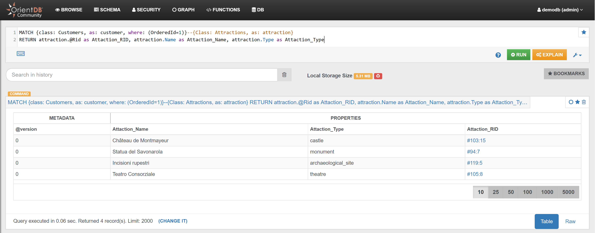
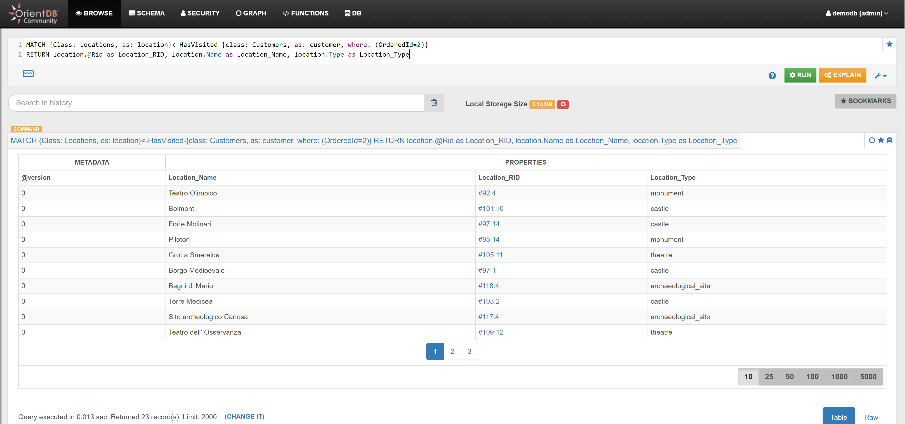

### Locations 

#### Example 1 

{{book.demodb_query_15_text}}:

<pre><code class="lang-sql">MATCH {class: Customers, as: customer, where: (OrderedId=1)}--{Class: Attractions, as: attraction}
RETURN $pathelements
</code></pre>

In the _Graph Editor_ included in [Studio](../studio/README.md), using _'RETURN $pathelements'_ as `RETURN` clause, this is the obtained graph:


In the _Browse Tab_ of [Studio](../studio/README.md), using _'RETURN attraction.@Rid as Attaction_RID, attraction.Name as Attaction_Name, attraction.Type as Attaction_Type'_ as `RETURN` clause, this is the obtained list of records (only few records are shown in the image below):




#### Example 2

{{book.demodb_query_16_text}}:

<pre><code class="lang-sql">MATCH {class: Customers, as: customer, where: (OrderedId=1)}--{Class: Services, as: service}
RETURN $pathelements
</code></pre>

In the _Graph Editor_ included in [Studio](../studio/README.md), using _'RETURN $pathelements'_ as `RETURN` clause, this is the obtained graph:


In the _Browse Tab_ of [Studio](../studio/README.md), using _'RETURN service.@Rid as Service_RID, service.Name as Service_Name, service.Type as Service_Type'_ as `RETURN` clause, this is the obtained list of records (only few records are shown in the image below):


#### Example 3

{{book.demodb_query_25_text}}:


#### Example 4

{{book.demodb_query_26_text}}:


#### Example 5

{{book.demodb_query_18_text}}:

<pre><code class="lang-sql">MATCH {Class: Locations, as: location}<-HasVisited-{class: Customers, as: customer, where: (OrderedId=2)}
RETURN $pathelements
</code></pre>

In the _Graph Editor_ included in [Studio](../studio/README.md), using _'RETURN $pathelements'_ as `RETURN` clause, this is the obtained graph:


In the _Browse Tab_ of [Studio](../studio/README.md), using _'RETURN location.@Rid as Location_RID, location.Name as Location_Name, location.Type as Location_Type'_ as `RETURN` clause, this is the obtained list of records (only few records are shown in the image below):




#### Example 6

{{book.demodb_query_35_text}}:

```sql
MATCH {Class: Profiles, as: profile, where: (Name='Santo' and Surname='OrientDB')}-HasFriend->{Class: Profiles, as: friend}<-HasProfile-{Class: Customers, as: customer}-HasVisited->{Class: Locations, as: location} 
RETURN $pathelements
```