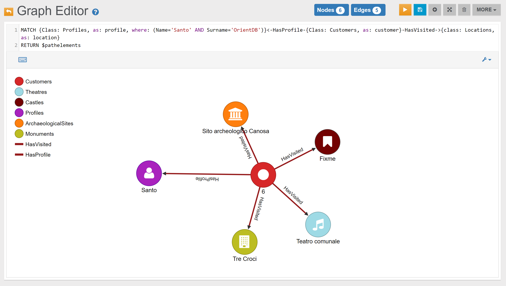
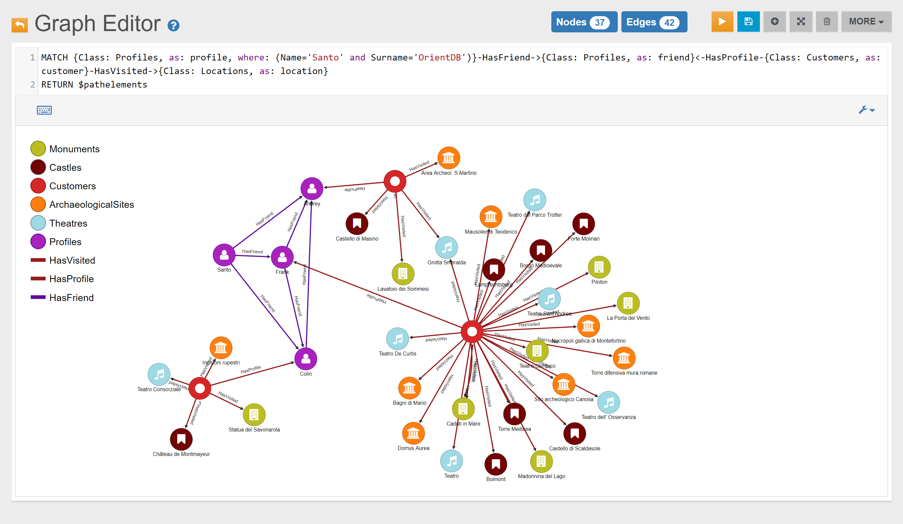

# Locations 

## Example 1

Find all Locations visited by Santo:

```sql
MATCH {Class: Profiles, as: profile, where: (Name='Santo' AND Surname='OrientDB')}<-HasProfile-{Class: Customers, as: customer}-HasVisited->{class: Locations, as: location} 
RETURN $pathelements
```

In the _Graph Editor_ included in [Studio](../../../studio/README.md), using the query above, this is the obtained graph:




## Example 1




## Example 2




## Example 3

Find all Locations visited by Customer with OrderedId 2:

```sql
MATCH {Class: Locations, as: location}<-HasVisited-{class: Customers, as: customer, where: (OrderedId=2)}
RETURN $pathelements
```

In the _Graph Editor_ included in [Studio](../../../studio/README.md), using _'RETURN $pathelements'_ as `RETURN` clause, this is the obtained graph:


In the _Browse Tab_ of [Studio](../../../studio/README.md), using _'RETURN location.@Rid as Location_RID, location.Name as Location_Name, location.Type as Location_Type'_ as `RETURN` clause, this is the obtained list of records (only few records are shown in the image below):


## Example 4

Find all Locations visited by Santo's friends:

```sql
MATCH {Class: Profiles, as: profile, where: (Name='Santo' and Surname='OrientDB')}-HasFriend->{Class: Profiles, as: friend}<-HasProfile-{Class: Customers, as: customer}-HasVisited->{Class: Locations, as: location} 
RETURN $pathelements
```

In the _Graph Editor_ included in [Studio](../../../studio/README.md), using _'RETURN $pathelements'_ as `RETURN` clause, this is the obtained graph:



In the _Browse Tab_ of [Studio](../../../studio/README.md), using _'location.@Rid as Location_RID, location.Name as Location_Name, location.Type as Location_Type, friend.Name as Friend_Name, friend.Surname as Friend_Surname'_ as `RETURN` clause, this is the obtained list of records (only few records are shown in the image below):


