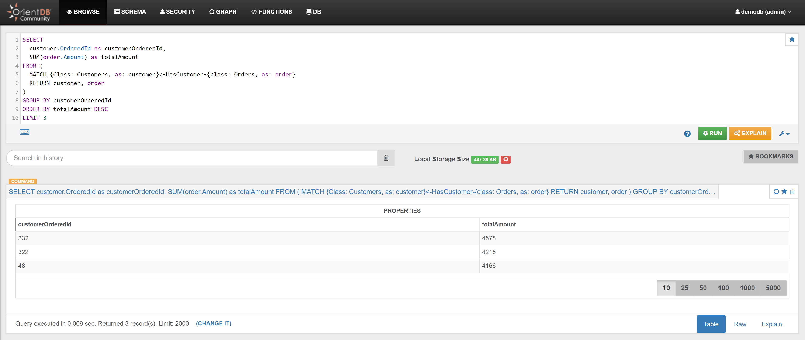

# Orders

## Example 1

Calculate the total revenues from Orders, and the min, max and average Order amount:

```sql
SELECT 
  count(*) as OrdersNumber, 
  sum(Amount) AS TotalRevenuesFromOrders, 
  min(Amount) as MinAmount,
  (sum(Amount)/count(*)) as AverageAmount,
  max(Amount) as MaxAmount
FROM Orders
```

In the _Browse Tab_ of [Studio](../../../studio/README.md), using the query above, this is the visualized result:


## Example 2

Find the year of the Orders, and how many Orders have been placed in the same year:

```sql
SELECT 
  count(*) as OrdersCount, 
  OrderDate.format('yyyy') AS OrderYear 
FROM Orders 
GROUP BY OrderYear 
ORDER BY OrdersCount DESC
```

In the _Browse Tab_ of [Studio](../../../studio/README.md), using the query above, this is the visualized result:


## Example 3




## Example 4

Find the top 3 Customers in terms of spending:

```sql
SELECT 
  customer.OrderedId as customerOrderedId, 
  SUM(order.Amount) as totalAmount 
FROM (
  MATCH {Class: Customers, as: customer}<-HasCustomer-{class: Orders, as: order} 
  RETURN customer, order
) 
GROUP BY customerOrderedId 
ORDER BY totalAmount DESC 
LIMIT 3
```

In the _Browse Tab_ of [Studio](../../../studio/README.md), using the query above, this is the visualized result:


