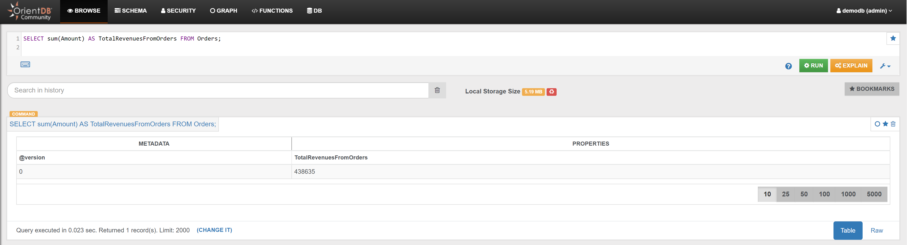
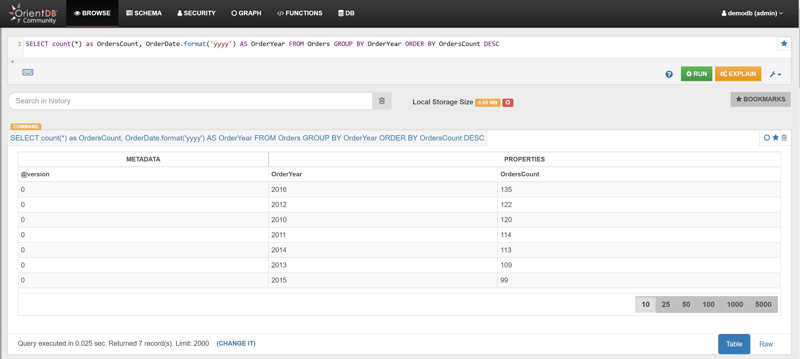

### Orders

#### Example 1

Calculate the total revenues from Orders:

<pre><code class="lang-sql">SELECT sum(Amount) AS TotalRevenuesFromOrders FROM Orders;</code></pre>

In the _Browse Tab_ of [Studio](../studio/README.md), using the query above, this is the visualized result:

#### Example 2

Find the year of the Orders, and how many Orders have been placed in the same year:

<pre><code class="lang-sql">SELECT count(*) as OrdersCount, OrderDate.format('yyyy') AS OrderYear FROM Orders GROUP BY OrderYear ORDER BY OrdersCount DESC</code></pre>

In the _Browse Tab_ of [Studio](../studio/README.md), using the query above, this is the visualized result:

### Example 3

