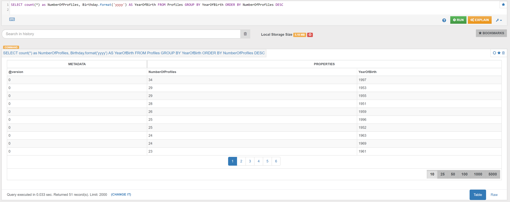
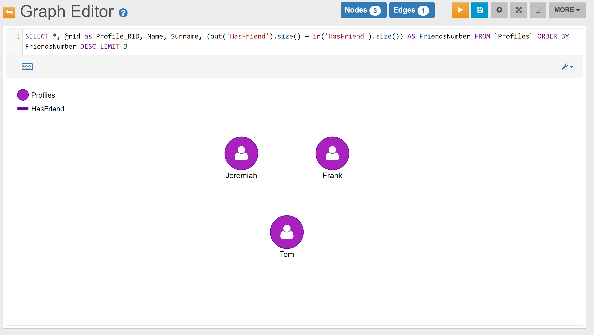

### Profiles

#### Example 1

Find the 'year of birth' of the Profiles, and how many Profiles were born in the same year:

In the _Browse Tab_ of [Studio](../studio/README.md), using the query below, this is the obtained list of records (only few records are shown in the image below):

<pre><code class="lang-sql">SELECT count(*) as NumberOfProfiles, Birthday.format('yyyy') AS YearOfBirth FROM Profiles GROUP BY YearOfBirth ORDER BY NumberOfProfiles DESC</code></pre>

#### Example 2

Find the top 3 Profiles that have the highest number of Friends:

In the _Graph Editor_ included in [Studio](../studio/README.md), using the query below, this is the obtained graph:

<pre><code class="lang-sql">SELECT *, @rid as Profile_RID, Name, Surname, (out('HasFriend').size() + in('HasFriend').size()) AS FriendsNumber FROM `Profiles` ORDER BY FriendsNumber DESC LIMIT 3</code></pre>

In the _Browse Tab_ of [Studio](../studio/README.md), using the query below, this is the obtained list of records:

<pre><code class="lang-sql">SELECT @rid as Profile_RID, Name, Surname, (out('HasFriend').size() + in('HasFriend').size()) AS FriendsNumber FROM `Profiles` ORDER BY FriendsNumber DESC LIMIT 3</code></pre>

