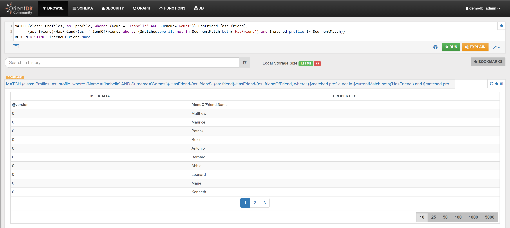

### Recommendations

#### Example 1

{{book.demodb_query_22_text}}:

```sql
MATCH {class: Profiles, as: profile, where: (Name = 'Isabella' AND Surname='Gomez')}-HasFriend-{as: friend},
	  {as: friend}-HasFriend-{as: friendOfFriend, where: ($matched.profile not in $currentMatch.both('HasFriend') and $matched.profile != $currentMatch)} 
RETURN DISTINCT friendOfFriend.Name
```




#### Example 2

{{book.demodb_query_23_text}}:

```sql
MATCH 
  {Class: Customers, as: customer, where: (OrderedId=1)}-HasProfile->{class: Profiles, as: profile},
  {as: profile}-HasFriend->{class: Profiles, as: friend},
  {as: friend}<-HasProfile-{Class: Customers, as: customerFriend},
  {as: customerFriend}-HasStayed->{Class: Hotels, as: hotel},
  {as: customerFriend}-MadeReview->{Class: Reviews, as: review},
  {as: hotel}-HasReview->{as: review}
RETURN $pathelements
```


To filter additionally, and suggest only the 4 and 5-rated hotels, it is possible to add a filter condition on the 'HasReview' edge (property 'Stars'):

```sql
MATCH
  {Class: Customers, as: customer, where: (OrderedId=1)}-HasProfile->{class: Profiles, as: profile},
  {as: profile}-HasFriend->{class: Profiles, as: friend},
  {as: friend}<-HasProfile-{Class: Customers, as: customerFriend},
  {as: customerFriend}-HasStayed->{Class: Hotels, as: hotel},
  {as: customerFriend}-MadeReview->{Class: Reviews, as: review},
  {as: hotel}.outE('HasReview'){as: ReviewStars, where: (Stars>3)}.inV(){as: review}
RETURN hotel, ReviewStars.Stars  
```
