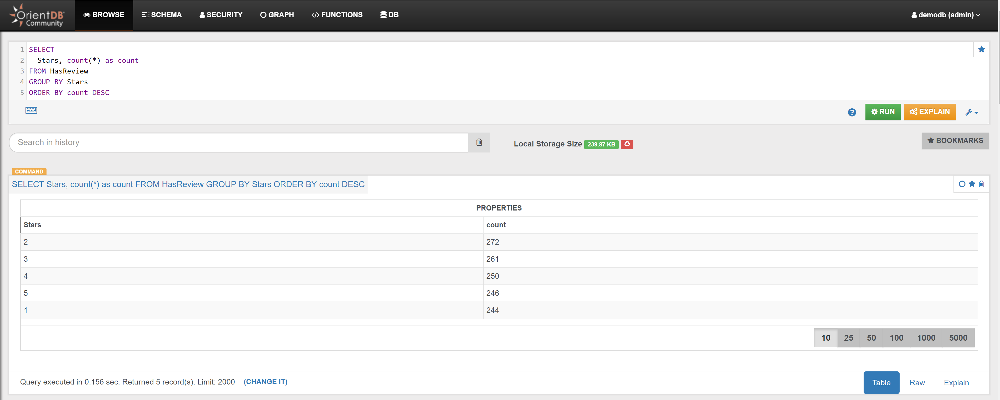

# Reviews 

## Example 1

Find number of Reviews per star:

```sql
SELECT 
  Stars, count(*) as count 
FROM HasReview 
GROUP BY Stars 
ORDER BY count DESC
```

In the _Browse Tab_ of [Studio](../../../studio/README.md), using the query above, this is the obtained list of records:




## Example 2

Find all reviewed Services:

```sql
MATCH {class: Services, as: s}-HasReview->{class: Reviews, as: r} 
RETURN $pathelements
```


## Example 3

Find all reviewed Services and the Customer who made the review:

```sql
MATCH {class: Services, as: s}-HasReview->{class: Reviews, as: r}<-MadeReview-{class: Customers, as: c} 
RETURN $pathelements 
```


## Example 4

Find the numbers of reviews per Service:

```sql
SELECT 
  @rid as Service_RID,
  Name as Service_Name,
  Type as Service_Type,
  out("HasReview").size() AS ReviewNumbers 
FROM `Services` 
ORDER BY ReviewNumbers DESC
```

In the _Browse Tab_ of [Studio](../../../studio/README.md), using the query above, this is the obtained list of records:


## Example 5




## Example 6


