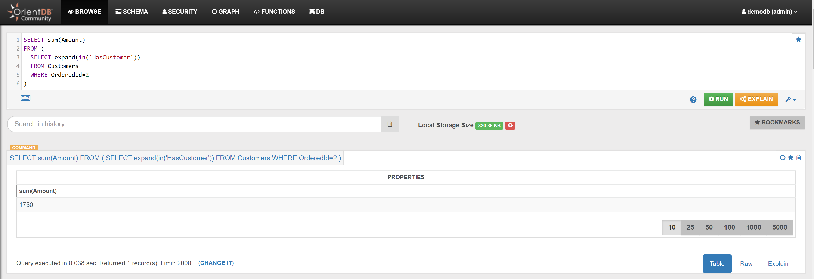

Calculate the total revenues from Orders associated with Customer with Id 2:

```sql
SELECT sum(Amount) 
FROM (
  SELECT expand(in('HasCustomer'))
  FROM Customers
  WHERE OrderedId=2
)
```

In the _Browse Tab_ of [Studio](../../../studio/README.md), using the query above, this is the obtained list of records:


