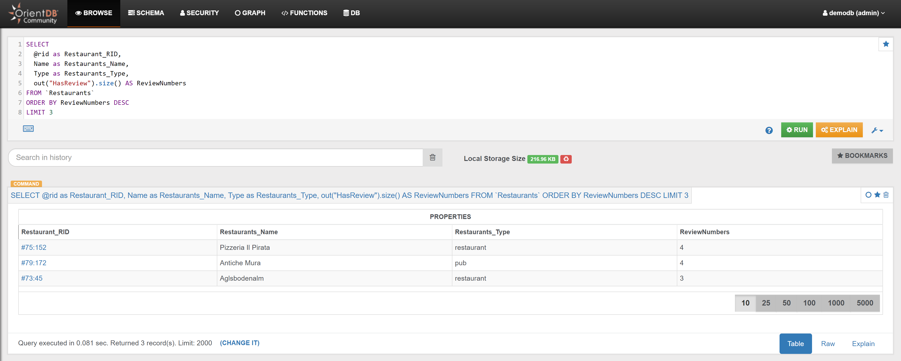

Find the 3 Hotels that have most reviews:

```sql
SELECT 
  @rid as Hotel_RID,
  Name as Hotel_Name,
  Type as Hotel_Type,
  out("HasReview").size() AS ReviewNumbers 
FROM `Hotels` 
ORDER BY ReviewNumbers DESC 
LIMIT 3
```

In the _Browse Tab_ of [Studio](../../../studio/README.md), using the query above, this is the obtained list of records:


In a similar way:

Find the 3 Restaurants that have most reviews:
 
```sql
SELECT
  @rid as Restaurant_RID,
  Name as Restaurants_Name,
  Type as Restaurants_Type,
  out("HasReview").size() AS ReviewNumbers 
FROM `Restaurants` 
ORDER BY ReviewNumbers DESC 
LIMIT 3
```

In the _Browse Tab_ of [Studio](../../../studio/README.md), using the query above, this is the obtained list of records:



In a polymorphic way:

Find the 3 Services (Hotels + Restaurants) that have most reviews:

```sql
SELECT 
  @rid,
  Name as Service_Name,
  Type as Service_Type,
  out("HasReview").size() AS ReviewNumbers 
FROM `Services` 
ORDER BY ReviewNumbers DESC 
LIMIT 3
```

In the _Browse Tab_ of [Studio](../../../studio/README.md), using the query above, this is the obtained list of records:


