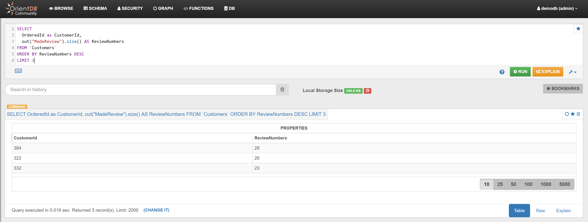

Find the 3 Customers who made more reviews:

```sql
SELECT 
  OrderedId as CustomerId,
  out("MadeReview").size() AS ReviewNumbers 
FROM `Customers` 
ORDER BY ReviewNumbers DESC 
LIMIT 3
```

In the _Browse Tab_ of [Studio](../../../studio/README.md), using the query above, this is the obtained list of records:


