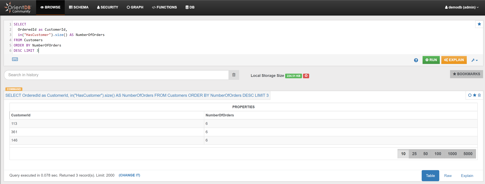

Find the 3 Customers who placed most Orders:

```sql
SELECT 
  OrderedId as CustomerId,
  in("HasCustomer").size() AS NumberOfOrders 
FROM Customers 
ORDER BY NumberOfOrders 
DESC LIMIT 3
```

In the _Browse Tab_ of [Studio](../../../studio/README.md), using the query above, this is the visualized result:

