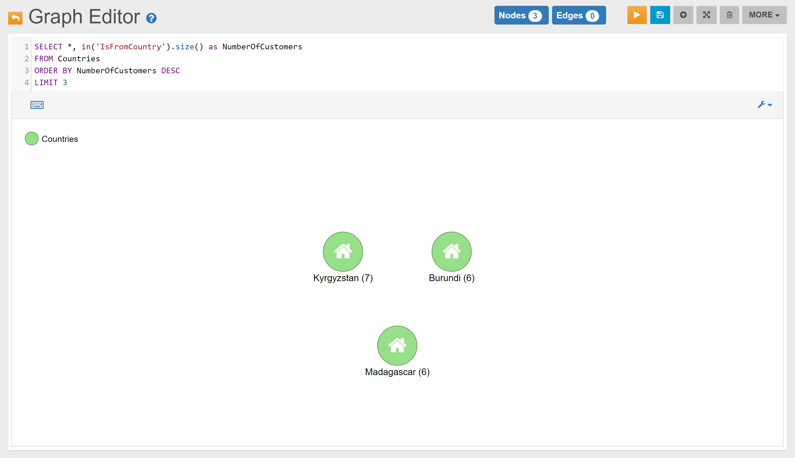

Find the top 3 Countries from where Customers are from:

In the _Graph Editor_ included in [Studio](../../../studio/README.md), using the query below, this is the obtained graph:

<pre><code class="lang-sql">SELECT *, in('IsFromCountry').size() as NumberOfCustomers 
FROM Countries
ORDER BY NumberOfCustomers DESC 
LIMIT 3</code></pre>

In the _Browse Tab_ of [Studio](../../../studio/README.md), using the query below, this is the obtained list of records:

<pre><code class="lang-sql">SELECT Name, in('IsFromCountry').size() as NumberOfCustomers 
FROM Countries
ORDER BY NumberOfCustomers DESC 
LIMIT 3</code></pre>

