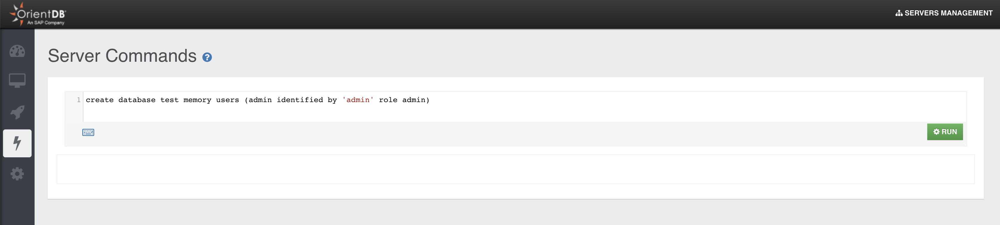

# Server-Level Commands

(since v 3.2)

Server-Level Commands allow SQL-like script execution on the server.

Since the very first versions, OrientDB allowed to execute a few different types of scripts, like SQL commands or console scripts.

SQL commands have a generic API that could be executed from any endpoint (REST, Studio, Console, application API) with the exact same effect. The scope of a SQL command is only a single database schema, so operations that do not involve the DB but have a broader scope (eg. the server instance or the cluster) can hardly be implemented with this mechanism.

Console scripts (eg. commands like `info` or like the old `create database`) act at server level, but they can only be executed via CLI. This makes this mechanism a bit limited and hard to extend.

In V 3.2 OrientDB introduces Server-Level Commands as a first-class component.

A Server-Level Command is a text command that is executed in the scope of a server, so the goal of this component is to run operations that do not limit their scope to a single database.

At this stage, the following commands are supported

- [CREATE DATABASE](Create-Database.md)
- [DROP DATABASE](Drop-Database.md)
- [CREATE SYSTEM USER](Create-System-User.md)
- [ALTER SYSTEM USER](Alter-System-User.md)
- [EXISTS SYSTEM ROLE](Exists-System-Role.md)

## How to invoke a Server-Level Command

### Console

The console natively supports Server-Level Commands. 

To run a command you have to be connected to a Server with `connect env`

eg. to create a MEMORY database using a Server-Level Command:

```
orientdb> connect env embedded:./target/dir root root

orientdb> create database test memory users (admin identified by 'admin' role admin)
```


### Studio


From SERVER MANAGEMENT



### Java API

Using OrientDB class, with the new `execute()` methods

```
orientDB = new OrientDB("remote:localhost", "root", "root", OrientDBConfig.defaultConfig());
orientDB.execute(
        "create database ? memory users (admin identified by 'admin' role admin)",
        theDbName);
    
```
