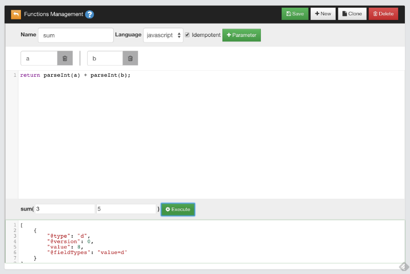

# Functions

A **Function** is an executable unit of code that can take parameters and return a result. Using Functions you can perform [Functional programming](http://en.wikipedia.org/wiki/Functional_programming) where logic and data are all together in a central place. Functions are similar to the [Stored Procedures](http://en.wikipedia.org/wiki/Stored_procedure) of RDBMS.

>**NOTE**: This guide refers to the last available release of OrientDB. For past revisions look at [Compatibility](Functions.md#wiki-compatibility).

OrientDB Functions features:
- are persistent
- can be written in [SQL](SQL.md) or Javascript (Ruby, Scala, Java and other languages are coming)
- can be executed via [SQL](SQL.md), [Java](#Usage_via_Java_API), [REST](#Usage_via_HTTP_REST) and [Studio](https://github.com/orientechnologies/orientdb-studio/wiki)
- can call each other
- supports recursion
- have automatic mapping of parameters by position and name
- plugins can inject new objects to being used by functions

## Create your first function

To start using Functions the simplest way is using the [Studio](https://github.com/orientechnologies/orientdb-studio/wiki). Open the database and go to the "Functions" panel. Then write as name "sum", add 2 parameters named "a" and "b" and now write the following code in the text area:

```javascript
return parseInt(a) + parseInt(b);
```

Click on the "Save" button. Your function has been saved and will appear on the left between the available functions.

Now let's go to test it. On the bottom you will find 2 empty boxes. This is where you can insert the parameters when invoking the function. Write 3 and 5 as parameters and click "Execute" to see the result. "8.0" will appear in the output box below.



_Why using parseInt() and not just `a + b`? because HTTP protocol passes parameters as strings._

## Where are my functions saved?

Functions are saved in the database using the `OFunction` class and the following properties:
- `name`, as the name of the function
- `code`, as the code to execute
- `parameters`, as an optional `EMBEDDEDLIST` of String containing the parameter names if any
- `idempotent`, tells if the function is `idempotent`, namely if it changes the database. Read-only functions are `idempotent`. This is needed to avoid calling non-`idempotent` functions using the HTTP GET method

### Concurrent editing

Since OrientDB uses 1 record per function, the [MVCC](http://en.wikipedia.org/wiki/Multiversion_concurrency_control) mechanism is used to protect against concurrent record updates.

## Usage

### Usage via Java API

Using OrientDB's functions from Java is straightforward. First get the reference to the Function Manager, get the right function and execute it passing the parameters (if any). In this example parameters are passed by position:

```java
ODatabaseDocumentTx db = new ODatabaseDocumentTx("local:/tmp/db");
db.open("admin", "admin");
OFunction sum = db.getMetadata().getFunctionLibrary().getFunction("sum");
Number result = sum.execute(3, 5);
```

If you're using the Blueprints Graph API get the reference to the Function in this way:

```java
OFunction sum = graph.getRawGraph().getMetadata().getFunctionLibrary().getFunction("sum");
```

You can execute functions passing parameters by name:
```java
Map<String,Object> params = new HashMap<String,Object>();
params.put("a", 3);
params.put("b", 5);
Number result = sum.execute(params);
```

## Usage via HTTP REST

Each function is exposed as a REST service allowing the receiving of parameters. Parameters can be passed by position in the URL, or starting from 2.1 can be passed in the request payload as JSON. In this case the mapping is not positional, but by name.

Example to execute the `sum` function created before passing 3 and 5 as parameters in the URL, so positional:
```
http://localhost:2480/function/demo/sum/3/5
```

Since 2.1, parameters can be passed also in the request's payload in a JSON, so by name:

```json
{ "a": 3, "b": 5 }
```

Both calls will return an HTTP 202 OK with an envelope containing the result of the calculation:
```
{"result":[{"@type":"d","@version":0,"value":2}]}
```

You can call with HTTP GET method only functions declared as "idempotent". Use HTTP POST to call any functions.

If you're executing the function using HTTP POST method, encode the content and set the HTTP request header to: `"Content-Type: application/json"`.

For more information, see [HTTP REST protocol](OrientDB-REST.md#function). To learn how to write server-side function for web applications, see [Server-Side functions](#Server-Side_functions).


## Function return values in HTTP calls

When calling a function as a REST service, OrientDB encapsulates the result in a JSON and sends it to the client via HTTP.
The result can be slightly different depending on the return value of the function. Here are some details about different cases:

- a function that returns a number:
```
return 31;
```

result:
```
{"result":[{"@type":"d","@version":0,"value":31}]}
```

- a function that returns a JS object
```
return {"a":1, "b":"foo"}
```

result:
```
{"result":[{"@type":"d","@version":0,"value":{"a":1,"b":"foo"}}]}
```

- a function that returns an array
```
return [1, 2, 3]
```

result:
```
{"result":[{"@type":"d","@version":0,"value":[1,2,3]}]}
```

- a function that returns a query result
```
return db.query("select from OUser")
```

result:
```
{
    "result": [
        {
            "@type": "d",
            "@rid": "#6:0",
            "@version": 1,
            "@class": "OUser",
            "name": "admin",
            "password": "...",
            "status": "ACTIVE",
            "roles": [
                "#4:0"
            ],
            "@fieldTypes": "roles=n"
        },
        {
            "@type": "d",
            "@rid": "#6:1",
            "@version": 1,
            "@class": "OUser",
            "name": "reader",
            "password": "...",
            "status": "ACTIVE",
            "roles": [
                "#4:1"
            ],
            "@fieldTypes": "roles=n"
        }
    ]
}
```


## Access to the databases from Functions

OrientDB always binds a special variable `orient` to use OrientDB services from inside the functions. The most important methods are:
- `orient.getGraph()`, returns the current transactional [graph database](http://www.orientechnologies.com/javadoc/latest/com/tinkerpop/blueprints/impls/orient/OrientGraph.html) instance
- `orient.getGraphNoTx()`, returns the current [non-transactional graph database](http://www.orientechnologies.com/javadoc/latest/com/tinkerpop/blueprints/impls/orient/OrientGraphNoTx.html) instance
- `orient.getDatabase()`, returns the current [document database](http://www.orientechnologies.com/javadoc/latest/com/orientechnologies/orient/core/db/document/ODatabaseDocumentTx.html) instance

### Execute a query
Query is an idempotent command. To execute a query use the `query()` method. Example:

```javascript
return orient.getDatabase().query("select name from ouser");
```

### Execute a query with external parameters

Create a new function with name `getyUserRoles` with the parameter `user`. Then write this code:

```javascript
return orient.getDatabase().query("select roles from ouser where name = ?", name );
```

The name parameter is bound as variable in Javascript. You can use this variable to build your query.

### Execute a command

Commands can be written in any language supported by JVM. By default OrientDB supports "SQL" and "Javascript".

#### SQL Command
```javascript
var gdb = orient.getGraph();
var results = gdb.command( "sql", "select from Employee where company = ?", [ "Orient Technologies" ] );
```

The result of command is an array of objects, where objects can be:
- OrientVertex instances if vertices are returned
- OrientEdge instances if edges are returned
- OIdentifiable, or any subclasses of it, instances if records are returned

## Write your own repository classes

Functions are the perfect place to write the logic for your application to access to the database. You could adopt a [DDD](http://en.wikipedia.org/wiki/Domain-driven_design) approach allowing the function to work as a [Repository](http://en.wikipedia.org/wiki/Domain-driven_design#Building_blocks_of_DDD) or a [DAO](http://en.wikipedia.org/wiki/Data_access_object).

This mechanism provides a thin (or thick if you prefer) layer of encapsulation which may protect you from database changes.

Furthermore each function is published and reachable via HTTP REST protocol allowing the automatic creation of a RESTful service.

### Example

Below an example of functions to build a repository for `OUser` records.

**function user_getAll(){**
```javascript
return orient.getDatabase().query("select from ouser");
```
**}**

**function user_getByName( name ){**
```javascript
return orient.getDatabase().query("select from ouser where name = ?", name );
```
**}**

**function user_getAdmin(){**
```javascript
return user_getByName("admin");
```
**}**

**function user_create( name, role ){**
```javascript
var db = orient.getDatabase();
var role = db.query("select from ORole where name = ?", roleName);
if( role == null ){
  response.send(404, "Role name not found", "text/plain", "Error: role name not found" );
} else {

  db.begin();
  try{
    var result = db.save({ "@class" : "OUser", name : "Luca", password : "Luc4", status: "ACTIVE", roles : role});
    db.commit();
    return result;
  }catch ( err ){
    db.rollback();
    response.send(500, "Error on creating new user", "text/plain", err.toString() );
  }
}
```
**}**


## Recursive calls

Create the new function with name "factorial" with the parameter "n". Then write this code:
```javascript
if (num === 0)
  return 1;
else
  return num * factorial( num - 1 );
```


This function calls itself to find the factorial number for <code>&lt;num&gt;</code> as parameter. The result is <code>3628800.0</code>.

## Server-Side functions

Server-Side functions can be used as Servlet replacement. To know how to call a Server-Side function, see [Usage via HTTP REST](#Usage_via_HTTP_REST). When server-side functions are called via HTTP REST protocol, OrientDB embeds a few additional variables:
- **request**, as the HTTP request and implemented by <code>OHttpRequestWrapper</code> class
- **response**, as the HTTP request response implemented by <code>OHttpResponseWrapper</code> class
- **util**, as an utility class with helper functions to use inside the functions. It's implemented by <code>OFunctionUtilWrapper</code> class

### Request object

Refer to this object as "request". Example:
```javascript
var params = request.getParameters();
```

|Method signature|Description|Return type|
|----------------|-----------|-----------|
|`getContent()`|Returns the request's content|String|
|`getUser()`|Gets the request's user name|String|
|`getContentType()`|Returns the request's content type|String|
|`getHttpVersion()`|Return the request's HTTP version|String|
|`getHttpMethod()`|Return the request's HTTP method called|String|
|`getIfMatch()`|Return the request's IF-MATCH header|String|
|`isMultipart()`|Returns if the requests has multipart|boolean|
|`getArguments()`|Returns the request's arguments passed in REST form. Example: /2012/10/26|String[]|
|`getArgument(<position>)`|Returns the request's argument by position, or null if not found|String|
|`getParameters()`|Returns the request's parameters|String|
|`getParameter(<name>`)|Returns the request's parameter by name or null if not found|String|
|`hasParameters(<name>*`)|Returns the number of parameters found between those passed|Integer|
|`getSessionId()`|Returns the session-id|String|
|`getURL()`|Returns the request's URL|String|

### Response object

Refer to this object as "response". Example:

```javascript
var db = orient.getDatabase();
var roles = db.query("select from ORole where name = ?", roleName);
if( roles == null || roles.length == 0 ){
  response.send(404, "Role name not found", "text/plain", "Error: role name not found" );
} else {

  db.begin();
  try{
    var result = db.save({ "@class" : "OUser", name : "Luca", password : "Luc4", "roles" : roles});
    db.commit();
    return result;
  }catch ( err ){
    db.rollback();
    response.send(500, "Error on creating new user", "text/plain", err.toString() );
  }
}
```

|Method signature|Description|Return type|
|----------------|-----------|-----------|
|`getHeader()`|Returns the response's additional headers|String|
|`setHeader(String header)`|Sets the response's additional headers to send back. To specify multiple headers use the line breaks|Request object|
|`getContentType()`|Returns the response's content type. If null will be automatically detected|String|
|`setContentType(String contentType)`|Sets the response's content type.  If null will be automatically detected|Request object|
|`getCharacterSet()`|Returns the response's character set used|String|
|`setCharacterSet(String characterSet)`|Sets the response's character set|Request object|
|`getHttpVersion()`||String|
|`writeStatus(int httpCode, String reason)`|Sets the response's status as HTTP code and reason|Request object|
|`writeStatus(int httpCode, String reason)`|Sets the response's status as HTTP code and reason|Request object|
|`writeHeaders(String contentType)`|Sets the response's headers using the keep-alive|Request object|
|`writeHeaders(String contentType, boolean keepAlive)`|Sets the response's headers specifying when using the keep-alive or not|Request object|
|`writeLine(String content)`|Writes a line in the response. A line feed will be appended at the end of the content|Request object|
|`writeContent(String content)` |Writes content directly to the response |Request object|
|`writeRecords(List<OIdentifiable> records)` |Writes records as response. The records are serialized in JSON format |Request object|
|`writeRecords( List<OIdentifiable> records, String fetchPlan)`|Writes records as response specifying a fetch-plan to serialize nested records. The records are serialized in JSON format |Request object|
|`writeRecord(ORecord record)` | Writes a record as response. The record is serialized in JSON format|Request object|
|`writeRecord(ORecord record, String fetchPlan)` | Writes a record as response. The record is serialized in JSON format|Request object|
|`send(int code, String reason, String contentType, Object content)` | Sends the complete HTTP response in one call|Request object|
|`send(int code, String reason, String contentType, Object content, String headers)` |Sends the complete HTTP response in one call specifying additional headers. Keep-alive is set |Request object|
|`send(int code, String reason, String contentType, Object content, String headers, boolean keepAlive)` | Sends the complete HTTP response in one call specifying additional headers |Request object|
|`sendStream(int code, String reason, String contentType, InputStream content, long size)` | Sends the complete HTTP response in one call specifying a stream as content|Request object |
|`flush()`| Flushes the content to the TCP/IP socket |Request object|


### Util object

Refer to this object as `util`. Example:
```java
if( util.exists(year) ){
  print("\nYes, the year was passed!");
}
```

|Method signature|Description|Return type|
|----------------|-----------|-----------|
|`exists(<variable>)`|Returns trues if any of the passed variables are defined. In JS, for example, a variable is defined if it's not null and not equals to "undefined"|Boolean|

## Native functions
OrientDB's [SQL dialect](SQL.md) supports many functions written in native language. To obtain better performance you can [write you own native functions](SQL-Functions.md#custom-functions-in-java) in Java language and register them to the engine.

## Compatibility
### 1.5.0 and before

OrientDB binds the following variables:
- `db`, that is the current document database instance
- `gdb`, that is the current graph database instance
