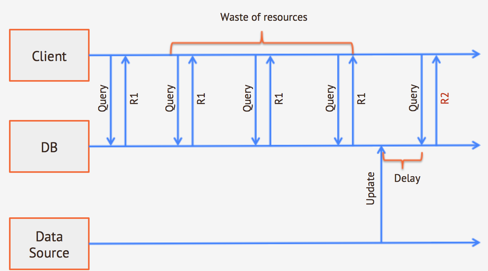

# Live Query

_(Since 2.1)_

Writing **realtime, reactive applications** is hard task with traditional query paradigm. 
Think about a simple use case like updating a web page with fresh data coming from the database and keeping it updated over time; also consider that updates can be made by different data sources (multiple applications, manual DBA operations...).

With a traditional approach, the client has to poll the database to obtain fresh data. This approach has three fundamental problems:

* the client never knows whether something has changed in the DB, so it will execute polling queries even when nothing has changed. This can be a big waste of resources, especially when the query is expensive
* if you need (near) realtime data, the client will have to poll the database very often
* results arrive to the client at fixed time intervals, so if a change happens in the database at the middle of that time interval, the result will arrive to the client only at the next query

The image below summarizes this situation

_traditional query polling approach_



You have to make a choice here 
* you can decide to have long polling intervals, reducing execution overhead, but having updated results later
* you can decine to have short polling intervals, having updated results sooner, but with a high execution overhead

With **LiveQuery** you can **subscribe** for changes on a particular class (or on a subset of records based on a WHERE condition); OrientDB will **push** changes to the client as soon as they happen in the database.

_LiveQuery approach_


Advantages are obvious:
* you do not have to poll the database, so there is no waste of resources when data do not change
* you get notifications as soon as changes happen in the db (no matter what the data source is)


## Traditional queries vs. Live Query

When executing a SELECT statement (synchronous or asynchronous), you expect the system to return results that are currently present in the database and that match your selection criteria. You expect your result set to be finite and your query to execute in a given time.

A live query acts in a slightly different way:
* it **does not** return data as they are at the moment of the query execution
* it returns **changes** that happen to the database from that moment on and that match your criteria
* it never ends (unless you terminate it or an error occurs)
* it is asynchronous and **push** based: the server will send you data as soon as they are available, you just have to provide a callback.

To make the difference explicit, here is a simple example (just the flow of results in a meta-language, not a working example)

### Standard query

A client executes a query on the DB

```sql
SELECT FROM PERSON
```

The client will receive a result that represents the current situation in the database:

```
RID,   NAME,    SURNAME
#12:0, "John",  "Smith"
#12:1, "Foo",   "Bar"

Number of results: 2
```

Another client inserts new data in the DB
```sql
INSERT INTO PERSON SET NAME = 'Jenny'
```

The first client will not receive this record, because the SELECT result set is closed. In short, this INSERT operation will not affect the previous query.

### LIVE query

The client executes this query:

```sql
LIVE SELECT FROM PERSON
```
the immediate result of this query is just the unique identifier of the query itself (no data are returned, even if data are present in the DB)
```
token: 1234567 // Unique identifier of this live query, needed for unsubscribe
```

Another client inserts new data in the DB

```sql
INSERT INTO PERSON SET name = 'Jenny'
```

The first client will receive a message with the following content (schematic):

```
content: {@rid: #12:0, name: 'Jenny'}
operation: insert
```

Another client updates existing data

```sql
UPDATE PERSON SET NAME = 'Kerry' WHERE NAME = 'Jenny'
```

The first client will receive a message with the following content (schematic):

```
content: {@rid: #12:0, name: 'Kerry'}
operation: update
```

Now the first client can decide to unsubscribe from this LiveQuery

```sql
LIVE UNSUBSCRIBE 1234567
```
From now on, the live query will not return any other results to the client.

## When should you use LiveQuery

LiveQuery is particularly useful in the following scenarios:
* when you need continuous (realtime) updates and you have multiple clients accessing different data subsets: polling is a an expensive operation, having thousands of clients that execute continuous polling could crash any server; in the best case it will be a waste of resources, especially if updates happen rarely
* when you have multiple data sources that insert/update data: if you have a single data source that populate the database, then you can intercept it and let it directly notify the clients for changes; unfortunately it almost never happens, in the majority of the use cases you will have multiple data sources, sometimes automatic (eg. applications) sometimes manual (your DBA that does data cleaning) and you want all these changes to be immediately notified to the client.
* when you develop on a push-based/reactive infrastructure: if you work on a message-driven infrastructoure or with a reactive framework, working with traditional (synchronous, blocking) queries can be a real pain; having a database that follows the same paradigm and that provides push notifications for data change will let you write applications in a more consistent way.

## Supported interfaces

Live Query is currently supported from the following interfaces
* [Java](https://github.com/orientechnologies/orientdb-docs/blob/master/Live-Query.md#livequery-in-java)
* [Node.js](https://github.com/orientechnologies/orientdb-docs/blob/master/Live-Query.md#livequery-in-nodejs) [(OrientJS)](https://github.com/orientechnologies/orientjs)


## Enabling LiveQuery

Since version 2.2 the live query are enabled by default, from disable it set the property `query.live.support` to false.

## LiveQuery in Java

To implement LiveQuery in Java you need two elements:
* a statement, to be executed by OLiveQuery
* a listener that asynchronous receives result 

The listener has to implement OLiveResultListener. It just has a callback method that takes the live query token and the record that was modified (with the operation that occurred, eg. insert, update or delete)

```java
class MyLiveQueryListener implements OLiveResultListener {

    public List<ORecordOperation> ops = new ArrayList<ORecordOperation>();

    @Override
    public void onLiveResult(int iLiveToken, ORecordOperation iOp) throws OException {
        System.out.println("New result from server for live query "+iLiveToken);
        System.out.println("operation: "+iOp.type);
        System.out.println("content: "+iOp.record);
    }
    
    public void onError(int iLiveToken) {
        System.out.println("Live query terminate due to error");
    }
    
    public void onUnsubscribe(int iLiveToken) {
        System.out.println("Live query terminate with unsubscribe");
    }
    
}
```

To actually execute the live query, you can use the `db.query()` method passing a `OLiveQuery` object as an argument, etc.

```java
ODatabaseDocumentTx db = ... // I suppose you have an active DB instance

// Instantiate the query listener
MyLiveQueryListener listener = new MyLiveQueryListener();

// Execute the query
List<ODocument> result = db.query(new OLiveQuery<ODocument>("live select from Test", listener));

// Get the query token, it is needed for unsubscribe
String token = result.get(0).field("token"); // 1234567

// From now you will receive results from the server for every change that matches your query criteria.

// If you or someone else executes an INSERT on the server
db.command(new OCommandSQL("insert into test set name = 'foo', surname = 'bar'")).execute();

// Your MyLiveQueryListener.onLiveResult() will be invoked. In this case the result will be
// New result from server for live query 1234567 <- a token generated by the server
// operation: 3 <- ORecordOperation.CREATED
// content: {@Rid: "#12:0", name: "foo", surname: "bar"}

db.command(new OCommandSQL("update test set name = 'baz' where surname = 'bar'")).execute();

// New result from server for live query 1234567 
// operation: 1 <- ORecordOperation.UPDATED
// content: {@Rid: "#12:0", name: "baz", surname: "bar"}      

db.command(new OCommandSQL("live unsubscribe 1234567")).execute();

// From now you will not receive any other results
```

## LiveQuery in Node.js

To use LiveQuery in Node.js you just have to import "orientjs" module with 

```npm install orientjs```

Here is a simple example that shows how to use LiveQuery with OrientJS

```Javascript
var OrientDB = require('orientjs');
var server = OrientDB({host: 'localhost', port: 2424});
var db = server.use({name: 'test', username: 'admin', password: 'admin'});

db.liveQuery("live select from V")
  .on('live-insert', function(data){
     //new record inserted in the database,
     var myRecord = data.content;
     // your code here...
  })
  .on('live-delete', function(data){
      //record just deleted, receiving the old content
      var myRecord = data.content;
      // your code here...
  })
  .on('live-update', function(data){
      //record updated, receiving the new content
      var myRecord = data.content;
      // your code here...
  })
```

## What's next

OrientDB team is working hard to make it stable and to support it on all the clients. To make live query stable in OrientDB 2.2, the following steps are needed:
- add tests for connection failure 
- check for memory leaks
- add tests it in distributed mode
- give an additional check to the OrientJs implementation 
 
We are also considering integrations with existing frameworks like [(Meteor)](https://www.meteor.com/)

Starting from 2.2 Live Query will be released as Stable and will be covered by commercial support too.
