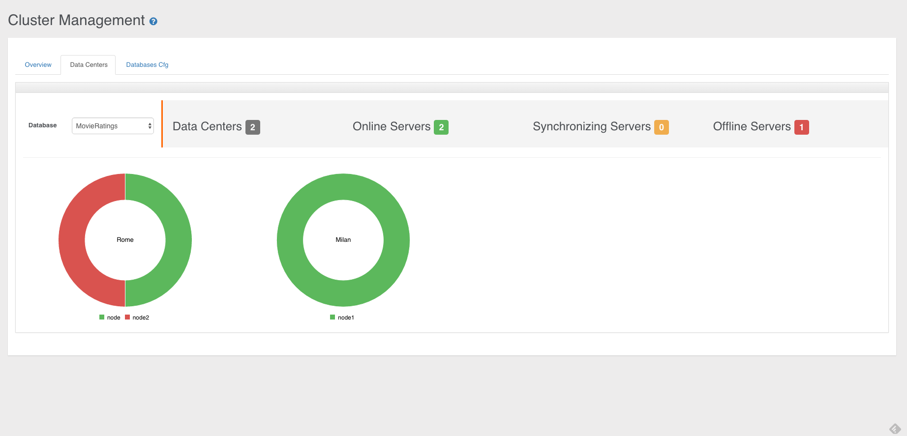

# Data Centers

Starting from [OrientDB Enterprise Edition](http://orientdb.com/orientdb-enterprise) v2.2.4, you can define how your servers are deployed in multiple **Data Centers**.



All you need is using the tag `"dataCenters"` in your [`default-distributed-config.json`](Distributed-Configuration.md#default-distributed-db-configjson) configuration file. This is the format:

```json
  "dataCenters": {
    "<data-center1-name>": {
      "writeQuorum": "<data-center1-quorum>",
      "servers": [ "<data-center1-server1>", "<data-center1-server2>", "<data-center1-serverN>" ]
    },
    "<data-center2-name>": {
      "writeQuorum": "<data-center2-quorum>",
      "servers": [ "<data-center2-server1>", "<data-center2-server2>", "<data-center2-serverN>" ]
    },
  },
```

NOTE: _This feature is available only in the [OrientDB Enterprise Edition](http://orientdb.com/orientdb-enterprise). If you are interested in a commercial license look at [OrientDB Subscription Packages](http://orientdb.com/support)_.

Example:

```json
  "dataCenters": {
    "usa": {
      "writeQuorum": "majority",
      "servers": [ "<austin>", "<paloalto>", "<newyork>" ]
    },
    "europe": {
      "writeQuorum": "majority",
      "servers": [ "<rome>", "<dublin>", "<london>" ]
    },
    "asia": {
      "writeQuorum": "majority",
      "servers": [ "<tokio>", "<singapore>", "<hongkong>" ]
    }
  },
```


## Write Quorum

The most common reason why defining data centers is a good idea is the possibility of defining the consistency at data center level. A typical scenario is having a synchronous replication between the servers in the same data center where the coordinator server is located and then propagate changes to the other data centers in asynchronous way. In this way you can avoid the cost of the latency of the replication to the servers located on different data centers. In order to activate this mode, set the global `"writeQuorum": "localDataCenter"` and then specify a writeQuorum per data center.

For example, if a write operation is executed by a server where its data center's write quorum setting is `majority`, then the used quorum will be `majority` between only the servers located in the same data center.

Example about the configuration of 2 data centers, "rome" and "austin", with respectively 3 and 2 servers.

```json
{
  "autoDeploy": true,
  "readQuorum": 1,
  "writeQuorum": "localDataCenter",
  "readYourWrites": true,
  "dataCenters": {
    "rome": {
      "writeQuorum": "majority",
      "servers": [ "europe-0", "europe-1", "europe-2" ]
    },
    "austin": {
      "writeQuorum": "majority",
      "servers": [ "usa-0", "usa-1" ]
    }
  },
  "servers": { "*": "master" },
  "clusters": {
    "internal": {},
    "*": { "servers": [ "<NEW_NODE>" ] }
  }
}
```

If a write operation is executed on the server "europe-0", the quorum used will be `majority`, but only between the servers locates in the same data center: namely "europe-0" (the coordinator), "europe-1" and "europe-2". Since the coordinator writes in the database before to distribute the operation, the write operation succeed as soon as at least one between the "europe-1" and "europe-2" servers provide the same result as with "europe-0". The rest of the replication will be executed in background in asynchronous way.

## Consistency

Since multiple data centers can have a local quorum, it is possible having an **Eventual Consistency** between them. It's always suggested to keep the number of servers odd, so you can, eventually, always be consistent. Example of 2 data centers with equal number of servers:

```json
  "dataCenters": {
    "rome": {
      "writeQuorum": "all",
      "servers": [ "europe-0", "europe-1", "europe-2" ]
    },
    "austin": {
      "writeQuorum": "all",
      "servers": [ "usa-0", "usa-1", "usa-2" ]
    }
```

In this case if an UPDATE operation is executed by the server "usa-0" (the coordinator), it will reach the quorum only if `all` the servers in the "austin" data center provide the same result. Let's say the result for all these 2 servers was `5` (in the UPDATE operation the result is the updated version of the record). But what happens if all the other 3 servers in "rome" return the version `6`? You have no majority in this case (3 against 3), so the coordinator cannot establish who is the winner. The database become inconsistent.

In order to automatically manage conflicts, the suggested configuration is always to keep an **odd number** of servers if you have or not data centers.

## Conflict Resolution Policy

In [OrientDB Enterprise Edition](http://orientdb.com/orientdb-enterprise) the additional `dc` [Conflict Resolution Strategy](Distributed-Architecture.md#conflict-resolution-policy) is supported to let to a configured data center to always win in case of conflict. To use this strategy in the conflict resolution chain, append `dc` at the chain by overwriting the global setting `distributed.conflictResolverRepairerChain`. Example:

`-Ddistributed.conflictResolverRepairerChain=majority,content,version,dc{winner:asia}`

Note the configuration passed in curly brackets `{winner:asia}` containing the name of the data center that will be the winner in case no winner has been found in the chain.


## Client Reconnection

Starting from OrientDB v2.2.25, when a client has lost its connection to the server, it's able to transparently reconnect to another server in the same Data Center of the server where it was connected. If no other server is available for the same Data Center, then it will try to reconnect to a server in another Data Center and, one by one, will try until one server is reachable. If no servers are reachable, then a connection error is thrown. You can change this strategy by forcing the reconnection to be only against the same Data Center. In this case, if no servers are available in the same Data Center, a connection error is thrown. This is the setting:

```
-Dnetwork.retry.strategy=same-dc
```
